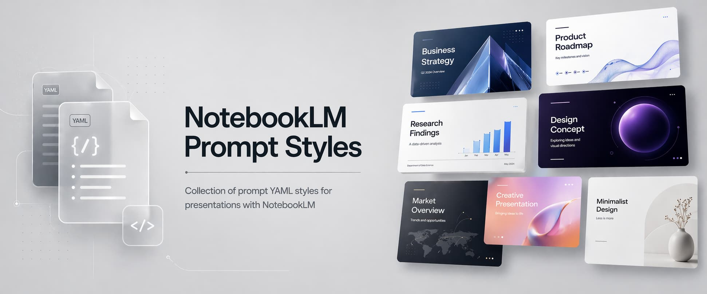

# مدرسه هوش مصنوعی یاس — مجموعه استایل‌های اسلاید NotebookLM
**گردآوری و توسعه توسط جعفر قربانی / مدرسه هوش مصنوعی یاس**

مجموعه‌ای برگزیده و تخصصی از استایل‌های طراحی بصری (YAML) برای شخصی‌سازی و ارتقای خروجی اسلایدهای NotebookLM.

- **مخزن گیت‌هاب:** [github.com/hvrashta/nps](https://github.com/hvrashta/nps)

## 🌐 وب‌سایت

این مجموعه را به صورت تعاملی در وب‌سایت مدرسه هوش مصنوعی یاس کاوش کنید. استایل‌ها را همراه با پیش‌نمایش ورق‌زن مشاهده کنید، کدهای پرامپت YAML را با یک کلیک کپی نمایید و موارد مورد علاقه خود را ذخیره کنید.

- **نسخه زنده وب‌سایت:** [مشاهده گالری استایل‌ها](https://notebooklm-prompt-styles.vercel.app/)

---

## 📖 Table of Contents

- [👔 Business & Executive](#-business-executive)
  - [Executive Report](#executive-report)
  - [Emerald Corporate](#emerald-corporate)
  - [Vibrant Corporate](#vibrant-corporate)
  - [Ensign Corporate](#ensign-corporate)
  - [Silicon Refined](#silicon-refined)
  - [Liquid Executive](#liquid-executive)
  - [Clinical Precision](#clinical-precision)
  - [Compassion Flat](#compassion-flat)
  - [Urban Barber](#urban-barber)
  - [Strategic Blue](#strategic-blue)
  - [Travel Pulse](#travel-pulse)
  - [Earthy Luxury](#earthy-luxury)
  - [Prestige Gold](#prestige-gold)
  - [Fresh Catering](#fresh-catering)
  - [Commercial Asset](#commercial-asset)
  - [Strategic Insight](#strategic-insight)
  - [Eco Estate](#eco-estate)
  - [Artisanal Brew](#artisanal-brew)
  - [Smart Commerce](#smart-commerce)
  - [Authentic Pasta](#authentic-pasta)
  - [Marine Harvest](#marine-harvest)
- [✨ Minimalist & Modern](#-minimalist-modern)
  - [Geometric Mono](#geometric-mono)
  - [Lush Minimal](#lush-minimal)
  - [Structured Mint](#structured-mint)
  - [Frosted Luxury](#frosted-luxury)
  - [Learning Time](#learning-time)
  - [Slow Living](#slow-living)
  - [Luxe Marble](#luxe-marble)
- [🎨 Creative & Playful](#-creative-playful)
  - [Creative Spark](#creative-spark)
  - [Artisan Rust](#artisan-rust)
  - [Vintage Charm](#vintage-charm)
  - [Creative Notebook](#creative-notebook)
  - [Kawaii Playful](#kawaii-playful)
  - [Y2K Nostalgia](#y2k-nostalgia)
  - [Creative Workshop](#creative-workshop)
  - [Creative Classroom](#creative-classroom)
  - [Hand-Drawn Scrapbook](#hand-drawn-scrapbook)
  - [Whimsical Animation](#whimsical-animation)
  - [Clinical Doodles](#clinical-doodles)
  - [Medicine Pop](#medicine-pop)
  - [Garden Doodles](#garden-doodles)
  - [Kawaii Storybook](#kawaii-storybook)
  - [Biochemical Doodles](#biochemical-doodles)
  - [Science Sketch](#science-sketch)
  - [Athletic Energy](#athletic-energy)
  - [Kawaii Wellness](#kawaii-wellness)
  - [Groovy 70s](#groovy-70s)
  - [Kawaii Pop](#kawaii-pop)
  - [Fandom Noir](#fandom-noir)
  - [Sweet Fandom](#sweet-fandom)
  - [Kawaii Fandom](#kawaii-fandom)
  - [Monster Party](#monster-party)
  - [Mango Kids](#mango-kids)
  - [Street Custom](#street-custom)
  - [Digital Nomad](#digital-nomad)
  - [Engaging Learner](#engaging-learner)
- [📖 Editorial & Magazine](#-editorial-magazine)
  - [Editorial Essence](#editorial-essence)
  - [Luxury Editorial](#luxury-editorial)
  - [Cobalt Editorial](#cobalt-editorial)
  - [Architectural Portfolio](#architectural-portfolio)
  - [Classical Gallery](#classical-gallery)
  - [Summer Collage](#summer-collage)
  - [Vision Board](#vision-board)
  - [Academic Edge](#academic-edge)
  - [Film Scrapbook](#film-scrapbook)
  - [Soft Editorial](#soft-editorial)
  - [Prime Noir](#prime-noir)
- [🚀 Tech & Innovation](#-tech-innovation)
  - [Visual Discovery](#visual-discovery)
  - [Urban Ribbon](#urban-ribbon)
  - [Neon Pulsar](#neon-pulsar)
  - [Midnight Tactical](#midnight-tactical)
  - [Architectural Mono](#architectural-mono)
  - [Architectural Cobalt](#architectural-cobalt)
  - [Startup Aura](#startup-aura)
  - [Neon Venture](#neon-venture)
  - [Cyber Pixel](#cyber-pixel)
  - [Project Launch](#project-launch)
  - [Tech Pitch](#tech-pitch)
  - [Prismatic Tech](#prismatic-tech)
  - [Cyber AI](#cyber-ai)
- [🌿 Nature & Wellness](#-nature-wellness)
  - [Eco Modern](#eco-modern)
  - [Botanical Journal](#botanical-journal)
  - [The Seasons](#the-seasons)
  - [Scholar's Journal](#scholars-journal)
  - [Classical Scrapbook](#classical-scrapbook)
  - [Vibrant Agency](#vibrant-agency)
  - [Vitality Glow](#vitality-glow)
  - [Modern Wellness](#modern-wellness)
  - [Deep Forest](#deep-forest)
  - [Urban Jungle](#urban-jungle)
  - [Modern Farm](#modern-farm)
  - [Sustainable Agri](#sustainable-agri)
  - [Modern Harvest](#modern-harvest)
  - [Mindful Aura](#mindful-aura)
  - [Botanical Harmony](#botanical-harmony)
  - [Yoga Glow](#yoga-glow)
  - [Misty Forest](#misty-forest)
  - [Serum Essence](#serum-essence)
  - [Artisanal Bloom](#artisanal-bloom)
- [🚀 How to Use](#-how-to-use)
- [🛠️ Contribution](#-contribution)
- [🏗️ Acknowledgements](#-acknowledgements)
- [⚖️ Disclaimer](#-disclaimer)

---

## 🎨 Themes

> [!IMPORTANT]
> The code snippets below are **simplified previews** focused on design tokens. To get the full configuration (including image generation prompts and detailed components), use the **[View Full YAML]** link in each section.

### 👔 Business & Executive

#### Executive Report

Data-dense, executive style for professional reports. Focuses on statement-driven "Action Titles", rigorous grid structures, and professional high-fidelity visuals.

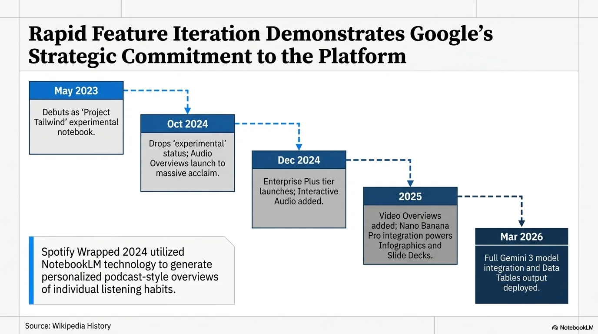

> [!TIP]
> This is a simplified preview. [View Full YAML](styles/executive_report.yaml)

```yaml
design_system:
  global_style:
    theme: "Professional, data-dense, and executive. Inspired by high-end consulting report standards. Focuses on statement-driven 'Action Titles', rigorous grid layouts, and high-impact data visualization."
    typography: 
      primary_heading: "Authoritative serif (e.g., Times New Roman, Georgia), bold, statement-driven"
      secondary_heading: "Clean professional sans-serif (e.g., Helvetica, Arial), bold"
      body_text: "Functional sans-serif, standard weights, high density"
    color_palette:
      primary_color: "#051C2C"
      background: "#FFFFFF"
      text_main: "#333333"
      accent_color: "#007DBB"
      secondary_accent: "#999999"
    key_visual_elements: 
      - "Full-width horizontal dividers for header and footer separation"
      - "High-information density"
      - "Source and Footer attribution blocks"
      - "Waterfall and Stacked bar chart motifs in icons"

  image_generation_prompts:
    style_guidelines: "Clean professional white background, deep blue accents, business-centric data visualization, executive presentation style."

slide_layout_templates:
  - type: "Executive_Action_Title"
    usage: "Standard consulting slide with a key insight title"
  - type: "Waterfall_Insight"
    usage: "Dynamic financial or process flow visualization"
  - type: "Quad_Analysis"
    usage: "Comparison of four key metrics"
```

#### Emerald Corporate

A professional, executive-level design featuring a deep forest green palette with sharp crystalline geometric overlays. It uses metallic silver accents and glassmorphic cards to create a high-tech, authoritative corporate atmosphere.

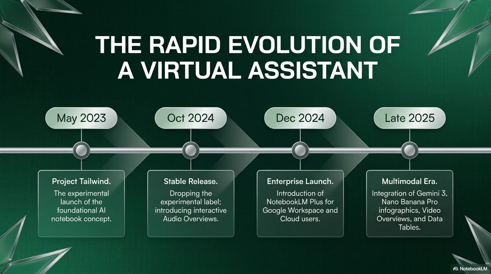

> [!TIP]
> This is a simplified preview. [View Full YAML](styles/emerald_corporate.yaml)

```yaml
design_system:
  global_style:
    theme: "Professional, executive, and high-tech. Deep emerald green with metallic silver accents."
    typography: 
      primary_heading: "Bold authoritative sans-serif, primarily uppercase"
      secondary_heading: "Medium weight sans-serif, clean"
      body_text: "Light-weight, highly legible sans-serif"
    color_palette:
      primary_color: "#0F3024"
      background: "Deep emerald with crystalline geometric shards"
      text_main: "#FFFFFF"
      accent_color: "#C0C0C0"
    key_visual_elements: 
      - "Sharp geometric shards with silver reflections"
      - "Pill-shaped gradient labels"
      - "Glassmorphic content cards"
      - "Professional office-centric photography"

slide_layout_templates:
  - type: "Executive_Cover"
    usage: "Authoritative intro with geometric framing"
  - type: "Pill_Grid_Methodology"
    usage: "Structured presentation of steps or research"
  - type: "Glassmorphic_Data"
    usage: "Data-heavy slides with visual clarity"

#### Vibrant Corporate

A dynamic, forward-moving corporate aesthetic featuring high-contrast navy blue and vibrant lime green. It uses sharp geometric diagonals, chevron markers, and structured grids to convey professional excellence and modern momentum.


> [!TIP]
> This is a simplified preview. [View Full YAML](styles/vibrant_corporate.yaml)

```yaml
design_system:
  global_style:
    theme: "Modern, dynamic, and professional corporate aesthetic."
    typography: 
      primary_heading: "Bold geometric sans-serif (Montserrat)"
      secondary_heading: "Medium weight sans-serif"
      body_text: "Clean functional sans-serif"
    color_palette:
      primary_color: "#051C2C"
      secondary_color: "#4CAF50"
      background: "#FFFFFF"
      text_main: "#111111"
    key_visual_elements: 
      - "Dynamic diagonal color blocks and chevron overlays"
      - "Circular icons with navy backgrounds"
      - "Chevron-shaped pointers for list items"
      - "Modern architectural and cityscape photography"

slide_layout_templates:
  - type: "Corporate_Cover"
    usage: "Bold navy and green diagonals for business plans"
  - type: "Timeline_History"
    usage: "Horizontal timeline with circular navy nodes"
  - type: "Objective_Chevron"
    usage: "List with green chevron markers and architectural bleed"
```

#### Ensign Corporate

Modern corporate, dynamic, and professional design. Features a strong navy and vivid blue foundation with energetic yellow/orange accents and distinctive corner 'ribbon' layers for a high-impact business presentation.


> [!TIP]
> This is a simplified preview. [View Full YAML](styles/ensign_corporate.yaml)

```yaml
design_system:
  global_style:
    theme: "Modern corporate, dynamic, professional. Navy/Blue with Yellow accents."
    typography: 
      primary_heading: "Bold geometric sans-serif, uppercase"
      secondary_heading: "Medium-bold sans-serif, accent color"
      body_text: "Clean sans-serif, business readability"
      info_label: "Small bold uppercase pill labels"
    color_palette:
      primary_color: "#101D42"
      secondary_color: "#4A6CF7"
      accent_yellow: "#FFB400"
      background: "#F5F7FA"
    key_visual_elements: 
      - "Layered corner 'ribbons' (Navy and Blue stacking)"
      - "Pill-shaped accent backgrounds for labels"
      - "Bold circular iconography"
      - "Rounded cards for content blocks"

slide_layout_templates:
  - type: "Ensign_Cover"
    usage: "Professional business introduction"
  - type: "Ribbon_Team"
    usage: "Team introduction with individual roles"
  - type: "Icon_Service_Grid"
    usage: "Listing core services or features"
```

#### Silicon Refined

Ultra-minimalist, premium, and sleek. Focuses on generous whitespace, precision typography, and high-fidelity visuals. Designed for high-end technology presentations where clarity and elegance are paramount.

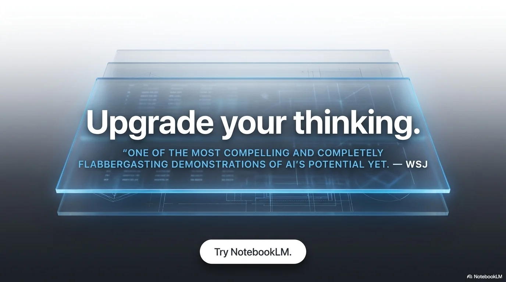

> [!TIP]
> This is a simplified preview. [View Full YAML](styles/silicon_refined.yaml)

```yaml
design_system:
  global_style:
    theme: "Ultra-minimalist, premium, and sleek. Generous whitespace and precision."
    typography: 
      primary_heading: "Clean high-quality sans-serif (e.g., SF Pro style), bold"
      secondary_heading: "Lightweight sans-serif, wide tracking"
      body_text: "Refined sans-serif, airy line-height"
    color_palette:
      primary_color: "#1D1D1F"
      background: "#FFFFFF"
      text_main: "#1D1D1F"
      accent_color: "#0071E3"
    key_visual_elements: 
      - "Generous whitespace (Airy layout)"
      - "High-resolution product-focused photography"
      - "Bento-style grids for features"

slide_layout_templates:
  - type: "Hero_Breathe"
    usage: "Impactful intro or single-statement slide"
  - type: "Bento_Grid_Specs"
    usage: "Showcasing multiple features or specifications"
  - type: "Feature_Gradient"
    usage: "Highlighting a breakthrough benefit"
```


#### Liquid Executive

A premium executive aesthetic characterized by flowing blue liquid and smoke textures on a solid black background. It features the elegant Garet typeface and ultra-rounded content containers. Ideal for high-stakes business presentations, corporate reports, and executive portfolios.

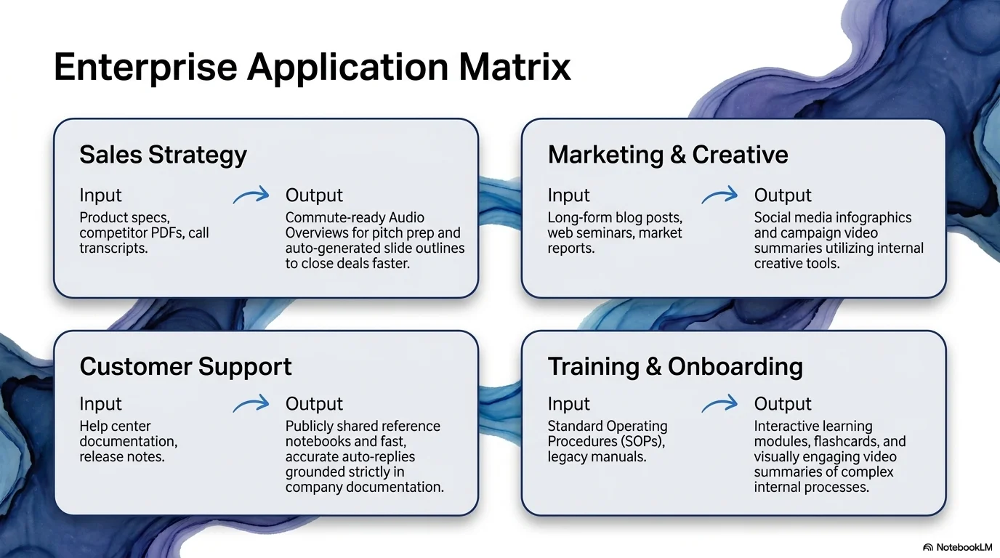

> [!TIP]
> This is a simplified preview. [View Full YAML](styles/liquid_executive.yaml)

```yaml
description: "A premium executive aesthetic characterized by flowing blue liquid and smoke textures on a solid black background. It features the elegant Garet typeface and ultra-rounded content containers. Ideal for high-stakes business presentations, corporate reports, and executive portfolios."
design_system:
  global_style:
    theme: "Liquid Executive. Professional corporate style with fluid blue textures and rounded layouts."
    typography: 
      primary_heading: "Garet, sans-serif"
      secondary_heading: "Garet, medium"
      body_text: "Open Sauce Sans, light"
    color_palette:
      primary: "#0056B3" # Executive Blue
      background: "#000000" # Pure Black
      surface: "#111111" # Dark Surface
      accent_gradient: "Flowing blue smoke texture with electric highlights"
      text_main: "#FFFFFF"
      text_secondary: "#CCCCCC"
    key_visual_elements: 
      - "Flowing blue liquid silk or smoke background patterns"
      - "Ultra-rounded corners for cards and images (24px+)"
      - "Thin white or light blue card outlines"
      - "Clean, high-contrast typography with generous leading"

  image_generation_prompts:
    style_guidelines: "Executive corporate style, flowing blue silk textures, deep black backgrounds, professional studio lighting, high-end business photography, sharp focus, Garet font vibe."
    themes:
      - target: "Corporate Flow"
        prompt_elements: "Abstract flowing blue smoke or liquid silk on a solid black background, elegant curves, high contrast."
      - target: "Modern Executive"
        prompt_elements: "Minimalist office interior with deep blue accents, professional lighting, clean and sophisticated."

slide_layout_templates:
  - type: "Executive_Hero"
    usage: "Large title over a dark background with a dramatic blue liquid wave on the right"
  - type: "Mission_Rounded"
    usage: "Mission and Vision points inside ultra-rounded blue cards with white text"
  - type: "Market_Analysis_Dark"
    usage: "Charts and data visualization with blue bar accents on a black background"
  - type: "Liquid_Contact"
    usage: "Clean contact info inside a rounded dark blue container with minimalist icons"
```


#### Clinical Precision

A modern, high-tech medical aesthetic designed for clinical and healthcare presentations. It utilizes the objective Helvetica World typeface, deep black backgrounds, and vibrant blue light glows. Characterized by large typography and sharp minimalist icons, it conveys trust and scientific precision.

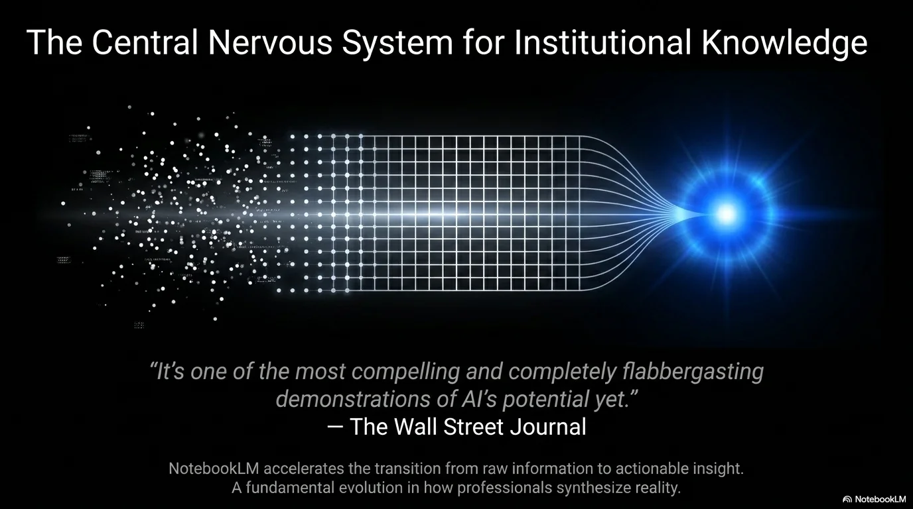

> [!TIP]
> This is a simplified preview. [View Full YAML](styles/clinical_precision.yaml)

```yaml
description: "A modern, high-tech medical aesthetic designed for clinical and healthcare presentations. It utilizes the objective Helvetica World typeface, deep black backgrounds, and vibrant blue light glows. Characterized by large typography and sharp minimalist icons, it conveys trust and scientific precision."
design_system:
  global_style:
    theme: "Clinical Precision. High-tech medical style with dark contrast and blue glows."
    typography: 
      primary_heading: "Helvetica World, sans-serif"
      secondary_heading: "Helvetica World, light"
      body_text: "Helvetica, Arial, sans-serif"
    color_palette:
      primary: "#2563EB" # Clinical Royal Blue
      background: "#000000" # Pure Black
      surface: "#111111" # Clinical Grey-Black
      accent_gradient: "Soft royal blue glow leaking from the edges"
      text_main: "#FFFFFF"
      text_secondary: "#A1A1AA"
    key_visual_elements: 
      - "Large minimalist arrow icons for calls to action"
      - "Subtle blue light leaks and glowing nodes on dark backgrounds"
      - "Thin 1px white horizontal dividers"
      - "Photography with clinical/modern medical subjects"

  image_generation_prompts:
    style_guidelines: "Modern medical photography, high-tech clinic environment, soft blue lighting glows, deep black backgrounds, clean professional medical aesthetic, sharp focus, Helvetica font vibe."
    themes:
      - target: "Medical Technology"
        prompt_elements: "Close-up of modern medical equipment with soft blue glow, clinical lighting, high-tech aesthetic, sharp focus."
      - target: "Care & Professionalism"
        prompt_elements: "A professional medical consultation in a modern clinic, soft blue ambient light, clean and trustworthy atmosphere."

slide_layout_templates:
  - type: "Medical_Title"
    usage: "Large title on a dark background with a massive arrow icon in the bottom right"
  - type: "Clinical_TOC"
    usage: "Table of contents with numbered list and soft blue background glow"
  - type: "Hospital_Timeline"
    usage: "Horizontal timeline with glowing nodes and blue spotlight effects"
  - type: "Data_Precision"
    usage: "Statistical highlights with large percentage numbers and subtle grid patterns"
```


#### Compassion Flat

A professional yet warm medical aesthetic utilizing modern flat 2D illustrations. It features the clean Poppins typeface, a serene palette of sky and navy blues, and large symbolic icons like medical crosses and hearts. Organized with rounded containers and soft shadows, it conveys institutional excellence with a human touch.

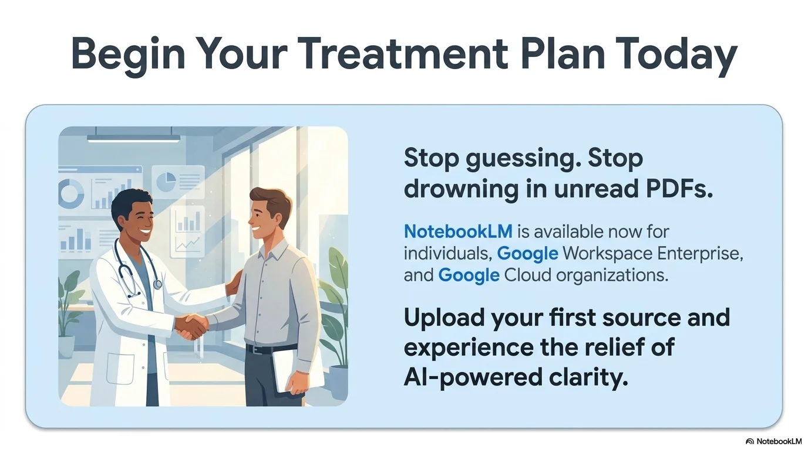

> [!TIP]
> This is a simplified preview. [View Full YAML](styles/compassion_flat.yaml)

```yaml
description: "A professional yet warm medical aesthetic utilizing modern flat 2D illustrations. It features the clean Poppins typeface, a serene palette of sky and navy blues, and large symbolic icons like medical crosses and hearts. Organized with rounded containers and soft shadows, it conveys institutional excellence with a human touch."
design_system:
  global_style:
    theme: "Compassion Flat. Modern 2D medical illustration style with a professional blue palette."
    typography: 
      primary_heading: "Poppins, sans-serif"
      secondary_heading: "Poppins, semi-bold"
      body_text: "Poppins, light"
    color_palette:
      primary: "#3B82F6" # Corporate Blue
      secondary: "#7EB1D1" # Sky Blue Matte
      background: "#FFFFFF" # Pure White
      surface: "#F8FAFC" # Light Slate Surface
      text_main: "#0F172A"
      text_secondary: "#475569"
    key_visual_elements: 
      - "Modern flat vector illustrations of healthcare professionals"
      - "Large decorative medical cross icons (+)"
      - "Rounded rectangular containers with subtle 1px borders"
      - "Clean, organized layouts with ample white space"

  image_generation_prompts:
    style_guidelines: "Flat 2D vector illustration, clean lines, no gradients, minimal shadows, corporate medical theme, professional characters, sky blue and white palette, Poppins font vibe."
    themes:
      - target: "Patient Care"
        prompt_elements: "A flat 2D illustration of a doctor talking to a patient, warm and professional vibe, clean vector style, blue and white tones."
      - target: "Medical Technology"
        prompt_elements: "Flat 2D illustration of a microscope and medical monitor, clean minimalist lines, medical blue accents, white background."

slide_layout_templates:
  - type: "Flat_Medical_Cover"
    usage: "Large title with a professional doctor illustration and a massive blue cross icon"
  - type: "Info_Card_Layout"
    usage: "Text contained in a rounded white card with a subtle shadow and sky blue title"
  - type: "Step_By_Step_Flat"
    usage: "Horizontal steps using circular icons and flat illustration characters"
  - type: "Medical_Components_Grid"
    usage: "A 2x2 grid of info cards with flat icons for each healthcare component"
```


#### Urban Barber

A sharp and sophisticated monochromatic aesthetic inspired by modern high-end barbershops. It features the geometric Glacial Indifference for bold, clean headlines and the expressive Bricolage Grotesque for body text. Characterized by a 'Barber Pole Noir' palette of black, white, and steel grey, it uses high-contrast layouts and minimalist razor or comb iconography to create a sense of precision, urban style, and professional grooming excellence.

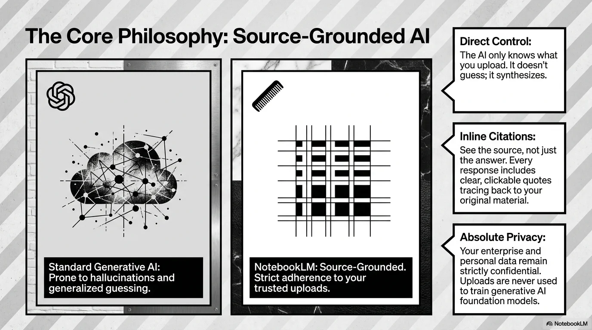

> [!TIP]
> This is a simplified preview. [View Full YAML](styles/urban_barber.yaml)

```yaml
description: "A sharp and sophisticated monochromatic aesthetic inspired by modern high-end barbershops. It features the geometric Glacial Indifference for bold, clean headlines and the expressive Bricolage Grotesque for body text. Characterized by a 'Barber Pole Noir' palette of black, white, and steel grey, it uses high-contrast layouts and minimalist razor or comb iconography to create a sense of precision, urban style, and professional grooming excellence."
design_system:
  global_style:
    theme: "Urban Barber. Sharp monochromatic design for professional grooming, fashion, and urban lifestyle topics."
    typography: 
      primary_heading: "Glacial Indifference, sans-serif"
      secondary_heading: "Glacial Indifference, bold"
      body_text: "Bricolage Grotesque, regular"
    color_palette:
      primary: "#000000" # Deep Black
      secondary: "#333333" # Steel Grey
      background: "#FFFFFF" # Crisp White
      surface: "#F2F2F2" # Light Concrete Surface
      text_main: "#000000"
      text_secondary: "#666666"
    key_visual_elements: 
      - "Bold monochromatic split-screen layouts"
      - "Minimalist vector icons of straight razors, combs, or shears"
      - "Diagonal stripe patterns (Barber Pole motif) in subtle grey tones"
      - "Sharp 0px corner radius for a 'straight-edge' precision feel"

  image_generation_prompts:
    style_guidelines: "Sharp monochromatic photography, high-contrast black and white, modern barbershop interior, industrial textures, professional grooming aesthetic, Glacial Indifference font vibe."
    themes:
      - target: "The Art of Precision"
        prompt_elements: "Close-up of a straight razor on a marble surface, black and white photography, sharp focus, industrial and elegant."
      - target: "Urban Lifestyle"
        prompt_elements: "A modern barbershop interior with leather chairs and white brick walls, high contrast, clean and professional atmosphere."

slide_layout_templates:
  - type: "Sharp_Headline"
    usage: "Large Glacial Indifference headline on a white background with a vertical black stripe on the left"
  - type: "Barber_Grid"
    usage: "A 3-column layout for grooming services or products with sharp black borders"
  - type: "Noir_Testimonial"
    usage: "Text centered over a subtle diagonal stripe background with high-contrast black icons"
  - type: "Straight_Edge_Visual"
    usage: "Full-bleed black and white photo with a transparent black overlay for white text"
```


#### Strategic Blue

A professional and structured corporate aesthetic designed for business proposals, strategic plans, and executive presentations. It features the versatile Montserrat typeface across all hierarchies to ensure maximum clarity and modern authority. Characterized by a palette of deep slate blue, ice blue, and professional grey, it uses subtle hexagonal background patterns, rounded image containers, and pill-shaped call-to-action buttons to create a clean, tech-forward, and trustworthy business presence.

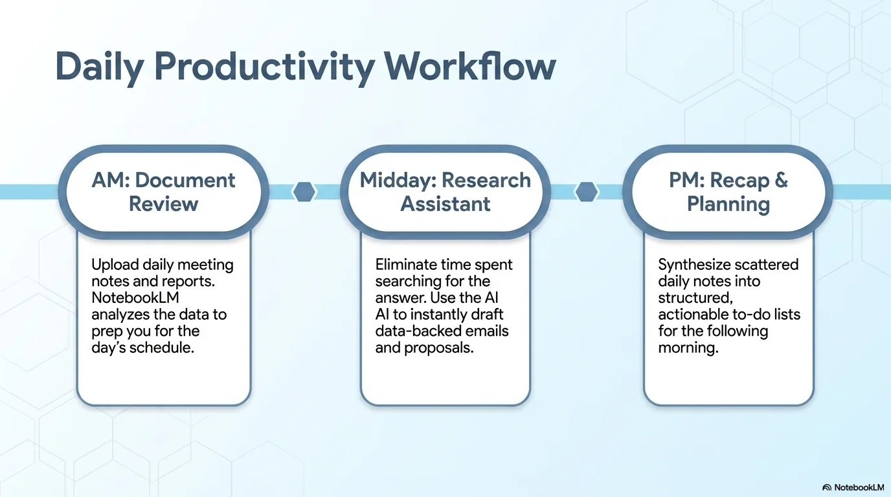

> [!TIP]
> This is a simplified preview. [View Full YAML](styles/strategic_blue.yaml)

```yaml
description: "A professional and structured corporate aesthetic designed for business proposals, strategic plans, and executive presentations. It features the versatile Montserrat typeface across all hierarchies to ensure maximum clarity and modern authority. Characterized by a palette of deep slate blue, ice blue, and professional grey, it uses subtle hexagonal background patterns, rounded image containers, and pill-shaped call-to-action buttons to create a clean, tech-forward, and trustworthy business presence."
design_system:
  global_style:
    theme: "Strategic Blue. Clean and professional corporate design with a tech-focused hexagonal motif."
    typography: 
      primary_heading: "Montserrat, sans-serif"
      secondary_heading: "Montserrat, bold"
      body_text: "Montserrat, regular"
    color_palette:
      primary: "#264653" # Slate Blue/Teal
      secondary: "#E9F5F8" # Ice Blue Background
      background: "#F8FAFC" # Light Grey-Blue
      surface: "#FFFFFF" # Pure White
      text_main: "#1E293B" # Dark Slate Text
      text_secondary: "#64748B" # Muted Blue-Grey
    key_visual_elements: 
      - "Light grey hexagonal geometric patterns in the background"
      - "Rounded corners (12px) for all image containers and cards"
      - "Pill-shaped buttons and label backgrounds"
      - "Structured information grids with subtle borders and shadows"

  image_generation_prompts:
    style_guidelines: "Professional business photography, modern office environments, soft daylight, slate blue and white palette, hexagonal geometric overlays, Montserrat font vibe, clean corporate aesthetic."
    themes:
      - target: "Strategic Planning"
        prompt_elements: "A professional business meeting in a bright modern office, clean blue and white tones, soft hexagonal pattern overlay, focused and high-end."
      - target: "Market Growth"
        prompt_elements: "Close-up of a professional holding a digital tablet, modern tech background, ice blue highlights, sharp and professional focus."

slide_layout_templates:
  - type: "Strategic_Proposal_Cover"
    usage: "Large Montserrat title centered on an ice blue background with a professional team photo in a rounded container"
  - type: "Hexa_Logic_Grid"
    usage: "A 2x2 or 3x1 grid of info cards with small hexagonal icons for each point"
  - type: "Solution_Roadmap"
    usage: "Horizontal steps using pill-shaped nodes and light blue connecting lines"
  - type: "Corporate_Contact_Pill"
    usage: "Contact details arranged in a clean footer with pill-shaped icons and dark slate text"
```


#### Travel Pulse

A dynamic and adventurous aesthetic designed for travel agencies, outdoor brands, and tourism portfolios. It utilizes the clean and technical Open Sauce typeface to convey modern reliability and bold exploration. Characterized by a high-contrast palette of charcoal grey, vibrant yellow, and crisp white, it features diagonal striped patterns, dotted airplane path motifs, and circular info badges to create an energetic and motion-focused visual experience.

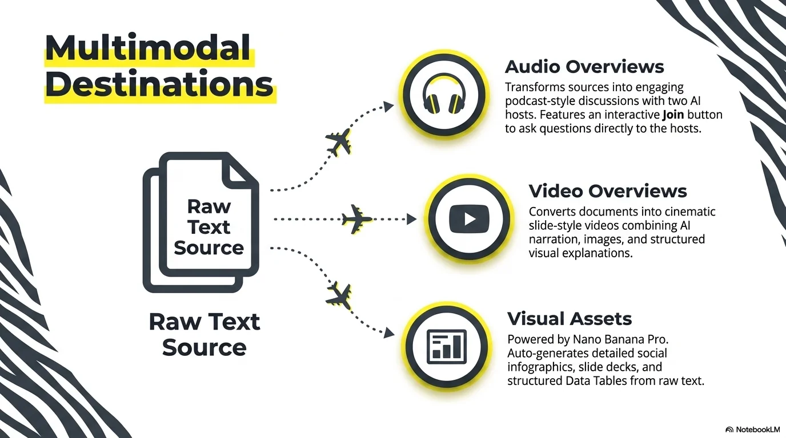

> [!TIP]
> This is a simplified preview. [View Full YAML](styles/travel_pulse.yaml)

```yaml
description: "A dynamic and adventurous aesthetic designed for travel agencies, outdoor brands, and tourism portfolios. It utilizes the clean and technical Open Sauce typeface to convey modern reliability and bold exploration. Characterized by a high-contrast palette of charcoal grey, vibrant yellow, and crisp white, it features diagonal striped patterns, dotted airplane path motifs, and circular info badges to create an energetic and motion-focused visual experience."
design_system:
  global_style:
    theme: "Travel Pulse. Dynamic adventure-focused design with high-contrast yellow accents."
    typography: 
      primary_heading: "Open Sauce, bold"
      secondary_heading: "Open Sauce, medium"
      body_text: "Open Sauce, regular"
    color_palette:
      primary: "#FFD600" # Vibrant Yellow
      secondary: "#333C4D" # Charcoal Grey
      background: "#FFFFFF" # Pure White
      surface: "#F1F5F9" # Light Grey Surface
      text_main: "#1E293B" # Dark Slate Text
      text_secondary: "#64748B" # Muted Slate
    key_visual_elements: 
      - "Diagonal striped patterns (zebra style) in charcoal and white"
      - "Dotted lines with small airplane icons indicating movement"
      - "Vertical striped circular motifs as background accents"
      - "Bright yellow highlight bars behind key titles"
      - "Circular icons with thick charcoal borders"

  image_generation_prompts:
    style_guidelines: "Action-oriented travel photography, panoramic landscapes, high contrast, vibrant yellow highlights, charcoal grey overlays, Open Sauce font vibe, energetic adventure aesthetic."
    themes:
      - target: "World Exploration"
        prompt_elements: "A traveler with a backpack looking at a vast mountain range, bright sunlight, charcoal and yellow geometric overlays, dynamic and bold."
      - target: "Luxury Travel"
        prompt_elements: "A modern resort pool with turquoise water, high-end architecture, clean white and yellow tones, sharp focus, professional travel magazine vibe."

slide_layout_templates:
  - type: "Adventure_Hero_Cover"
    usage: "Large Open Sauce title over a full-bleed travel photo with a charcoal diagonal stripe in the corner"
  - type: "Itinerary_Path"
    usage: "Vertical or horizontal steps connected by a dotted airplane path line and yellow nodes"
  - type: "Service_Highlight_Grid"
    usage: "4-column grid of photos with charcoal borders and yellow titles underneath"
  - type: "Travel_Contact_Dynamic"
    usage: "Contact info arranged in a charcoal box with yellow striped accents and airplane motifs"
```


#### Earthy Luxury

An earthy and organic hospitality aesthetic designed for boutique hotels, luxury resorts, and Mediterranean-inspired lifestyle brands. It features the clean and balanced Arial Unicode typeface to maintain a modern, uncluttered look that focuses on atmosphere. Characterized by a palette of muted olive green, warm terracotta, and soft cream, it utilizes asymmetrical photo grids with rounded corners, organic line icons, and split-screen layouts to create a serene and high-end experience.

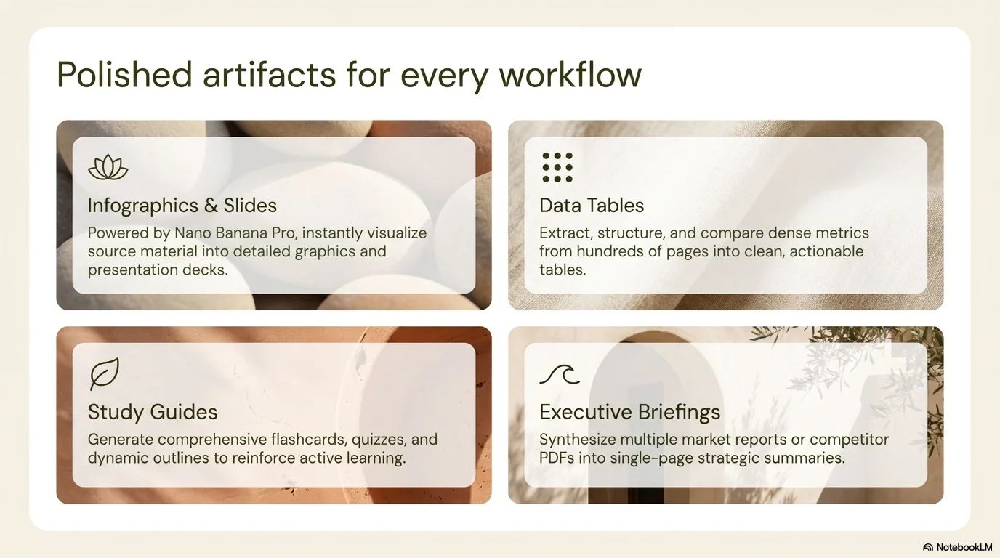

> [!TIP]
> This is a simplified preview. [View Full YAML](styles/earthy_luxury.yaml)

```yaml
description: "An earthy and organic hospitality aesthetic designed for boutique hotels, luxury resorts, and Mediterranean-inspired lifestyle brands. It features the clean and balanced Arial Unicode typeface to maintain a modern, uncluttered look that focuses on atmosphere. Characterized by a palette of muted olive green, warm terracotta, and soft cream, it utilizes asymmetrical photo grids with rounded corners, organic line icons, and split-screen layouts to create a serene and high-end experience."
design_system:
  global_style:
    theme: "Earthy Luxury. Organic hospitality design with Mediterranean warmth."
    typography: 
      primary_heading: "Arial Unicode, sans-serif"
      secondary_heading: "Arial Unicode, bold"
      body_text: "Arial Unicode, regular"
    color_palette:
      primary: "#8C8C6C" # Muted Olive
      secondary: "#8D493A" # Terracotta/Clay
      background: "#F9F6EE" # Soft Cream
      surface: "#FFFFFF" # Pure White
      text_main: "#4A4A3A" # Dark Olive Text
      text_secondary: "#70705B" # Muted Green-Grey
    key_visual_elements: 
      - "Photos with soft rounded corners (20px) arranged in overlapping grids"
      - "Split-screen layouts balancing full-bleed images and clean text areas"
      - "Organic, minimalist icons like lotus flowers or waves"
      - "Text blocks with wide letter spacing for an airy feel"
      - "Subtle beige borders around key image containers"

  image_generation_prompts:
    style_guidelines: "Luxury hospitality photography, Mediterranean architecture, warm natural light, muted olive and terracotta palette, organic textures, Arial Unicode font vibe, serene and high-end."
    themes:
      - target: "Suite Experience"
        prompt_elements: "A bright hotel suite with linen curtains, olive green accents, and sunlight streaming through a window, warm and luxurious."
      - target: "Organic Wellness"
        prompt_elements: "Close-up of a spa area with smooth stones and a wooden bowl, soft cream background, terracotta details, peaceful and organic."

slide_layout_templates:
  - type: "Hospitality_Hero_Grid"
    usage: "Large Arial Unicode title on the left with a grid of 3 rounded-corner photos on the right"
  - type: "Organic_Split_Intro"
    usage: "A vertical split layout with a full-bleed terracotta-toned image on one side and clean cream text on the other"
  - type: "Feature_List_Minimal"
    usage: "Bulleted list using organic dot icons and muted olive text on a white surface"
  - type: "Booking_Contact_Clean"
    usage: "Contact information centered at the bottom with wide letter spacing and a subtle olive logo"
```


#### Prestige Gold

A prestigious and high-end aesthetic designed for luxury real estate, premium listings, and executive portfolios. It features the elegant Boston Angel serif typeface for headlines, providing a sense of heritage and exclusivity. Characterized by a deep midnight blue background, old gold accents, and warm cream highlights, it utilizes subtle golden light waves, circular prestige icons, and clean architectural lines to create a sophisticated dark-mode experience.


> [!TIP]
> This is a simplified preview. [View Full YAML](styles/prestige_gold.yaml)

```yaml
description: "A prestigious and high-end aesthetic designed for luxury real estate, premium listings, and executive portfolios. It features the elegant Boston Angel serif typeface for headlines, providing a sense of heritage and exclusivity. Characterized by a deep midnight blue background, old gold accents, and warm cream highlights, it utilizes subtle golden light waves, circular prestige icons, and clean architectural lines to create a sophisticated dark-mode experience."
design_system:
  global_style:
    theme: "Prestige Gold. Luxury real estate design with a sophisticated gold-on-navy palette."
    typography: 
      primary_heading: "Boston Angel, serif"
      secondary_heading: "Boston Angel, italic"
      body_text: "Nunito, sans-serif"
    color_palette:
      primary: "#E2B670" # Old Gold
      secondary: "#0F172A" # Midnight Blue Background
      background: "#020617" # Deep Navy
      surface: "#1E293B" # Slate Surface
      text_main: "#F8FAFC" # Off-White Text
      text_secondary: "#94A3B8" # Muted Blue-Grey
    key_visual_elements: 
      - "Golden ethereal light curves and waves in the background"
      - "Gold circular badges with minimalist house or key icons"
      - "Thin gold borders around featured property images"
      - "High-contrast architectural photography with warm sunset tones"

  image_generation_prompts:
    style_guidelines: "Luxury modern architecture, high-end interior design, warm golden hour lighting, midnight blue and gold palette, sophisticated and sharp, Boston Angel font aesthetic."
    themes:
      - target: "Property Exterior"
        prompt_elements: "A modern glass mansion at dusk, warm interior lights, golden hour glow, deep blue sky, luxury real estate photography, sharp and prestigious."
      - target: "Interior Elegance"
        prompt_elements: "A high-end living room with marble floors and gold accents, soft ambient lighting, midnight blue walls, ultra-premium and serene."

slide_layout_templates:
  - type: "Prestige_Cover_Gold"
    usage: "Full-bleed architectural photo with a large Boston Angel title in gold and midnight blue overlays"
  - type: "Luxury_Feature_List"
    usage: "Golden circular icons for each feature with Nunito descriptions on a deep navy background"
  - type: "Gold_Accent_Quote"
    usage: "Large Boston Angel quote centered with thin gold horizontal lines above and below"
  - type: "Property_Stats_Pill"
    usage: "Key data points (sqft, beds) arranged in gold-bordered containers with crisp white text"
```


#### Fresh Catering

A fresh and modern catering aesthetic designed for food service brands, healthy eating startups, and culinary event portfolios. It utilizes the friendly and geometric Poppins typeface to convey cleanliness and professional reliability. Characterized by a palette of warm cream, orange terracotta, and soft peach, it features large rounded-corner cards, circular background accents, and minimalist geometric markers (+ and x) to create a structured and inviting visual experience.

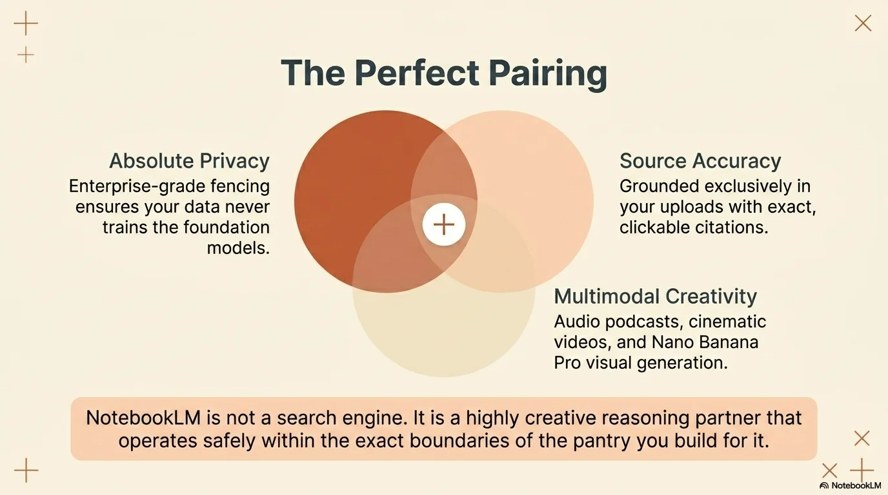

> [!TIP]
> This is a simplified preview. [View Full YAML](styles/fresh_catering.yaml)

```yaml
description: "A fresh and modern catering aesthetic designed for food service brands, healthy eating startups, and culinary event portfolios. It utilizes the friendly and geometric Poppins typeface to convey cleanliness and professional reliability. Characterized by a palette of warm cream, orange terracotta, and soft peach, it features large rounded-corner cards, circular background accents, and minimalist geometric markers (+ and x) to create a structured and inviting visual experience."
design_system:
  global_style:
    theme: "Fresh Catering. Modern food service design with warm terracotta and peach accents."
    typography: 
      primary_heading: "Poppins, bold"
      secondary_heading: "Poppins, medium"
      body_text: "Poppins, regular"
    color_palette:
      primary: "#E67E22" # Orange Terracotta
      secondary: "#FDF5E6" # Old Lace / Cream Background
      background: "#FFFFFF" # Pure White
      surface: "#FFE0B2" # Light Peach Surface
      text_main: "#2D3436" # Dark Slate Text
      text_secondary: "#636E72" # Muted Slate
    key_visual_elements: 
      - "Large rectangular text cards with high border-radius (24px) in terracotta"
      - "Circular background motifs in soft peach and cream tones"
      - "Small '+' and 'x' geometric markers in the corners for a structured look"
      - "Clean, high-brightness food photography with natural textures"
      - "Balanced white space to emphasize freshness and order"

  image_generation_prompts:
    style_guidelines: "Bright and airy food photography, natural ingredients, warm terracotta accents, cream background, sharp focus, Poppins font vibe, modern catering aesthetic."
    themes:
      - target: "Healthy Buffet"
        prompt_elements: "A variety of fresh salads and bowls on a wooden table, bright natural light, cream and orange accents, top-down view, professional catering style."
      - target: "Catering Service"
        prompt_elements: "A professional server handing a clean white plate with artistic food arrangement, warm inviting atmosphere, peach highlights, high quality."

slide_layout_templates:
  - type: "Catering_Hero_Pill"
    usage: "Large photo on the left with a terracotta rounded card containing the Poppins title on the right"
  - type: "Solution_Step_Circles"
    usage: "Process steps represented with circular photo accents and peach background blobs"
  - type: "Target_Market_Cards"
    usage: "Grid of terracotta cards with white text and small geometric markers in the corners"
  - type: "Fresh_Contact_Footer"
    usage: "Contact details centered on a cream background with a large peach circle in the background"
```


#### Commercial Asset

An established and professional aesthetic designed for commercial real estate, investment listings, and corporate property portfolios. It features the classic Times New Roman serif for headings to convey trust and authority, paired with the modern Poppins for body text. Characterized by a palette of deep chocolate brown, sienna orange, and crisp white, it utilizes circular property icons and clean grid layouts to create a sophisticated and reliable investment experience.

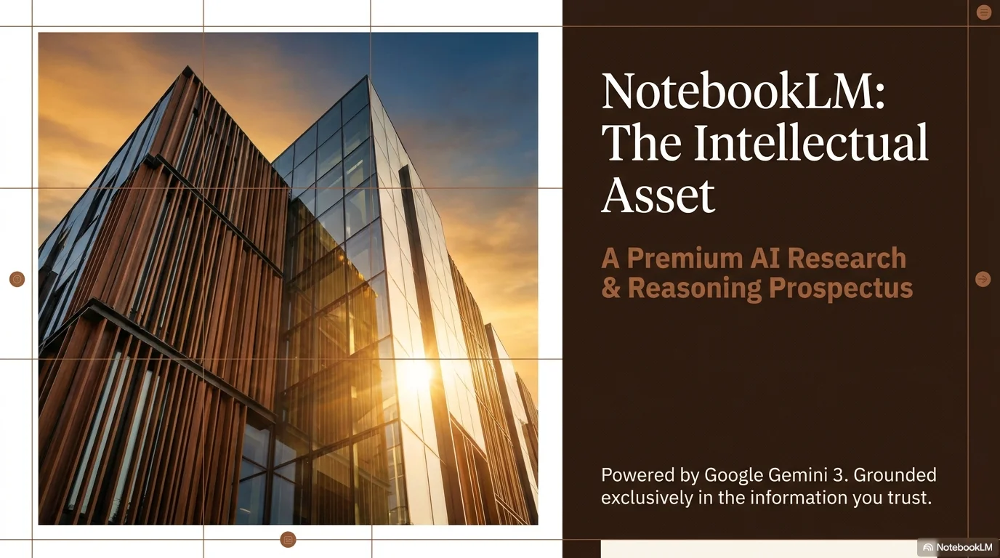

> [!TIP]
> This is a simplified preview. [View Full YAML](styles/commercial_asset.yaml)

```yaml
description: "An established and professional aesthetic designed for commercial real estate, investment listings, and corporate property portfolios. It features the classic Times New Roman serif for headings to convey trust and authority, paired with the modern Poppins for body text. Characterized by a palette of deep chocolate brown, sienna orange, and crisp white, it utilizes circular property icons and clean grid layouts to create a sophisticated and reliable investment experience."
design_system:
  global_style:
    theme: "Commercial Asset. Professional investment design with chocolate and sienna accents."
    typography: 
      primary_heading: "Times New Roman, serif"
      secondary_heading: "Poppins, bold"
      body_text: "Poppins, regular"
    color_palette:
      primary: "#A0522D" # Sienna / Burnt Orange
      secondary: "#2B1B17" # Chocolate Brown
      background: "#FFFFFF" # Pure White
      surface: "#FDF5E6" # Old Lace / Cream Surface
      text_main: "#1A1A1A" # Near Black
      text_secondary: "#5D4037" # Muted Brown
    key_visual_elements: 
      - "Circular icon badges in sienna and brown for key metrics"
      - "Clean, high-end architectural and interior photography"
      - "Structured information blocks with thin brown dividers"
      - "Burnt orange highlight boxes for important calls to action"

  image_generation_prompts:
    style_guidelines: "Modern commercial architecture, professional office interiors, warm natural light, chocolate brown and sienna palette, established and sharp, Times New Roman font vibe."
    themes:
      - target: "Investment Property"
        prompt_elements: "A modern commercial building with glass and wood textures, warm sunlight, professional real estate photography, sienna accents, sharp and trustworthy."
      - target: "Corporate Office"
        prompt_elements: "A high-end boardroom with a large wooden table and modern chairs, chocolate brown wall details, warm ambient lighting, prestigious and established."

slide_layout_templates:
  - type: "Investment_Hero_Cover"
    usage: "Large photo on the left with a chocolate brown panel and white Times New Roman title on the right"
  - type: "Asset_Specifications"
    usage: "Grid of technical details with sienna circular icons and brown Poppins text"
  - type: "Amenities_Showcase"
    usage: "Large interior photo with overlaid sienna stat boxes and white percentages"
  - type: "Commercial_Contact_Brown"
    usage: "Contact details in a chocolate brown footer with sienna accents and clear Poppins typography"
```


#### Strategic Insight

A high-precision and strategic aesthetic designed for luxury market analysis, business consulting, and data-driven strategy presentations. It features the modern and geometric TT Firs Neue typeface to convey technical sophistication and clarity. Characterized by a palette of deep navy blue, crisp white, and cyan accents, it utilizes concentric wave patterns, dot grids, and a signature triple-dot motif in the corners to create a structured and insightful visual experience.

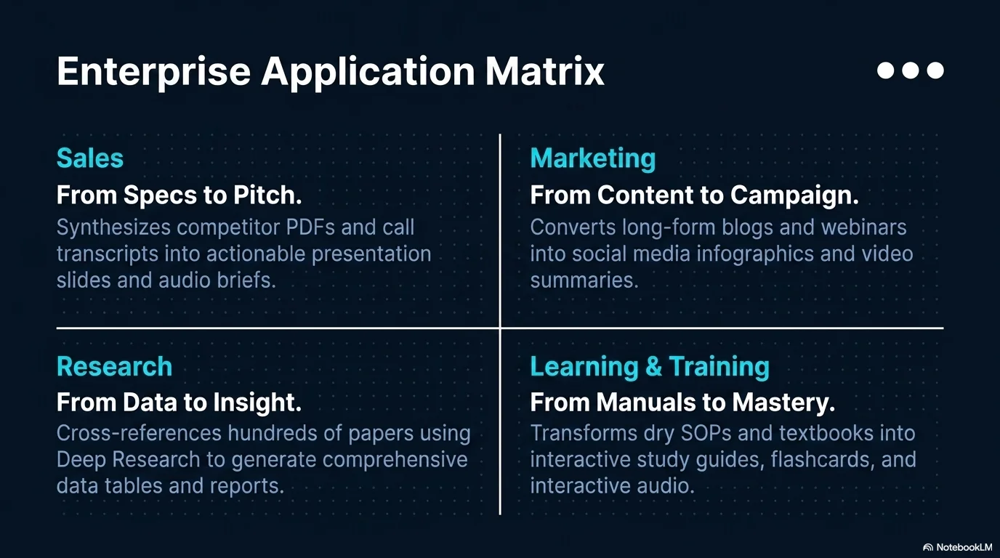

> [!TIP]
> This is a simplified preview. [View Full YAML](styles/strategic_insight.yaml)

```yaml
description: "A high-precision and strategic aesthetic designed for luxury market analysis, business consulting, and data-driven strategy presentations. It features the modern and geometric TT Firs Neue typeface to convey technical sophistication and clarity. Characterized by a palette of deep navy blue, crisp white, and cyan accents, it utilizes concentric wave patterns, dot grids, and a signature triple-dot motif in the corners to create a structured and insightful visual experience."
design_system:
  global_style:
    theme: "Strategic Insight. Deep navy analysis design with white and cyan tech accents."
    typography: 
      primary_heading: "TT Firs Neue, bold"
      secondary_heading: "TT Firs Neue, medium"
      body_text: "TT Firs Neue, regular"
    color_palette:
      primary: "#000080" # Deep Navy Blue
      secondary: "#FFFFFF" # Pure White
      background: "#000033" # Very Dark Navy
      surface: "#E3F2FD" # Light Blue Surface
      text_main: "#FFFFFF" # White Text on dark backgrounds
      text_secondary: "#B0BEC5" # Muted Blue Grey
    key_visual_elements: 
      - "White concentric wave patterns in corners and as section dividers"
      - "Signature triple-dot motif in the top-right corner for navigation vibe"
      - "Subtle dot grid patterns and technical markers for data visualization"
      - "Split-screen layouts with professional business and market data photography"
      - "Cyan highlight bars for emphasized strategic points"

  image_generation_prompts:
    style_guidelines: "Professional business strategy sessions, market data screens, deep navy backgrounds, concentric wave patterns, minimalist tech aesthetic, TT Firs Neue font vibe."
    themes:
      - target: "Market Analysis"
        prompt_elements: "A professional analyzing printed market charts on a clean table, deep navy color grading, cyan highlights, sharp focus, strategic consulting vibe."
      - target: "Strategic Planning"
        prompt_elements: "A team in a modern office looking at a data dashboard, concentric blue wave overlays, professional and technical atmosphere, high precision."

slide_layout_templates:
  - type: "Strategic_Hero_Insight"
    usage: "Large photo on the right with a deep navy panel and bold white TT Firs Neue title on the left"
  - type: "Market_Landscape_Grid"
    usage: "Technical grid with market data photography and white text boxes with cyan headers"
  - type: "Strategic_Direction_Bullets"
    usage: "Split layout with a business photo on one side and clean white bullet points on a navy background"
  - type: "Technical_Thank_You"
    usage: "Centered white text on a navy background with concentric wave patterns in the corners"
```


#### Eco Estate

A clean and forward-thinking aesthetic designed for sustainable architecture, eco-friendly real estate, and green energy projects. It features the distinctive Prachasong typeface for a modern look, paired with the versatile Poppins. Characterized by a palette of sage green, forest green, and crisp white, it utilizes technical grid patterns, leaf-inspired lightbulb icons, and diagonal growth arrows to create a structured and environmentally conscious visual experience.

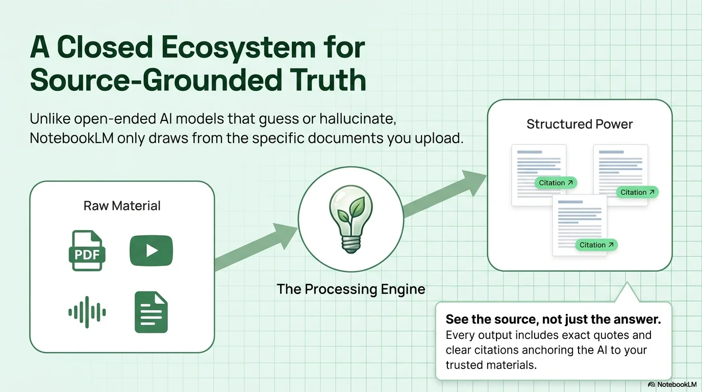

> [!TIP]
> This is a simplified preview. [View Full YAML](styles/eco_estate.yaml)

```yaml
description: "A clean and forward-thinking aesthetic designed for sustainable architecture, eco-friendly real estate, and green energy projects. It features the distinctive Prachasong typeface for a modern look, paired with the versatile Poppins. Characterized by a palette of sage green, forest green, and crisp white, it utilizes technical grid patterns, leaf-inspired lightbulb icons, and diagonal growth arrows to create a structured and environmentally conscious visual experience."
design_system:
  global_style:
    theme: "Eco Estate. Sustainable design with sage/forest green and technical grid accents."
    typography: 
      primary_heading: "Prachasong, bold"
      secondary_heading: "Poppins, medium"
      body_text: "Poppins, regular"
    color_palette:
      primary: "#4F8A6D" # Sage Green
      secondary: "#1E4D3B" # Forest Green
      background: "#FFFFFF" # Pure White
      surface: "#F1F8F5" # Very Light Mint Surface
      text_main: "#263238" # Dark Charcoal
      text_secondary: "#546E7A" # Muted Blue Grey
    key_visual_elements: 
      - "Subtle technical grid patterns (graph paper style) in light green"
      - "Leaf-infused lightbulb icons to represent eco-innovation"
      - "Diagonal 'growth' arrow lines in the corners"
      - "Large rounded-corner cards with thin green borders"
      - "Bright, natural lighting in architectural photography"

  image_generation_prompts:
    style_guidelines: "Modern eco-friendly architecture, solar panels on rooftops, lush green gardens, bright natural sunlight, sage and forest green palette, clean and technical, Prachasong font vibe."
    themes:
      - target: "Sustainable Home"
        prompt_elements: "A modern house with vertical gardens and large glass windows, solar panels, bright daylight, sage green accents, architectural photography style."
      - target: "Green Energy"
        prompt_elements: "Close up of a smart home energy monitor with leaf icons, soft green lighting, clean minimalist tech, eco-friendly atmosphere."

slide_layout_templates:
  - type: "Sustainable_Hero_List"
    usage: "Large photo on the right with a sage green gradient panel and bold white Prachasong title on the left"
  - type: "Eco_Market_Outlook"
    usage: "Technical grid layout with small photos and percentage stats highlighted in forest green"
  - type: "Pillar_Value_Cards"
    usage: "Three vertical cards with leaf-lightbulb icons and forest green Poppins headings"
  - type: "Green_Energy_Summary"
    usage: "Full-width photo with white text boxes and diagonal arrow markers in the corners"
```


#### Artisanal Brew

A sophisticated and organic aesthetic designed for premium tea brands, artisanal food experiences, and organic product showcases. It features the powerful Heading Now typeface for titles to convey elegance, paired with the technical clarity of TT Firs Neue. Characterized by a palette of olive green, soft lime, and deep forest black, it utilizes hand-drawn leaf illustrations, organic curved photo containers, and pill-shaped UI elements to create a grounded and premium visual experience.

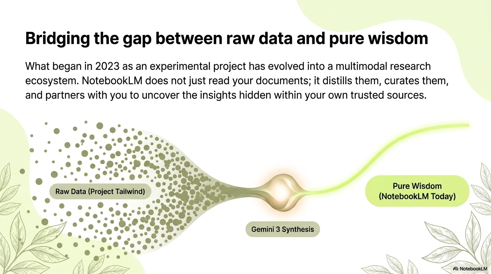

> [!TIP]
> This is a simplified preview. [View Full YAML](styles/artisanal_brew.yaml)

```yaml
description: "A sophisticated and organic aesthetic designed for premium tea brands, artisanal food experiences, and organic product showcases. It features the powerful Heading Now typeface for titles to convey elegance, paired with the technical clarity of TT Firs Neue. Characterized by a palette of olive green, soft lime, and deep forest black, it utilizes hand-drawn leaf illustrations, organic curved photo containers, and pill-shaped UI elements to create a grounded and premium visual experience."
design_system:
  global_style:
    theme: "Artisanal Brew. Organic luxury design with olive/lime tones and botanical illustrations."
    typography: 
      primary_heading: "Heading Now, bold"
      secondary_heading: "TT Firs Neue, bold"
      body_text: "TT Firs Neue, regular"
    color_palette:
      primary: "#3E4E36" # Olive Green
      secondary: "#D4E157" # Soft Lime Green
      background: "#FFFFFF" # Pure White
      surface: "#1B2418" # Dark Forest Black
      text_main: "#1B2418" # Dark Green Text
      text_secondary: "#558B2F" # Muted Olive
    key_visual_elements: 
      - "Delicate hand-drawn leaf and botanical illustrations as decorative overlays"
      - "Fluid, organic curved containers for photography and background shapes"
      - "Pill-shaped buttons and labels with minimalist functional icons"
      - "Dark forest green horizontal bands for strong content separation"
      - "Warm, earthy photography of tea ceremonies and natural textures"

  image_generation_prompts:
    style_guidelines: "Close up of tea being poured into a ceramic cup, steam rising, organic textures, olive and lime green color palette, hand-drawn leaf overlays, soft natural light, Heading Now font vibe."
    themes:
      - target: "Tea Ceremony"
        prompt_elements: "Traditional tea preparation with a ceramic teapot, soft shadows, olive green atmosphere, organic and calm, high-end food photography."
      - target: "Organic Plantation"
        prompt_elements: "Aerial view of lush green tea fields with morning mist, soft lime green highlights, peaceful and artisanal, 8k resolution."

slide_layout_templates:
  - type: "Artisanal_Hero_Experience"
    usage: "Large photo on the right with a curved edge and a bold dark green Heading Now title on the left"
  - type: "Product_Problem_Organic"
    usage: "Split layout with botanical illustrations and a dark green text band for emphasis"
  - type: "Key_Features_Lime"
    usage: "Three column layout on a lime surface with dark forest green headings and leaf icons"
  - type: "Thank_You_Artisanal"
    usage: "Contact details in a pill-shaped dark green box on a background with leaf illustrations"
```


#### Smart Commerce

A smart and innovative aesthetic designed for e-commerce strategies, digital growth agencies, and tech-forward business presentations. It features the powerful Heading Now typeface for titles to convey modern authority, paired with the technical precision of TT Firs Neue. Characterized by a palette of slate grey, soft peach, and mustard yellow, it utilizes abstract geometric shapes, modular grid layouts, and dot patterns to create a structured and innovative visual experience.

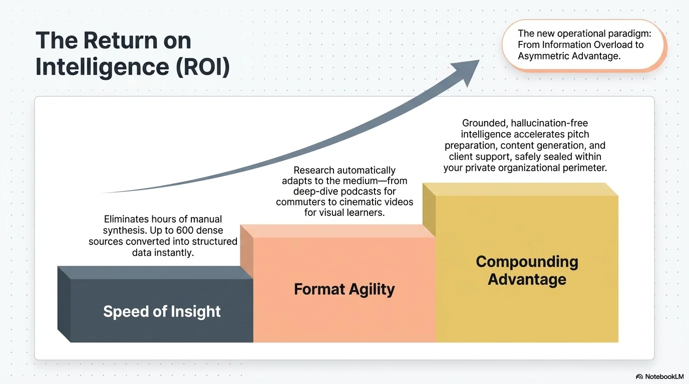

> [!TIP]
> This is a simplified preview. [View Full YAML](styles/smart_commerce.yaml)

```yaml
description: "A smart and innovative aesthetic designed for e-commerce strategies, digital growth agencies, and tech-forward business presentations. It features the powerful Heading Now typeface for titles to convey modern authority, paired with the technical precision of TT Firs Neue. Characterized by a palette of slate grey, soft peach, and mustard yellow, it utilizes abstract geometric shapes, modular grid layouts, and dot patterns to create a structured and innovative visual experience."
design_system:
  global_style:
    theme: "Smart Commerce. Innovative tech design with slate, peach, and mustard geometric accents."
    typography: 
      primary_heading: "Heading Now, bold"
      secondary_heading: "TT Firs Neue, bold"
      body_text: "TT Firs Neue, regular"
    color_palette:
      primary: "#455A64" # Slate Grey
      secondary: "#FFAB91" # Soft Peach
      background: "#FFFFFF" # Pure White
      surface: "#F5F5F5" # Light Grey Surface
      accent: "#FFCC80" # Soft Mustard
      text_main: "#263238" # Dark Charcoal
      text_secondary: "#546E7A" # Muted Slate
    key_visual_elements: 
      - "Abstract geometric shapes (triangles and semi-circles) in peach and mustard"
      - "Modular card layouts with deep slate grey headers"
      - "Subtle dot grid patterns as background textures"
      - "Clean business photography integrated into geometric containers"
      - "Pill-shaped call-to-action boxes with arrow icons"

  image_generation_prompts:
    style_guidelines: "Modern office environments, high-tech workspaces, digital marketing dashboards, slate and peach color palette, abstract geometric overlays, sharp and innovative, Heading Now font vibe."
    themes:
      - target: "E-Commerce Growth"
        prompt_elements: "Close up of a professional working on a laptop with a digital shop interface, abstract geometric shapes in the background, slate and peach tones, clean and sharp."
      - target: "Smart Innovation"
        prompt_elements: "A team brainstorming in a bright modern office with glass walls, geometric mustard and grey overlays, professional and tech-forward."

slide_layout_templates:
  - type: "Smart_Hero_Business"
    usage: "Large photo on the right with a slate grey floating card and bold white Heading Now title"
  - type: "ECommerce_Landscape_Grid"
    usage: "Technical overview with photos in geometric frames and mustard yellow bullet points"
  - type: "Competitive_Strengths_Cards"
    usage: "Grid of white cards with slate grey icons and peach accent borders"
  - type: "Approach_Methodology_Flow"
    usage: "Process flow using peach and mustard circles connected by thin slate lines"
```


#### Authentic Pasta

A rustic and artisanal aesthetic designed for gourmet pasta brands, traditional culinary markets, and premium food industry presentations. It features the bold Heading Now typeface for titles to convey a modern yet traditional feel, paired with the clean TT Firs Neue for body text. Characterized by a palette of terracotta red, dark olive green, and warm cream, it utilizes dark wood textures, hand-drawn botanical illustrations of fresh ingredients (tomatoes, basil, garlic), and circular food badges to create a rich and authentic culinary experience.

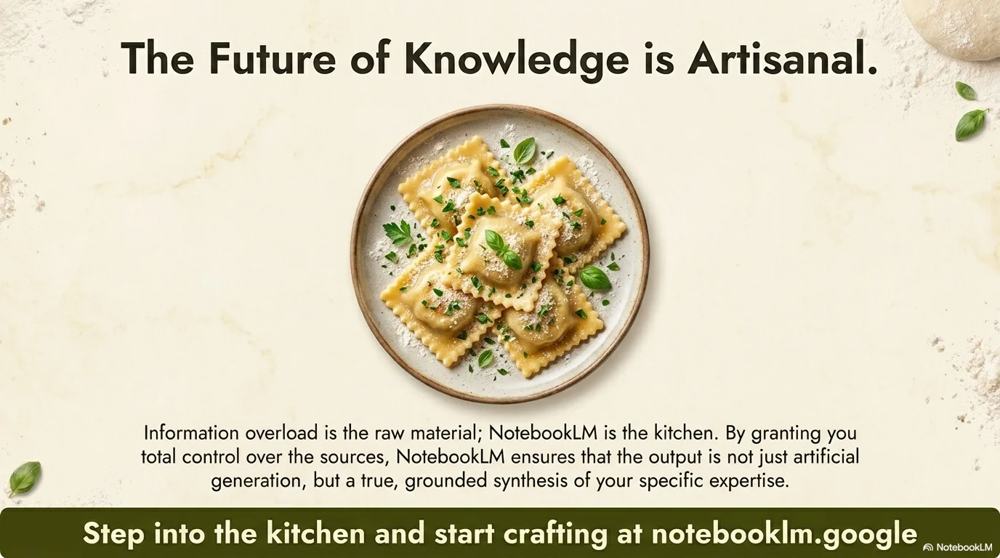

> [!TIP]
> This is a simplified preview. [View Full YAML](styles/authentic_pasta.yaml)

```yaml
description: "A rustic and artisanal aesthetic designed for gourmet pasta brands, traditional culinary markets, and premium food industry presentations. It features the bold Heading Now typeface for titles to convey a modern yet traditional feel, paired with the clean TT Firs Neue for body text. Characterized by a palette of terracotta red, dark olive green, and warm cream, it utilizes dark wood textures, hand-drawn botanical illustrations of fresh ingredients (tomatoes, basil, garlic), and circular food badges to create a rich and authentic culinary experience."
design_system:
  global_style:
    theme: "Authentic Pasta. Rustic culinary design with wood textures and botanical food illustrations."
    typography: 
      primary_heading: "Heading Now, bold"
      secondary_heading: "TT Firs Neue, bold"
      body_text: "TT Firs Neue, regular"
    color_palette:
      primary: "#B03A2E" # Tomato Red / Terracotta
      secondary: "#3E4637" # Dark Olive Green
      background: "#FEF9E7" # Warm Cream
      surface: "#797D7F" # Muted Wood Tone
      accent: "#7D6608" # Deep Moss Green
      text_main: "#1B2418" # Dark Green Text
      text_secondary: "#6E2C00" # Deep Earth Brown
    key_visual_elements: 
      - "Dark wood texture panels as background for primary headings"
      - "Detailed botanical illustrations of tomatoes, garlic, and fresh pasta as decorative overlays"
      - "Circular food badges and badges with pasta illustrations"
      - "Olive green horizontal highlight bands for content separation"
      - "Warm, textured photography of traditional pasta making"

  image_generation_prompts:
    style_guidelines: "Close up of fresh handmade pasta on a wooden table, scattered flour, fresh basil and tomatoes, dark wood textures, warm lighting, botanical illustrations, Heading Now font vibe."
    themes:
      - target: "Artisanal Pasta Making"
        prompt_elements: "Hands kneading dough on a rustic wooden surface, scattered flour, egg yolk, warm atmospheric lighting, high-end food photography."
      - target: "Italian Ingredients"
        prompt_elements: "A flat lay of fresh tomatoes, garlic bulbs, and basil leaves on a cream textured background, botanical illustration style, organic and rich."

slide_layout_templates:
  - type: "Pasta_Hero_Wood"
    usage: "Large dark wood panel in the center with bold white Heading Now title, surrounded by botanical illustrations"
  - type: "Culinary_Vision_Mission"
    usage: "Split layout with a warm food photo and cream text cards with olive green headers"
  - type: "Product_Showcase_Circles"
    usage: "Grid of circular food photos on a cream background with botanical overlays"
  - type: "Thank_You_Culinary"
    usage: "Contact details centered on a cream background with ravioli illustrations and olive green footer"
```


#### Marine Harvest

A professional and marine-inspired aesthetic designed for sustainable seafood brands, ocean conservation projects, and premium seafood industry presentations. It features the wide and modern Agrandir typeface for titles to convey strength and scale, paired with the versatile Poppins for body text. Characterized by a palette of deep ocean blue, bright coral orange, and sandy beige, it utilizes water textures, hand-drawn seafood sketches (lobsters, shrimp, fish), and wavy shapes to create a fresh and trustworthy marine experience.

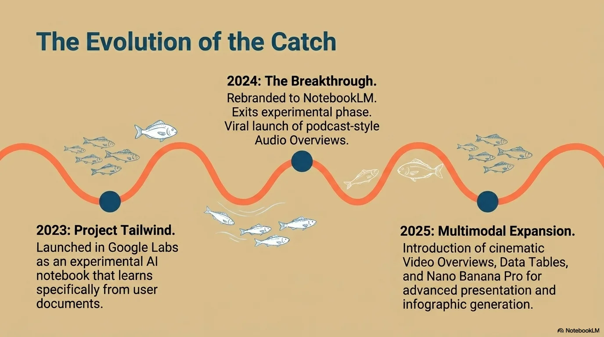

> [!TIP]
> This is a simplified preview. [View Full YAML](styles/marine_harvest.yaml)

```yaml
description: "A professional and marine-inspired aesthetic designed for sustainable seafood brands, ocean conservation projects, and premium seafood industry presentations. It features the wide and modern Agrandir typeface for titles to convey strength and scale, paired with the versatile Poppins for body text. Characterized by a palette of deep ocean blue, bright coral orange, and sandy beige, it utilizes water textures, hand-drawn seafood sketches (lobsters, shrimp, fish), and wavy shapes to create a fresh and trustworthy marine experience."
design_system:
  global_style:
    theme: "Marine Harvest. Sustainable seafood design with ocean textures and coral orange accents."
    typography: 
      primary_heading: "Agrandir, bold"
      secondary_heading: "Poppins, bold"
      body_text: "Poppins, regular"
    color_palette:
      primary: "#01345B" # Deep Ocean Blue
      secondary: "#FF5700" # Bright Coral Orange
      background: "#FFFFFF" # Pure White
      surface: "#EDE0D4" # Sandy Beige Surface
      text_main: "#01345B" # Deep Blue Text
      text_secondary: "#546E7A" # Muted Slate
    key_visual_elements: 
      - "Deep blue ocean wave textures as background for cover slides"
      - "Minimalist hand-drawn sketches of lobsters, shrimp, and fish in white and light blue"
      - "Bright coral orange highlight boxes for important calls to action"
      - "Sandy beige surface panels for text-heavy content"
      - "Fluid, wavy shapes for photo containers and section transitions"

  image_generation_prompts:
    style_guidelines: "Fresh seafood paella in a rustic pan, ocean water textures, bright coral orange accents, sandy beige backgrounds, hand-drawn seafood sketches, soft natural light, Agrandir font vibe."
    themes:
      - target: "Premium Seafood"
        prompt_elements: "A variety of fresh seafood on ice, bright natural light, ocean blue and coral accents, high-end food industry photography, fresh and crisp."
      - target: "Sustainable Fishing"
        prompt_elements: "A professional fisherman at sea with a net, blue ocean waves, bright daylight, sustainable and high quality atmosphere."

slide_layout_templates:
  - type: "Seafood_Hero_Wave"
    usage: "Full-bleed ocean wave background with a deep blue floating card and bold white Agrandir title"
  - type: "About_Sustainable_Marine"
    usage: "Split layout with a sandy beige panel and a large seafood photo with a wavy border"
  - type: "Marine_Opportunity_Cards"
    usage: "Grid of orange cards with white seafood icons and deep blue text descriptions"
  - type: "Thank_You_Ocean"
    usage: "Contact details centered on a sandy beige background with large lobster sketches and orange footer"
```

---


### ✨ Minimalist & Modern

#### Geometric Mono

Professional, architectural, and monochromatic design. It uses a strong grayscale palette with geometric shapes and high-contrast photography to convey precision, structure, and corporate excellence.

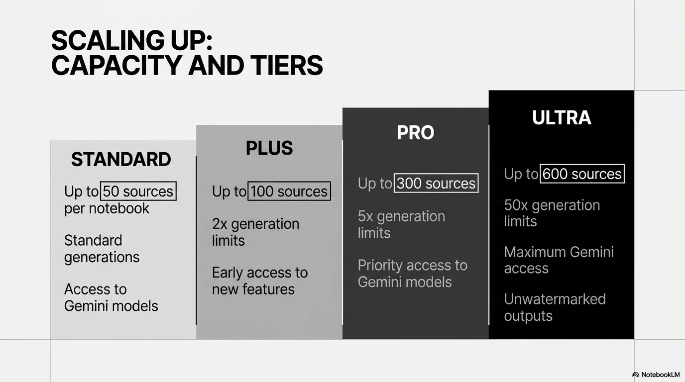

> [!TIP]
> This is a simplified preview. [View Full YAML](styles/geometric_mono.yaml)

```yaml
design_system:
  global_style:
    theme: "Professional, architectural, and monochromatic. Precision and structure."
    typography: 
      primary_heading: "Bold geometric sans-serif (e.g., Montserrat), uppercase"
      secondary_heading: "Medium weight sans-serif, clean"
      body_text: "Functional sans-serif, high contrast"
    color_palette:
      primary_color: "#FFFFFF"
      background: "#E0E0E0"
      text_main: "#000000"
      accent_color: "#333333"
    key_visual_elements: 
      - "High-contrast architectural grayscale photography"
      - "Diagonals and geometric color blocks"
      - "Circular icons with thin white outlines"

slide_layout_templates:
  - type: "Corporate_Summary"
    usage: "Executive summary or project overview"
  - type: "Geometric_Split"
    usage: "Comparing data or value propositions"
  - type: "Architectural_Timeline"
    usage: "Visualizing project phases or milestones"
```

#### Lush Minimal

Nature-inspired, organic, and soft design. It focuses on botanical imagery, sage greens, and large rounded corners to create a peaceful yet professional atmosphere.

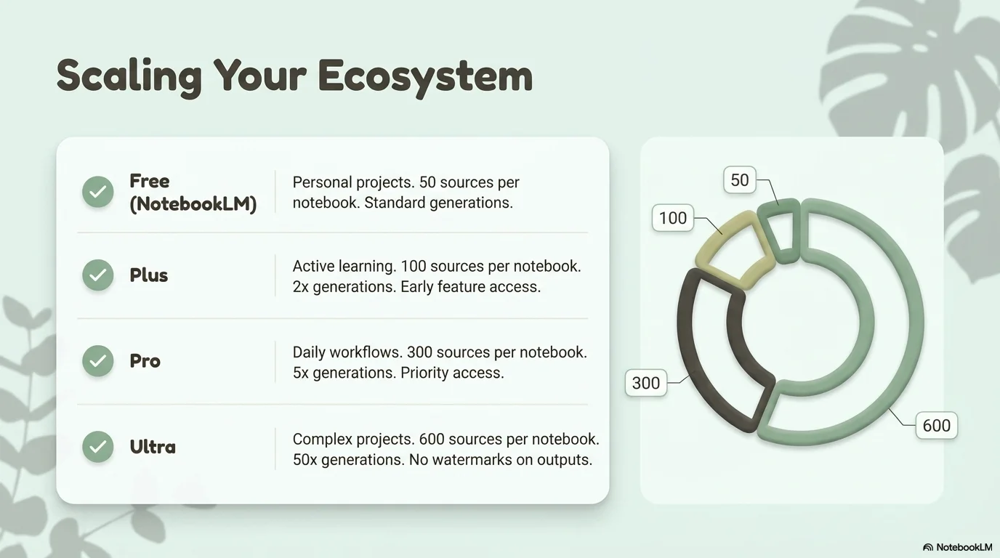

> [!TIP]
> This is a simplified preview. [View Full YAML](styles/lush_minimal.yaml)

```yaml
design_system:
  global_style:
    theme: "Nature-inspired, organic, and soft. Botanical focus."
    typography: 
      primary_heading: "Bold rounded sans-serif (e.g., Lexend)"
      secondary_heading: "Regular weight sans-serif"
      body_text: "Clean sans-serif with generous spacing"
    color_palette:
      primary_color: "#4A4A4A"
      background: "#F5F7F5"
      text_main: "#4A4A4A"
      accent_color: "#7A906E"
    key_visual_elements: 
      - "Botanical photography (monstera, succulents)"
      - "Large rounded corners (24px+)"
      - "Soft, subtle drop shadows"

slide_layout_templates:
  - type: "Botanical_Split"
    usage: "Intro slides or service highlights"
  - type: "Organic_Goals"
    usage: "Presenting multiple points or objectives"
  - type: "Sage_Data"
    usage: "Presenting metrics or growth"
```

#### Structured Mint

Professional, structured, and refreshing corporate design. Features distinctive tiered corner frames in mint green and dark teal, offering a clean and organized frame for business presentations.

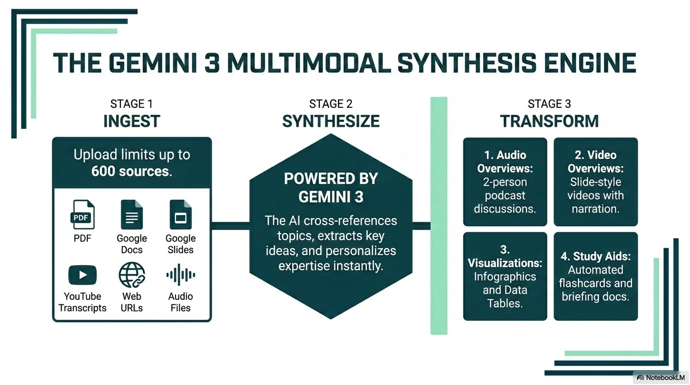

> [!TIP]
> This is a simplified preview. [View Full YAML](styles/structured_mint.yaml)

```yaml
design_system:
  global_style:
    theme: "Corporate, structured, and refreshing. Tiered corner frames and mint accents."
    typography: 
      primary_heading: "Bold geometric sans-serif (e.g., Montserrat), uppercase"
      secondary_heading: "Medium sans-serif, clean"
      body_text: "Functional sans-serif, optimized for readability"
    color_palette:
      primary_color: "#557A68"
      background: "#FFFFFF"
      accent_mint: "#B2EBF2"
      text_main: "#263238"
    key_visual_elements: 
      - "Tiered corner frames (Mint and Teal accents)"
      - "Pill-shaped category tags"
      - "Numbered grid boxes"
      - "Vertical mint-green accent bars"

slide_layout_templates:
  - type: "Structured_Cover"
    usage: "Impactful intro with tiered frames"
  - type: "Grid_Methodology"
    usage: "Listing steps or structured points"
  - type: "Content_Focus_Split"
    usage: "Image and text side-by-side"
```


#### Frosted Luxury

A sophisticated and high-end minimalist aesthetic inspired by luxury fragrance advertising. It features the refined Arial Nova typeface, a warm palette of beige and charcoal, and airy layouts with ample negative space. Characterized by frosted glass effects, high-fashion photography, and elegant thin borders, it conveys exclusivity and timeless elegance.

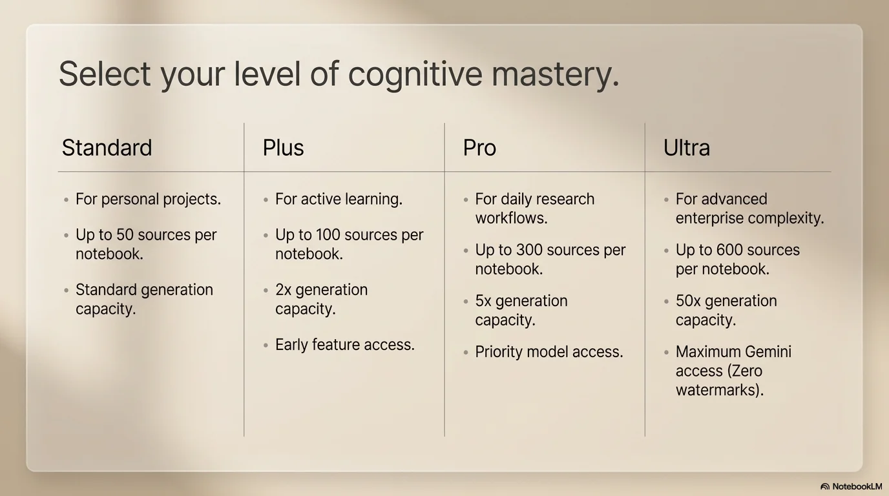

> [!TIP]
> This is a simplified preview. [View Full YAML](styles/frosted_luxury.yaml)

```yaml
description: "A sophisticated and high-end minimalist aesthetic inspired by luxury fragrance advertising. It features the refined Arial Nova typeface, a warm palette of beige and charcoal, and airy layouts with ample negative space. Characterized by frosted glass effects, high-fashion photography, and elegant thin borders, it conveys exclusivity and timeless elegance."
design_system:
  global_style:
    theme: "Frosted Luxury. High-end minimalist style with warm beige tones and editorial layouts."
    typography: 
      primary_heading: "Arial Nova, sans-serif"
      secondary_heading: "Arial Nova, light"
      body_text: "Arial Nova, regular"
    color_palette:
      primary: "#333333" # Stone Charcoal
      secondary: "#A8A29E" # Warm Taupe
      background: "#F5F2ED" # Warm Sand Beige
      surface: "#FFFFFF" # Bone White
      text_main: "#1C1917"
      text_secondary: "#57534E"
    key_visual_elements: 
      - "Frosted glass (blur) overlays for sections"
      - "High-end minimalist product photography"
      - "Large negative space areas to create an 'airy' feel"
      - "Elegant 1px thin grey borders and dividers"

  image_generation_prompts:
    style_guidelines: "Luxury editorial photography, soft natural lighting, frosted glass textures, minimalist product staging, warm beige and neutral color grading, high-end fashion aesthetic, Arial Nova font vibe."
    themes:
      - target: "Visual Inspiration"
        prompt_elements: "Close-up of a glass perfume bottle with soft shadows, beige background, frosted glass texture, minimalist and elegant."
      - target: "Brand Messaging"
        prompt_elements: "Minimalist interior with a single design object, soft sunlight, neutral tones, high-end editorial feel."

slide_layout_templates:
  - type: "Luxury_Title"
    usage: "Large refined title on a sand background with a high-end product shot on the left"
  - type: "Editorial_Agenda"
    usage: "Numbered list with wide line-height and plenty of white space"
  - type: "Frosted_Concept"
    usage: "Image with a frosted glass overlay containing brief descriptive text"
  - type: "Minimalist_Metrics"
    usage: "Clean data points inside rounded white pills with thin grey borders"
```


#### Learning Time

A structured and friendly educational aesthetic designed for learning environments, step-by-step guides, and data visualization. It features the soft geometric Aristotelica Pro typeface. Characterized by a palette of sky blue, emerald green, and coral orange on cream backgrounds, it uses grained textures, clock icons, and Venn-diagram-inspired lists to create a clear, professional, and engaging instructional atmosphere.

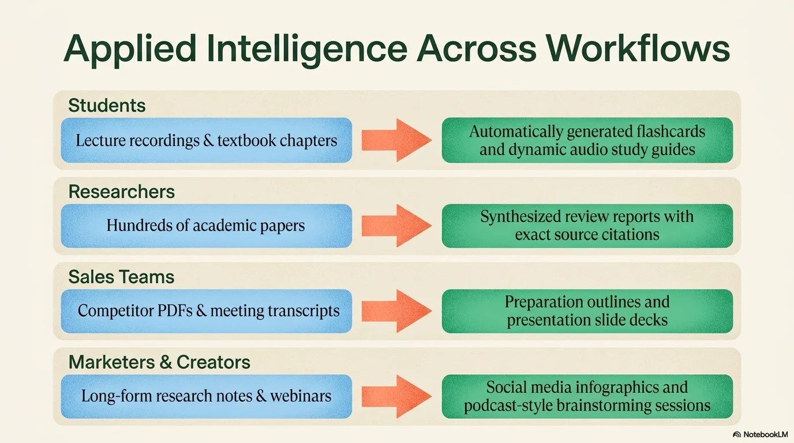

> [!TIP]
> This is a simplified preview. [View Full YAML](styles/learning_time.yaml)

```yaml
description: "A structured and friendly educational aesthetic designed for learning environments, step-by-step guides, and data visualization. It features the soft geometric Aristotelica Pro typeface. Characterized by a palette of sky blue, emerald green, and coral orange on cream backgrounds, it uses grained textures, clock icons, and Venn-diagram-inspired lists to create a clear, professional, and engaging instructional atmosphere."
design_system:
  global_style:
    theme: "Learning Time. Structured and friendly design for educational and instructional content."
    typography: 
      primary_heading: "Aristotelica Pro, sans-serif"
      secondary_heading: "Aristotelica Pro, bold"
      body_text: "Aristotelica Pro, regular"
    color_palette:
      primary: "#4CAF50" # Emerald Green
      secondary: "#FF8A65" # Coral Orange
      background: "#FFF9C4" # Soft Cream
      surface: "#BBDEFB" # Sky Blue Surface
      text_main: "#1B5E20" # Dark Green for body text
      text_secondary: "#E64A19" # Deep Orange for emphasis
    key_visual_elements: 
      - "Shapes with grained/noisy textures (circles, fans, semicircles)"
      - "Instructional icons like hourglasses, clocks, and calendars"
      - "List items with overlapping circular bullets (Venn diagram style)"
      - "Balanced layouts with clear visual hierarchy and instructional focus"

  image_generation_prompts:
    style_guidelines: "Educational and clean aesthetic, sky blue and emerald green palette, grained texture shapes, hourglass and clock icons, Aristotelica Pro font vibe, master-class atmosphere."
    themes:
      - target: "Lesson Introduction"
        prompt_elements: "A modern hourglass with green sand, soft grainy textures in the background, sky blue and cream palette, clean and professional."
      - target: "Concept Diagram"
        prompt_elements: "Abstract geometric shapes with noise texture, overlapping circles, educational and balanced composition."

slide_layout_templates:
  - type: "Instructional_Cover"
    usage: "Title in Aristotelica Pro over a large textured fan shape in coral and green"
  - type: "Venn_List_Slide"
    usage: "A vertical list where each bullet point is composed of two overlapping textured circles"
  - type: "Time_Metric_Highlight"
    usage: "Large clock icons used to highlight specific metrics or time durations"
  - type: "Summary_Grid"
    usage: "A clean 2x2 or 3x1 grid with light blue backgrounds and dark green text for summaries"
```


#### Slow Living

A premium and sophisticated aesthetic based on the 'Slow Living' movement. It uses the modern Open Sauce sans-serif to create a minimalist editorial look. Characterized by deep navy blue, pure white, and muted earthy browns, it features high-contrast split-screen layouts and macro photography focus to convey calmness, mindfulness, and a high-end lifestyle vibe.

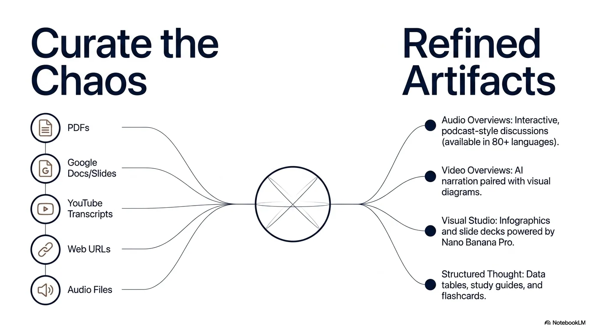

> [!TIP]
> This is a simplified preview. [View Full YAML](styles/slow_living.yaml)

```yaml
description: "A premium and sophisticated aesthetic based on the 'Slow Living' movement. It uses the modern Open Sauce sans-serif to create a minimalist editorial look. Characterized by deep navy blue, pure white, and muted earthy browns, it features high-contrast split-screen layouts and macro photography focus to convey calmness, mindfulness, and a high-end lifestyle vibe."
design_system:
  global_style:
    theme: "Slow Living. Minimalist editorial design with macro photography and high-contrast layouts."
    typography: 
      primary_heading: "Open Sauce, sans-serif"
      secondary_heading: "Open Sauce, bold"
      body_text: "Open Sauce, regular"
    color_palette:
      primary: "#0D47A1" # Deep Navy
      secondary: "#8D6E63" # Muted Earthy Brown
      background: "#FFFFFF" # Pure White
      surface: "#F5F5F5" # Light Gray Surface
      text_main: "#1A1A1A" # Near Black
      text_secondary: "#0D47A1"
    key_visual_elements: 
      - "Bold split-screen layouts (half photo / half color or text)"
      - "Emphasis on high-quality macro photography (nature, textures, daily moments)"
      - "Oversized, clean typography with generous letter spacing and line height"
      - "Minimalist UI elements like thin lines and small circular call-to-action buttons"

  image_generation_prompts:
    style_guidelines: "Minimalist editorial photography, macro focus on a snail or plant, high contrast, deep navy and white palette, Open Sauce font vibe, premium and calm 'slow living' atmosphere."
    themes:
      - target: "The Essence of Slowing Down"
        prompt_elements: "Macro photography of a snail on a leaf, soft focus background, deep navy blue overlay on one side, minimalist and high-end."
      - target: "Daily Rituals"
        prompt_elements: "A person holding a ceramic cup in warm sunlight, muted earthy tones, clean white space, professional editorial look."

slide_layout_templates:
  - type: "Macro_Title"
    usage: "Large bold title in Open Sauce on a white background, balanced by a full-height macro photo on the right"
  - type: "Split_Insight"
    usage: "Left side is a solid deep navy block with a single point; right side is a macro photo of nature"
  - type: "Minimalist_Grid"
    usage: "Small icons and short text descriptions with massive white space around them"
  - type: "Editorial_Quote"
    usage: "A large quote in Open Sauce bold that takes up 70% of the slide, with a tiny reference at the bottom"
```


#### Luxe Marble

An ultra-premium and ethereal aesthetic inspired by the purity of white marble and the softness of fine silk. It features the elegant Tenor Sans typeface, which brings a timeless, high-fashion clarity to every slide. Characterized by a palette of bone white, platinum silver, and soft mineral greys, it uses airy layouts and subtle light reflections to create an atmosphere of absolute luxury, exclusivity, and diamond-cut precision.

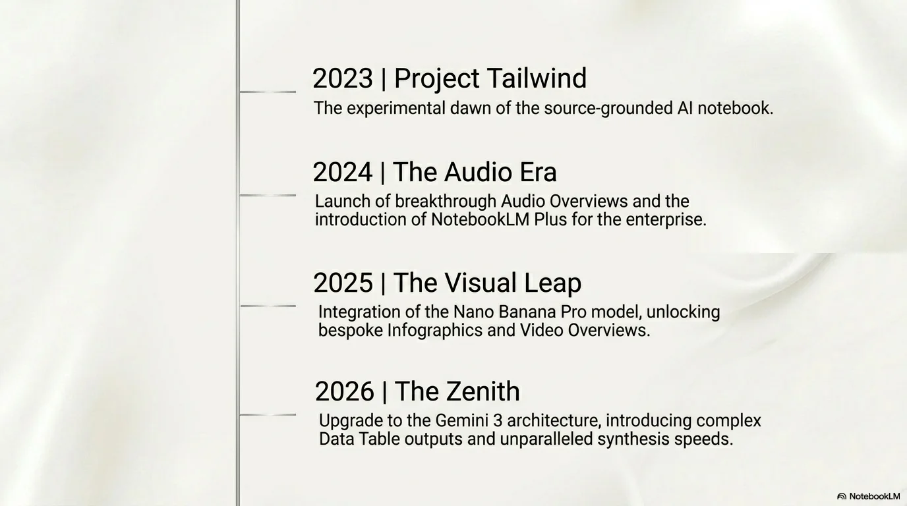

> [!TIP]
> This is a simplified preview. [View Full YAML](styles/luxe_marble.yaml)

```yaml
description: "An ultra-premium and ethereal aesthetic inspired by the purity of white marble and the softness of fine silk. It features the elegant Tenor Sans typeface, which brings a timeless, high-fashion clarity to every slide. Characterized by a palette of bone white, platinum silver, and soft mineral greys, it uses airy layouts and subtle light reflections to create an atmosphere of absolute luxury, exclusivity, and diamond-cut precision."
design_system:
  global_style:
    theme: "Luxe Marble. High-end minimalist design with marble textures and silk-smooth layouts."
    typography: 
      primary_heading: "Tenor Sans, sans-serif"
      secondary_heading: "Tenor Sans, regular"
      body_text: "Tenor Sans, light"
    color_palette:
      primary: "#1A1A1A" # Obsidian Black (Accents)
      secondary: "#A1A1AA" # Platinum Silver
      background: "#F9F9F7" # Bone White
      surface: "#FFFFFF" # Pure Silk White
      text_main: "#1A1A1A"
      text_secondary: "#71717A"
    key_visual_elements: 
      - "Subtle white marble vein patterns in background layers"
      - "Silk-like cloth textures with soft shadows and highlights"
      - "Diamond-cut geometric framing (thin 0.5px lines)"
      - "Ample negative space to convey a sense of 'expensive' minimalism"

  image_generation_prompts:
    style_guidelines: "Luxury editorial photography, soft ethereal lighting, white marble and silk textures, diamond-cut precision, bone white and platinum palette, Tenor Sans font vibe."
    themes:
      - target: "The Essence of Luxury"
        prompt_elements: "Close-up of white silk fabric rippling over a marble surface, soft natural light, ethereal and high-end."
      - target: "Architectural Precision"
        prompt_elements: "A minimalist luxury interior with white stone walls and silver accents, clean lines, serene and exclusive atmosphere."

slide_layout_templates:
  - type: "Marble_Title"
    usage: "Elegant Tenor Sans title centered on a white silk texture background with a thin silver border"
  - type: "Silk_TOC"
    usage: "A clean, airy list with wide line spacing and a subtle marble vein running diagonally"
  - type: "Diamond_Grid"
    usage: "A 2x2 grid where each quadrant is separated by 0.5px silver lines, featuring minimalist product shots"
  - type: "Ethereal_Quote"
    usage: "Large quote in Tenor Sans light over a blurred white mineral background to emphasize vision"
```

---


### 🎨 Creative & Playful

#### Creative Spark

Vibrant, creative, and high-impact design. Uses a deep dark canvas with neon purple accents, combining elegant script typography with bold, heavy block fonts for maximum contrast.

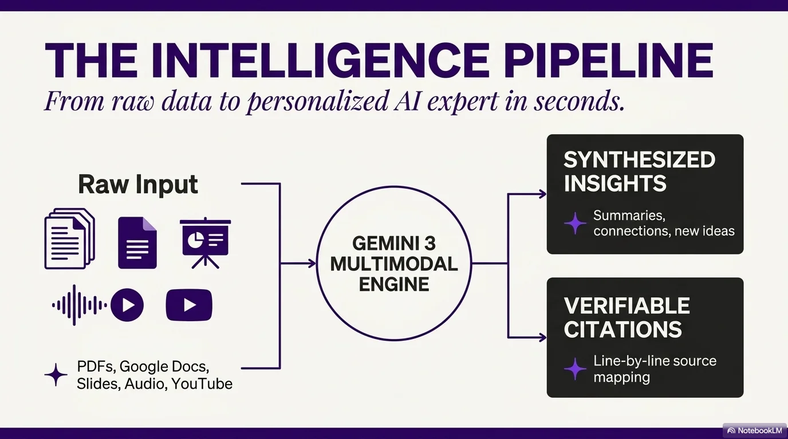

> [!TIP]
> This is a simplified preview. [View Full YAML](styles/creative_spark.yaml)

```yaml
design_system:
  global_style:
    theme: "Vibrant, creative, and high-impact. Dark canvas with neon purple accents."
    typography: 
      primary_heading: "Bold heavy sans-serif (e.g., Montserrat Black)"
      accent_heading: "Elegant cursive script (e.g., Great Vibes)"
      body_text: "Clean modern sans-serif"
    color_palette:
      primary_color: "#B18CFF"
      background: "#0F0F0F"
      text_main: "#FFFFFF"
    key_visual_elements: 
      - "Four-pointed sparkle icons"
      - "Thick vertical color blocks on edges"
      - "High-contrast tables"

slide_layout_templates:
  - type: "Cover_Spark"
    usage: "High-impact opening slide"
  - type: "Stitched_Portfolio"
    usage: "Showcasing multiple works or images"
  - type: "Impact_Results_Table"
    usage: "Presenting data with high contrast"
```

#### Artisan Rust

Warm, handcrafted, and organic design. Uses a textured rust-colored background with hand-drawn white doodles and tall condensed typography for an artisan feel.

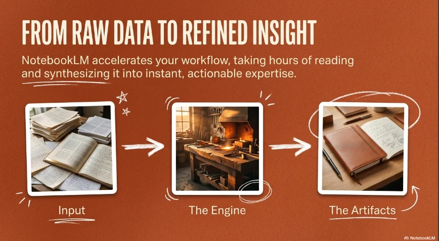

> [!TIP]
> This is a simplified preview. [View Full YAML](styles/artisan_rust.yaml)

```yaml
design_system:
  global_style:
    theme: "Warm, handcrafted, and organic. Textured rust canvas with hand-drawn doodles."
    typography: 
      primary_heading: "Tall condensed sans-serif (e.g., Anton)"
      secondary_heading: "Clean minimal sans-serif"
      body_text: "Functional sans-serif"
    color_palette:
      primary_color: "#FFFFFF"
      background: "#B34D2E"
      text_main: "#F5F5DC"
    key_visual_elements: 
      - "Hand-drawn white doodles"
      - "Grainy paper texture"
      - "Sticker-style image cutouts"

slide_layout_templates:
  - type: "Artisan_Portfolio"
    usage: "Showcasing projects with a handcrafted vibe"
  - type: "Process_Timeline"
    usage: "Visualizing steps or history"
  - type: "Sticker_Callout"
    usage: "Focusing on a specific person or object"
```

#### Vintage Charm

Romantic, nostalgic, and layered design inspired by coquette and scrapbooking aesthetics. It uses pastel tones, torn paper textures, and elegant accents like bows and pearls for a high-jewelry, vintage feel.

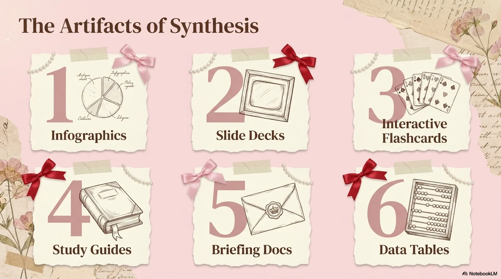

> [!TIP]
> This is a simplified preview. [View Full YAML](styles/vintage_charm.yaml)

```yaml
design_system:
  global_style:
    theme: "Romantic, nostalgic, and layered. Vintage scrapbook aesthetic."
    typography: 
      primary_heading: "Elegant vintage serif (e.g., Playfair Display)"
      secondary_heading: "Soft serif or clean traditional sans"
      body_text: "Functional serif with a classic feel"
    color_palette:
      primary_color: "#E67E7E"
      background: "#F8E1E1"
      text_main: "#4A3B3B"
      accent_color: "#D2C1A5"
    key_visual_elements: 
      - "Pink/Red ribbons and bows"
      - "Torn paper edges and layered textures"
      - "Vintage illustrations (floral/portraits)"
      - "Washi tape and pearls"

slide_layout_templates:
  - type: "Scrapbook_Header"
    usage: "Dynamic intro or section transitions"
  - type: "Layered_Referents"
    usage: "Showcasing aesthetic or historical references"
  - type: "Numbered_Vintage_Grid"
    usage: "Listing steps, characteristics, or points"
```

#### Creative Notebook

A clean, academic yet playful design inspired by creative journals and student notebooks. It features a graph paper grid background, organic pastel blobs in peach and blue, and numbered list elements for a highly organized yet aesthetic presentation feel.

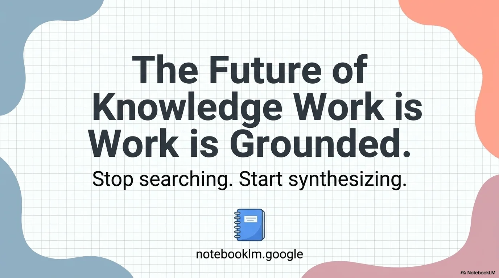

> [!TIP]
> This is a simplified preview. [View Full YAML](styles/creative_notebook.yaml)

```yaml
design_system:
  global_style:
    theme: "Creative, academic-journalistic, and organized. Scrapbook aesthetic with grid textures and organic pastel shapes."
    typography: 
      primary_heading: "Bold, clean sans-serif, primarily sentence case"
      secondary_heading: "Medium weight sans-serif"
      body_text: "Clean, highly legible sans-serif, airy spacing"
    color_palette:
      primary_color: "#FAD9C5"
      background: "White with light gray grid and organic pastel blobs"
      text_main: "#333333"
      accent_color: "#D1E3E9"
    key_visual_elements: 
      - "Graph paper/grid background pattern"
      - "Organic pastel blobs (Peach, Blue, Pink)"
      - "Numbered list items in colored circles"
      - "Post-it note elements with paperclips"

slide_layout_templates:
  - type: "Cover_Journal"
    usage: "Impactful intro with grid and organic framing"
  - type: "Horizontal_Cards"
    usage: "Presenting mission, vision, or core objectives"
  - type: "Sticker_Note_Split"
    usage: "Idea origin or highlighted conceptual points"
```

#### Kawaii Playful

Playful, friendly, and ultra-cute 'Kawaii' aesthetic. Combines soft pastel colors with chubby cat character illustrations, hand-drawn stars, and notebook-style grid backgrounds.

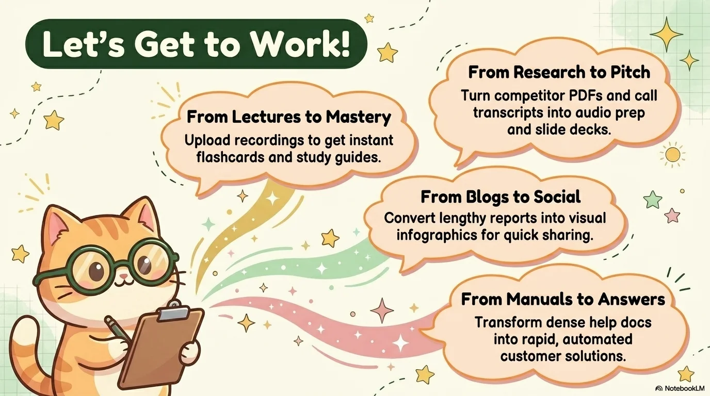

> [!TIP]
> This is a simplified preview. [View Full YAML](styles/kawaii_playful.yaml)

```yaml
design_system:
  global_style:
    theme: "Playful, friendly, and ultra-cute 'Kawaii' aesthetic."
    typography: 
      primary_heading: "Super-bold rounded bubble font (e.g., DynaPuff)"
      secondary_heading: "Clean, rounded sans-serif"
      body_text: "Friendly rounded sans-serif"
    color_palette:
      primary_color: "#4B6B4C"
      background: "#F7F8E0"
      accent_rose: "#F48FB1"
    key_visual_elements: 
      - "Chibi/Kawaii cat character illustrations"
      - "Subtle green notebook-style grid patterns"
      - "Pill-shaped containers for labels"
      - "Hand-drawn doodles (stars, sparkles)"

slide_layout_templates:
  - type: "Creative_Brainstorm"
    usage: "Opening slide for workshops"
  - type: "Strategic_Play"
    usage: "Outlining goals or objectives"
```

#### Y2K Nostalgia

Bubblegum pop, iridescent textures, and early digital nostalgia. Features CD-ROM reflections, fluffy clouds, and 3D 'plastic' icons (gummy bears, hearts, cupids) on pastel gradients.

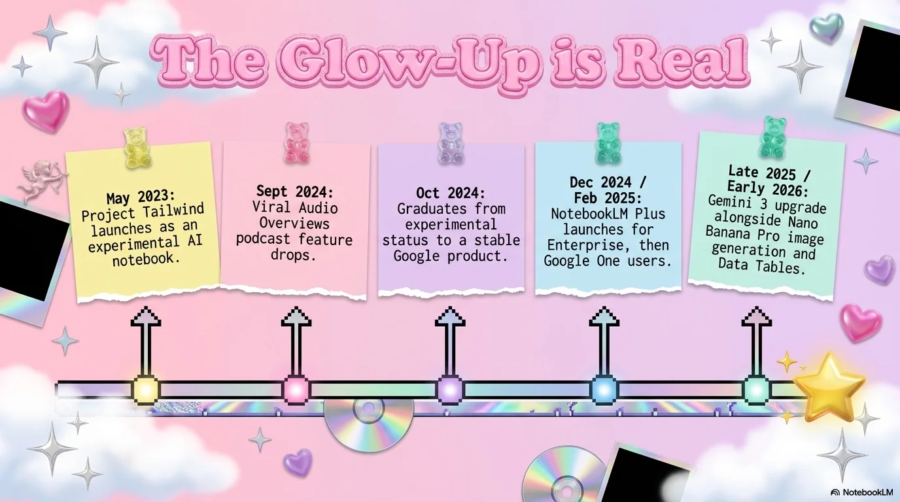

> [!TIP]
> This is a simplified preview. [View Full YAML](styles/y2k_nostalgia.yaml)

```yaml
design_system:
  global_style:
    theme: "Retro Digital. Bubblegum & Holographic."
    typography: 
      primary_heading: "Bold quirky block letters"
      secondary_heading: "Pixellated or typewriter monospace"
      body_text: "Clean legible monospace (e.g., Courier New)"
    color_palette:
      primary_color: "#FF85A1"
      background: "#FDEFF4"
      accent_purple: "#B19CD9"
    key_visual_elements: 
      - "CD-ROM rainbow reflections"
      - "Holographic/Iridescent textures"
      - "3D plastic gummy bears and icons"
      - "Polaroid photo frames"

slide_layout_templates:
  - type: "Pop_Culture_Hero"
    usage: "Dynamic titles or mood setters"
  - type: "Digital_Dairy"
    usage: "Storytelling or personal anecdotes"
  - type: "Memory_Gallery"
    usage: "Photos or event highlights"
```

#### Creative Workshop

Artistic, youthful, and workshop-oriented design. Features notebook grid backgrounds, pastel pink wavy accents, and friendly 2D art supply doodles (pencils, rainbows, stars).

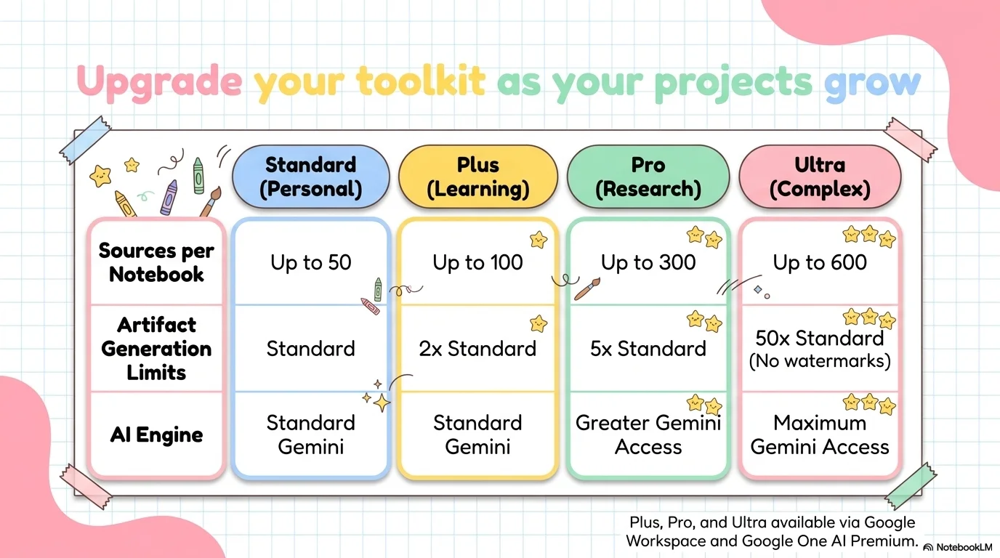

> [!TIP]
> This is a simplified preview. [View Full YAML](styles/creative_workshop.yaml)

```yaml
design_system:
  global_style:
    theme: "Art Studio. Creative & Playful."
    typography: 
      primary_heading: "Bold blocky sans-serif (Multi-color)"
      secondary_heading: "Rounded friendly sans-serif"
      body_text: "Clean legible sans-serif"
    color_palette:
      primary_color: "#F48FB1"
      background: "#FFFFFF"
      grid_lines: "#E1F5FE"
    key_visual_elements: 
      - "Ruled background textures"
      - "Organic wavy pink blobs"
      - "Smiling art supply illustrations"
      - "Pill-shaped category tags"

slide_layout_templates:
  - type: "Workshop_Hero"
    usage: "Project titles or starters"
  - type: "Activity_Grid"
    usage: "Listing activities or topics"
  - type: "Showcase_Gallery"
    usage: "Highlighting events or work"
```

#### Creative Classroom

Playful, warm, and educational design. Inspired by primary school classrooms and hand-drawn doodle aesthetics. Features soft cream backgrounds, chalkboard content frames, and flat 2D illustrations of classroom objects.

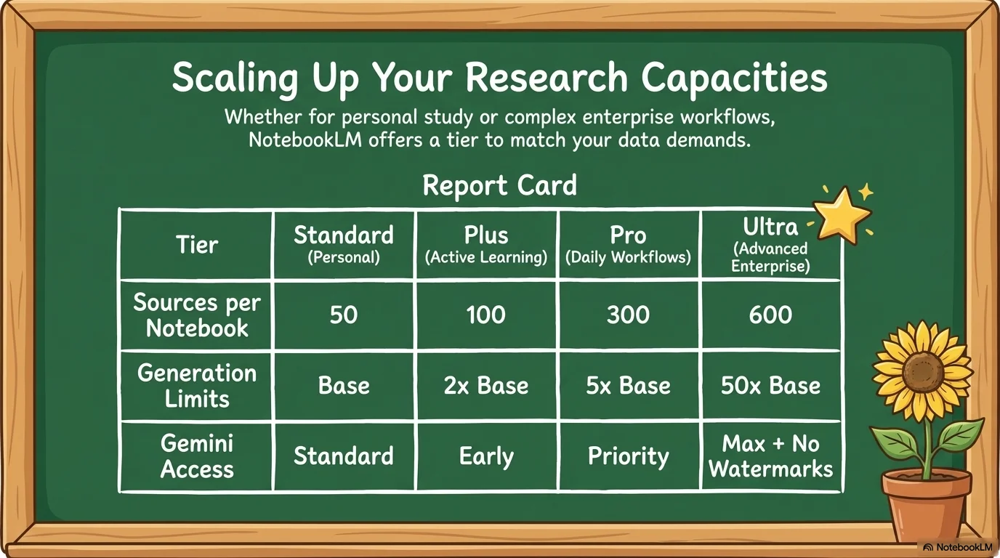

> [!TIP]
> This is a simplified preview. [View Full YAML](styles/creative_classroom.yaml)

```yaml
design_system:
  global_style:
    theme: "Playful educational. Classroom & Doodles."
    typography: 
      primary_heading: "Hand-drawn bold sans-serif (e.g., Fredoka One)"
      secondary_heading: "Rounded friendly sans-serif"
      body_text: "Clean legible sans-serif"
    color_palette:
      primary_color: "#557A68"
      background: "#FFF9E6"
      accent_wood: "#C4A484"
    key_visual_elements: 
      - "Chalkboard-themed content frames"
      - "Flat, 2D vector illustrations (globes, books)"
      - "ABC alphabet blocks"
      - "Irregular hand-drawn edges"

slide_layout_templates:
  - type: "Classroom_Hero"
    usage: "Main title or module introductions"
  - type: "Informational_Board"
    usage: "Core lesson content or discussion"
  - type: "Object_Focus_Detail"
    usage: "Summaries or conceptual focuses"
```


#### Hand-Drawn Scrapbook

A whimsical, Kawaii-inspired aesthetic characterized by soft pastel palettes, hand-drawn stickers, and a playful gingham grid. Perfect for educational projects, creative journals, or friendly presentations.

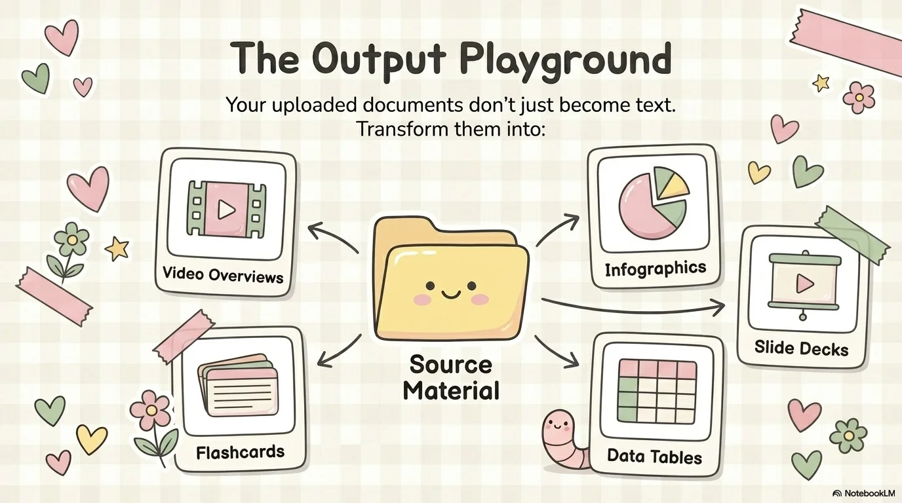

> [!TIP]
> This is a simplified preview. [View Full YAML](styles/hand_drawn_scrapbook.yaml)

```yaml
description: "A whimsical, Kawaii-inspired aesthetic characterized by soft pastel palettes, hand-drawn stickers, and a playful gingham grid. Perfect for educational projects, creative journals, or friendly presentations."
design_system:
  global_style:
    theme: "Whimsical, Kawaii-inspired aesthetic. Soft pastel palettes, hand-drawn stickers, and a playful gingham grid."
    typography: 
      primary_heading: "Baloo Thambi 2, display"
      secondary_heading: "Rounded friendly sans-serif"
      body_text: "Inter, sans-serif"
    color_palette:
      primary_color: "#A2B276"
      background: "#FDFCF0"
      accent_pink: "#F9A8A8"
      accent_yellow: "#F9D97D"
      text_main: "#4A4A4A"
    key_visual_elements: 
      - "Subtle gingham grid in pastel hues"
      - "Doodle flowers, Soft hearts, Friendly worm"
      - "Washi tape ribbon banners"
      - "Hand-drawn, slightly irregular strokes"

  image_generation_prompts:
    style_guidelines: "Whimsical hand-drawn illustrations, flat vector art, sticker aesthetic, Kawaii style, pastel colors, 2D illustration."
    themes:
      - target: "Creative Student"
        prompt_elements: "A person writing in a colorful journal with stickers and doodles, flat vector art."

slide_layout_templates:
  - type: "Sticker_Hero"
    usage: "Title slide with floating decorative elements and center title"
  - type: "Washi_Team"
    usage: "Team members showcased with ribbon-style name tags"
  - type: "Doodle_Grid"
    usage: "Content organized in rounded 'bento' boxes with hand-drawn borders"
```


#### Whimsical Animation

A sophisticated, animation-inspired portfolio aesthetic. It features a lush palette of forest and lime greens, modern geometric typography, and painterly gouache textures. Ideal for creative professionals looking for a whimsical yet high-end presentation style.

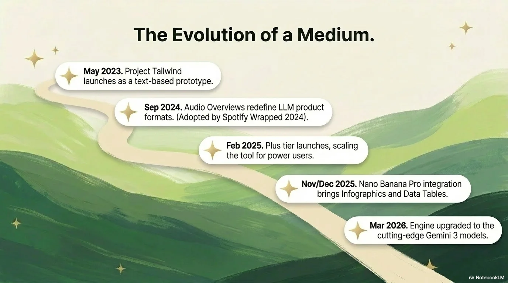

> [!TIP]
> This is a simplified preview. [View Full YAML](styles/whimsical_animation.yaml)

```yaml
description: "A sophisticated, animation-inspired portfolio aesthetic. It features a lush palette of forest and lime greens, modern geometric typography, and painterly gouache textures. Ideal for creative professionals looking for a whimsical yet high-end presentation style."
design_system:
  global_style:
    theme: "Whimsical Animation Portfolio. Organic greens, painterly textures, and modern geometric shapes."
    typography: 
      primary_heading: "TT Firs Neue, sans-serif"
      secondary_heading: "Medium weight geometric sans-serif"
      body_text: "Clean, high-legibility sans-serif"
    color_palette:
      primary: "#4A7C59" # Forest Green
      secondary: "#DCE6A3" # Lime Mist
      accent: "#FFD700" # Golden Star
      background: "#F1F5E1" # Soft Cream
      text_main: "#1A1A1A"
      surface: "#FFFFFF"
    key_visual_elements: 
      - "Painterly gouache-style background textures"
      - "Heavy rounded corners (pill-shaped containers)"
      - "Minimalist celestial accents (small four-pointed stars)"
      - "Soft irregular cloud shapes with dry-brush edges"

  image_generation_prompts:
    style_guidelines: "Gouache painting style, soft painterly textures, nature-inspired abstract backgrounds, stylized hills and clouds, soft lighting, professional creative portfolio aesthetic, TT Firs Neue font vibe."
    themes:
      - target: "Abstract Nature"
        prompt_elements: "Minimalist stylized hills and soft clouds in shades of green and lime, gouache texture, artistic composition."
      - target: "Creative Focus"
        prompt_elements: "Abstract geometric shapes with hand-painted textures, soft sage and forest green tones, minimalist stars."

slide_layout_templates:
  - type: "Animation_Hero"
    usage: "Main portfolio title with large pill-shaped heading container"
  - type: "Painterly_Grid"
    usage: "Project showcase using rounded bento-style blocks with textured backgrounds"
  - type: "Celestial_Process"
    usage: "Workflow steps marked with small minimalist star accents"
```


#### Clinical Doodles

An approachable and empathetic medical aesthetic inspired by hand-drawn nursing journals. It features the playful Schoolbell handwriting font, a soft pastel blue palette, and a subtle grid paper texture. Characterized by charming doodle illustrations and organic cloud-like shapes, it humanizes clinical topics.


> [!TIP]
> This is a simplified preview. [View Full YAML](styles/clinical_doodles.yaml)

```yaml
description: "An approachable and empathetic medical aesthetic inspired by hand-drawn nursing journals. It features the playful Schoolbell handwriting font, a soft pastel blue palette, and a subtle grid paper texture. Characterized by charming doodle illustrations and organic cloud-like shapes, it humanizes clinical topics."
design_system:
  global_style:
    theme: "Clinical Doodles. Warm, hand-drawn medical aesthetic with a scrapbook feel."
    typography: 
      primary_heading: "Schoolbell, cursive"
      secondary_heading: "Schoolbell, regular"
      body_text: "Schoolbell, regular"
    color_palette:
      primary: "#1E3A8A" # Navy Outline
      secondary: "#F87171" # Warm Coral Accent
      background: "#E0F2FE" # Soft Sky Blue
      surface: "#FFFFFF" # Paper Surface
      text_main: "#1E293B"
      text_secondary: "#475569"
    key_visual_elements: 
      - "Subtle grid paper background pattern"
      - "Hand-drawn 'doodle' illustrations of medical staff"
      - "Organic blob and cloud-like containers"
      - "Decorative swirls and hand-drawn arrows"

  image_generation_prompts:
    style_guidelines: "Hand-drawn illustration style, colored pencil texture, soft clinical themes, friendly characters, pastel blue and navy color palette, scrapbook aesthetic, Schoolbell font vibe."
    themes:
      - target: "Nursing Care"
        prompt_elements: "A friendly hand-drawn illustration of a nurse helping an elderly patient, soft colors, clinical but warm atmosphere, doodle style."
      - target: "Medical Agenda"
        prompt_elements: "A hand-drawn desk with medical tools and an agenda, doodle style, soft blue and white colors, grid paper background."

slide_layout_templates:
  - type: "Doodle_Cover"
    usage: "Title in hand-drawn clouds with medical staff illustrations surrounding it"
  - type: "Grid_Content"
    usage: "Bullet points on a grid paper background with decorative swirls"
  - type: "Scrapbook_Image"
    usage: "Image contained in an organic hand-drawn frame with a small coral accent"
  - type: "Medical_Timeline_Doodle"
    usage: "A wavy line timeline with hand-drawn icons and nursing characters"
```


#### Medicine Pop

A vibrant and high-energy medical aesthetic inspired by pop-art and modern vector illustrations. It features the bold Luktao typeface, a striking palette of deep purple, lavender, and energetic orange over a soft cream background. Characterized by playful medical icons and colorful 'plus' symbols, it brings a fresh and optimistic approach to healthcare data.

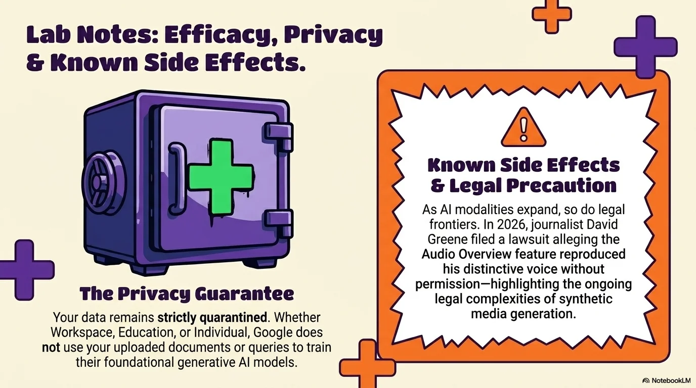

> [!TIP]
> This is a simplified preview. [View Full YAML](styles/medicine_pop.yaml)

```yaml
description: "A vibrant and high-energy medical aesthetic inspired by pop-art and modern vector illustrations. It features the bold Luktao typeface, a striking palette of deep purple, lavender, and energetic orange over a soft cream background. Characterized by playful medical icons and colorful 'plus' symbols, it brings a fresh and optimistic approach to healthcare data."
design_system:
  global_style:
    theme: "Medicine Pop. High-energy medical illustration style with vibrant purple and orange tones."
    typography: 
      primary_heading: "Luktao, sans-serif"
      secondary_heading: "Luktao, regular"
      body_text: "Poppins, medium" # Complemented with Poppins for body readability
    color_palette:
      primary: "#5B10A3" # Deep Purple
      secondary: "#FFAD33" # Energy Orange
      background: "#FFFBF0" # Soft Cream
      surface: "#F3E8FF" # Lavender Surface
      text_main: "#2D0A4E"
      text_secondary: "#5B10A3"
    key_visual_elements: 
      - "Vibrant flat illustrations of medical objects (pills, monitors, etc.)"
      - "Large colorful 'plus' icons (+) scattered as accents"
      - "Bold, saturated color blocks for data and charts"
      - "Playful and rounded layout shapes"

  image_generation_prompts:
    style_guidelines: "Vibrant vector illustration, pop-art medical style, saturated colors (purple, orange), soft cream background, playful characters and objects, clean bold lines, Luktao font vibe."
    themes:
      - target: "Medical Statistics"
        prompt_elements: "Colorful bar charts and icons, medical icons (heart, pill), vibrant purple and orange palette, energetic aesthetic."
      - target: "Innovative Lab"
        prompt_elements: "A laboratory with colorful test tubes and purple lighting, pop-art style illustration, vibrant and modern atmosphere."

slide_layout_templates:
  - type: "Pop_Medical_Cover"
    usage: "Large title on cream background surrounded by colorful medical doodles and orange crosses"
  - type: "Vibrant_Statistics"
    usage: "Full purple background slide with white cards for high-contrast data visualization"
  - type: "Timeline_Pop"
    usage: "A thick purple vertical line with orange markers and colorful icons for each milestone"
  - type: "Team_Doodles"
    usage: "Round portraits with thick colorful borders and name labels in Luktao font"
```


#### Garden Doodles

A cozy and organic hand-drawn aesthetic inspired by nature and garden sketches. It features the friendly Mali typeface and a warm palette of terracotta, sage green, and chocolate brown over a soft beige background. Characterized by charming 'doodle' illustrations like smiling suns, flowers, and wooden fences, it brings a personal and approachable touch to any presentation.

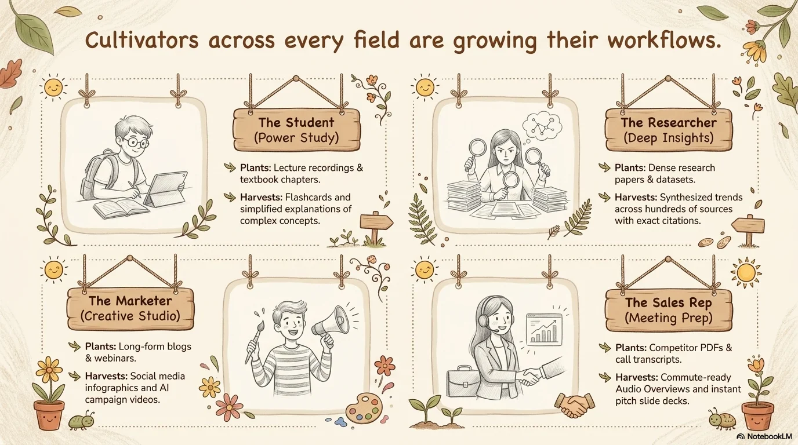

> [!TIP]
> This is a simplified preview. [View Full YAML](styles/garden_doodles.yaml)

```yaml
description: "A cozy and organic hand-drawn aesthetic inspired by nature and garden sketches. It features the friendly Mali typeface and a warm palette of terracotta, sage green, and chocolate brown over a soft beige background. Characterized by charming 'doodle' illustrations like smiling suns, flowers, and wooden fences, it brings a personal and approachable touch to any presentation."
design_system:
  global_style:
    theme: "Garden Doodles. Hand-drawn nature style with warm earth tones and friendly sketches."
    typography: 
      primary_heading: "Mali, sans-serif"
      secondary_heading: "Mali, medium"
      body_text: "Mali, regular"
    color_palette:
      primary: "#4B3D33" # Chocolate Brown
      secondary: "#D47C6A" # Terracotta
      background: "#F2E8DF" # Soft Beige
      surface: "#FAF3ED" # Light Cream Surface
      text_main: "#4B3D33"
      text_secondary: "#7A6C5D"
    key_visual_elements: 
      - "Hand-drawn 'doodle' illustrations of suns, plants, and flowers"
      - "Soft rounded corners for all containers and cards"
      - "Organic accent shapes like leaves and stars floating as background elements"
      - "Dotted lines and hand-drawn arrows for connectors"

  image_generation_prompts:
    style_guidelines: "Hand-drawn doodle illustration, warm earth tones, children's book aesthetic, soft pencil textures, organic shapes, friendly and cozy atmosphere, Mali font vibe."
    themes:
      - target: "Nature Elements"
        prompt_elements: "Smiling sun, garden flowers, and green leaves in a cute doodle style, soft beige background, terracotta accents."
      - target: "Project Timeline"
        prompt_elements: "A hand-drawn ladder with vines, earthy colors, organic and playful layout, cozy garden vibe."

slide_layout_templates:
  - type: "Garden_Cover"
    usage: "Large title in Mali font on a beige background with a smiling sun and flowers in the corners"
  - type: "Doodle_Team"
    usage: "Portrait photos inside soft rounded frames with hand-drawn name labels below"
  - type: "Organic_Timeline"
    usage: "A dotted horizontal line connecting colorful hand-drawn circles with event text"
  - type: "Resource_Garden"
    usage: "A collage of garden icons (watering cans, plants, trees) acting as a background for resource links"
```


#### Kawaii Storybook

An adorable and high-contrast Kawaii aesthetic inspired by children's storybooks. It features the chunky and playful More Sugar typeface over a bright sky blue and meadow green landscape. Characterized by super-cute animal characters (chicks, rabbits, elephants) with rosy cheeks and smiling clouds, it creates a joyful and innocent atmosphere for any presentation.

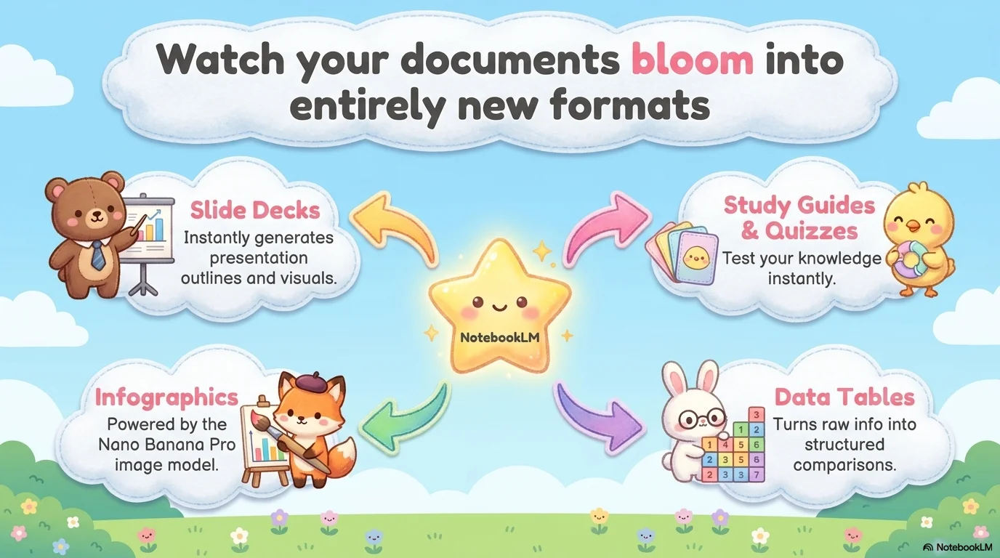

> [!TIP]
> This is a simplified preview. [View Full YAML](styles/kawaii_storybook.yaml)

```yaml
description: "An adorable and high-contrast Kawaii aesthetic inspired by children's storybooks. It features the chunky and playful More Sugar typeface over a bright sky blue and meadow green landscape. Characterized by super-cute animal characters (chicks, rabbits, elephants) with rosy cheeks and smiling clouds, it creates a joyful and innocent atmosphere for any presentation."
design_system:
  global_style:
    theme: "Kawaii Storybook. Ultra-cute animal illustration style with bright pastel tones."
    typography: 
      primary_heading: "More Sugar, sans-serif"
      secondary_heading: "More Sugar, regular"
      body_text: "Quicksand, medium" # Complemented with Quicksand for a soft rounded body feel
    color_palette:
      primary: "#34495E" # Charcoal Text
      secondary: "#FFB7C5" # Cherry Blossom Pink
      background: "#D1F2FF" # Bright Sky Blue
      surface: "#FFFFFF" # Pure White Cloud Surface
      text_main: "#34495E"
      text_secondary: "#5D6D7E"
    key_visual_elements: 
      - "Super-cute (Kawaii) animal illustrations with simple faces and rosy cheeks"
      - "Bright sun and clouds with smiling faces"
      - "Meadow green bottom border with small flowers"
      - "Soft, patchwork or felt-like textures on illustrations"

  image_generation_prompts:
    style_guidelines: "Kawaii animal illustration, pastel colors, children's storybook style, thick rounded lines, smiling faces on everything, rosy cheeks, felt texture look, More Sugar font vibe."
    themes:
      - target: "Project Overview"
        prompt_elements: "Cute blue elephant and a pink pacifier illustration, soft sky blue background, Kawaii aesthetic, innocent and joyful."
      - target: "Success Analysis"
        prompt_elements: "A happy chick wearing a party hat next to a colorful bar chart, Kawaii style, bright and cheerful colors."

slide_layout_templates:
  - type: "Kawaii_Cover"
    usage: "Title in More Sugar font centered on a white cloud, surrounded by a smiling sun, rabbit, and chick"
  - type: "Story_Landscape"
    usage: "Text placed on a large white central bubble with a sky blue top and green grass bottom full of animals"
  - type: "Character_Points"
    usage: "Bullet points where each point is introduced by a different Kawaii animal"
  - type: "Thank_You_Story"
    usage: "Large 'Thank You' with all characters waving from the corners of the slide"
```


#### Biochemical Doodles

A creative and educational scientific aesthetic that blends modern biology with hand-drawn doodles. It features the tactile Bobby Jones typeface over a subtly textured paper background. Characterized by charming sketches of DNA helices, beakers, molecules, and organic fluid shapes in muted wine and sage tones, it brings a curious and experimental spirit to any presentation.

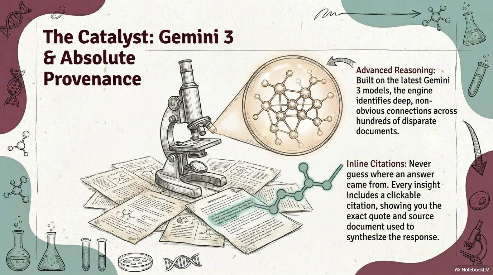

> [!TIP]
> This is a simplified preview. [View Full YAML](styles/biochemical_doodles.yaml)

```yaml
description: "A creative and educational scientific aesthetic that blends modern biology with hand-drawn doodles. It features the tactile Bobby Jones typeface over a subtly textured paper background. Characterized by charming sketches of DNA helices, beakers, molecules, and organic fluid shapes in muted wine and sage tones, it brings a curious and experimental spirit to any presentation."
design_system:
  global_style:
    theme: "Biochemical Doodles. Hand-drawn scientific illustration style with muted organic tones."
    typography: 
      primary_heading: "Bobby Jones, sans-serif"
      secondary_heading: "Bobby Jones, regular"
      body_text: "Sniglet, regular" # Complemented with Sniglet for a friendly rounded body feel
    color_palette:
      primary: "#6D435A" # Deep Wine Maroon
      secondary: "#92B4B1" # Sage Teal
      background: "#F9F7F2" # Textured Paper White
      surface: "#E8E4D9" # Dusty Stone Surface
      text_main: "#4A2D3C"
      text_secondary: "#6D435A"
    key_visual_elements: 
      - "Hand-drawn scientific sketches (beakers, DNA, cells, molecules)"
      - "Fluid, organic background blobs in muted colors"
      - "Subtle paper grain or fiber texture throughout the slides"
      - "Rustic, hand-drawn dividers and icons"

  image_generation_prompts:
    style_guidelines: "Hand-drawn scientific illustration, muted wine and sage color palette, textured paper background, organic fluid shapes, pencil and ink sketches, experimental and curious atmosphere, Bobby Jones font vibe."
    themes:
      - target: "Chemical Analysis"
        prompt_elements: "Sketches of molecules and beakers, organic fluid blobs in the background, muted colors, textured paper look."
      - target: "Biological Research"
        prompt_elements: "A hand-drawn DNA helix and microscopic cells, earthy tones, curious and scholarly aesthetic."

slide_layout_templates:
  - type: "Science_Project_Cover"
    usage: "Bold Bobby Jones title on textured paper with beakers and fluid shapes in the corners"
  - type: "Lab_Rules"
    usage: "Numbered list with hand-drawn beaker icons for each rule on a clean stone surface"
  - type: "Molecular_Diagram"
    usage: "A central molecule sketch with descriptive text boxes floating around it"
  - type: "Experimental_Timeline"
    usage: "A vertical line representing an experiment progress with hand-drawn icons at each stage"
```


#### Science Sketch

A clean and vibrant academic aesthetic inspired by high school science projects and textbook sketches. It features the hand-drawn Schoolbell typeface paired with the condensed Pompiere for subtitles. Characterized by thick-lined blue vector doodles filled with bright yellow, and accents like graph paper grids and wavy lines, it conveys a sense of organized learning and active discovery.

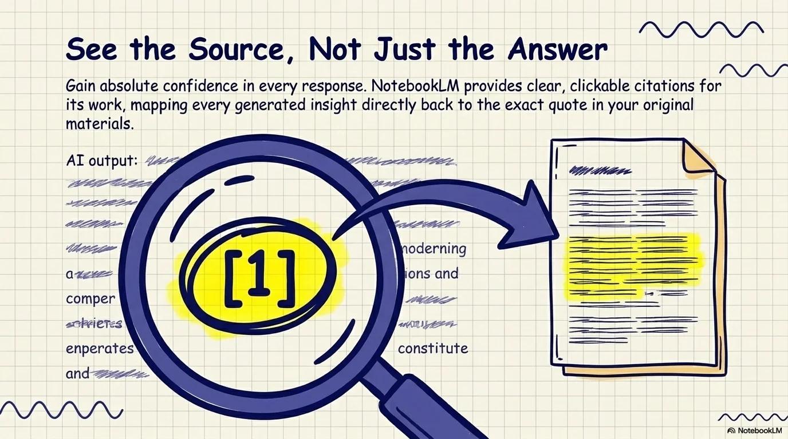

> [!TIP]
> This is a simplified preview. [View Full YAML](styles/science_sketch.yaml)

```yaml
description: "A clean and vibrant academic aesthetic inspired by high school science projects and textbook sketches. It features the hand-drawn Schoolbell typeface paired with the condensed Pompiere for subtitles. Characterized by thick-lined blue vector doodles filled with bright yellow, and accents like graph paper grids and wavy lines, it conveys a sense of organized learning and active discovery."
design_system:
  global_style:
    theme: "Science Sketch. Clean academic illustration style with bold blue and yellow tones."
    typography: 
      primary_heading: "Schoolbell, sans-serif"
      secondary_heading: "Pompiere, regular"
      body_text: "Schoolbell, regular"
    color_palette:
      primary: "#3F51B5" # Indigo Blue
      secondary: "#FFD54F" # Sunflower Yellow
      background: "#FFFDF0" # Light Cream
      surface: "#E3F2FD" # Sky Blue Surface
      text_main: "#283593"
      text_secondary: "#3F51B5"
    key_visual_elements: 
      - "Clean vector doodles with thick indigo outlines and yellow fills"
      - "Graph paper (grid) patterns in the corners or background"
      - "Wavy horizontal lines (sine waves) as decorative accents"
      - "Soft color blobs acting as backgrounds for key scientific icons"

  image_generation_prompts:
    style_guidelines: "Clean vector doodle, thick blue outlines, bright yellow highlights, cream background, graph paper textures, educational icons, Schoolbell font vibe."
    themes:
      - target: "Methodology"
        prompt_elements: "Microscope and test tubes in a clean vector style, indigo and yellow palette, academic and bright."
      - target: "Findings"
        prompt_elements: "A bar chart on a graph paper background, thick-lined doodles of a magnifying glass, vibrant educational aesthetic."

slide_layout_templates:
  - type: "Sketch_Cover"
    usage: "Large Schoolbell title with thick outlines, surrounded by atoms, books, and yellow wavy lines"
  - type: "Grid_Content"
    usage: "Text placed on a clean area with a subtle graph paper grid pattern in the background"
  - type: "Method_Focus"
    usage: "Central image with rounded corners and a thick border, surrounded by scientific doodles"
  - type: "Academic_Summary"
    usage: "Summary list where each item is marked by a small yellow filled indigo circle"
```


#### Athletic Energy

A vibrant and motivational aesthetic that celebrates sports and physical activity through a grainy, textured illustration style. It features the massive and blocky Gulfs Display typeface for high-impact headlines. Characterized by energetic salmon and mint green tones, and illustrations of athletes in motion over stippled backgrounds, it brings vitality and a youthful spirit to health and wellness presentations.

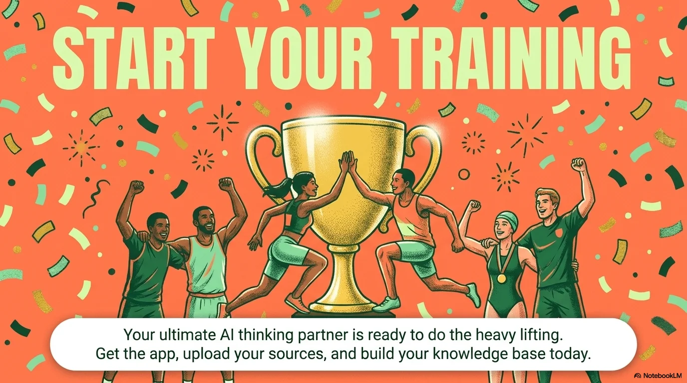

> [!TIP]
> This is a simplified preview. [View Full YAML](styles/athletic_energy.yaml)

```yaml
description: "A vibrant and motivational aesthetic that celebrates sports and physical activity through a grainy, textured illustration style. It features the massive and blocky Gulfs Display typeface for high-impact headlines. Characterized by energetic salmon and mint green tones, and illustrations of athletes in motion over stippled backgrounds, it brings vitality and a youthful spirit to health and wellness presentations."
design_system:
  global_style:
    theme: "Athletic Energy. Dynamic sports illustration style with grainy textures and bold blocky typography."
    typography: 
      primary_heading: "Gulfs Display, sans-serif"
      secondary_heading: "Gulfs Display, regular"
      body_text: "Inter, regular" # Complemented with Inter for modern readability
    color_palette:
      primary: "#FF7051" # Salmon Orange
      secondary: "#A5D6A7" # Mint Green
      background: "#F1F8E9" # Pale Lime Green
      surface: "#FFCDD2" # Soft Red Surface
      text_main: "#1B5E20" # Deep Forest Green for contrast
      text_secondary: "#FF7051"
    key_visual_elements: 
      - "Dynamic character illustrations in sports action poses (running, jumping)"
      - "Subtle stippling/noise texture on all colors and shapes"
      - "Red running track curves as a recurring background motif"
      - "Rounded white containers for body text to maintain legibility"

  image_generation_prompts:
    style_guidelines: "Dynamic sports illustration, grainy stippled texture, Gulfs Display font vibe, salmon and mint green color scheme, energetic and youthful atmosphere, soft airbrush shading."
    themes:
      - target: "Teamwork"
        prompt_elements: "Athletes high-fiving on a running track, grainy texture, vibrant colors, motivational sports aesthetic."
      - target: "Individual Achievement"
        prompt_elements: "A runner crossing a finish line, stippled effect, salmon and green palette, powerful and dynamic movement."

slide_layout_templates:
  - type: "Sports_Headline"
    usage: "Full-page Gulfs Display title in salmon over a textured sports scene"
  - type: "Action_Feature"
    usage: "Large action illustration on one side with a rounded text bubble on the other"
  - type: "Dynamic_Step"
    usage: "A sequence of athletes representing progress or steps in a process"
  - type: "Victory_Slide"
    usage: "Central trophy illustration with festive confetti doodles and a large 'Thank You' in Gulfs Display"
```


#### Kawaii Wellness

An ultra-cute and cheering aesthetic that makes fitness feel approachable and fun. It features the modern TT Firs Neue typeface against a whimsical pastel world. Characterized by adorable chubby characters (kawaii style) engaged in exercises, pink and yellow checkered patterns, and twinkling stars, it brings a sense of joy and sweetness to health and daily movement content.


> [!TIP]
> This is a simplified preview. [View Full YAML](styles/kawaii_wellness.yaml)

```yaml
description: "An ultra-cute and cheering aesthetic that makes fitness feel approachable and fun. It features the modern TT Firs Neue typeface against a whimsical pastel world. Characterized by adorable chubby characters (kawaii style) engaged in exercises, pink and yellow checkered patterns, and twinkling stars, it brings a sense of joy and sweetness to health and daily movement content."
design_system:
  global_style:
    theme: "Kawaii Wellness. Cute and whimsical pastel design for friendly fitness content."
    typography: 
      primary_heading: "TT Firs Neue, bold"
      secondary_heading: "TT Firs Neue, regular"
      body_text: "Sniglet, regular" # Friendly rounded body text
    color_palette:
      primary: "#F48FB1" # Pastel Pink
      secondary: "#FFF59D" # Pastel Yellow
      accent: "#81D4FA" # Pastel Blue
      background: "#FFFDF0" # Creamy White
      text_main: "#424242"
      text_secondary: "#F48FB1"
    key_visual_elements: 
      - "Chubby, kawaii characters performing fitness activities"
      - "Checkered patterns (pink/white or yellow/white)"
      - "Twinkling stars and sparkles as background decorations"
      - "Dashed-line containers and rounded bubble shapes"

  image_generation_prompts:
    style_guidelines: "Kawaii character design, pastel color palette, chubby white mochi-style characters, pink checkered patterns, cheerful and cute atmosphere, stars and sparkles."
    themes:
      - target: "Daily Workout"
        prompt_elements: "A cute round character lifting a tiny dumbbell, pastel pink background with stars, kawaii fitness style."
      - target: "Healthy Habits"
        prompt_elements: "Adorable characters sleeping and eating apples, yellow checkered border, whimsical and sweet wellness aesthetic."

slide_layout_templates:
  - type: "Kawaii_Wellness_Cover"
    usage: "Bold title surrounded by stars and a large illustration of an exercising mochi character"
  - type: "Bubble_Card"
    usage: "Text placed inside a soft-edged pink bubble with a cute character peeking from the side"
  - type: "Step_by_Step_Pastel"
    usage: "Sequential items marked by different pastel stars (pink, yellow, blue)"
  - type: "Checkered_Slide"
    usage: "Content area with a checkered pattern border and a large cheerful illustration"
```


#### Groovy 70s

A warm and nostalgic aesthetic inspired by the groovy 70s. It features the psychedelic and flowing TAN Nimbus serif for a highly stylized look. Characterized by a cream background with wavy rainbow stripes in burnt orange, mustard yellow, and teal, it uses retro sparkles, flower power icons, and organic heart shapes to create a soulful and stylish atmosphere.

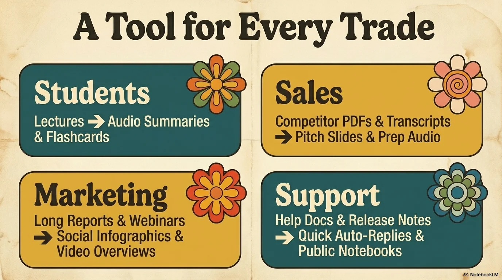

> [!TIP]
> This is a simplified preview. [View Full YAML](styles/groovy_70s.yaml)

```yaml
description: "A warm and nostalgic aesthetic inspired by the groovy 70s. It features the psychedelic and flowing TAN Nimbus serif for a highly stylized look. Characterized by a cream background with wavy rainbow stripes in burnt orange, mustard yellow, and teal, it uses retro sparkles, flower power icons, and organic heart shapes to create a soulful and stylish atmosphere."
design_system:
  global_style:
    theme: "Groovy 70s. Nostalgic and psychedelic design with organic curves and warm retro tones."
    typography: 
      primary_heading: "TAN Nimbus, serif"
      secondary_heading: "TAN Nimbus, medium"
      body_text: "Inter, regular" # Using a clean sans for readability alongside the stylized headers
    color_palette:
      primary: "#BF360C" # Burnt Orange
      secondary: "#FBC02D" # Mustard Yellow
      background: "#E8DCC4" # Warm Cream / Beige
      surface: "#006064" # Teal / Dark Green
      text_main: "#212121" # Charcoal for contrast
      text_secondary: "#BF360C"
    key_visual_elements: 
      - "Wavy, multi-colored rainbow stripes flowing across the layout"
      - "Retro four-pointed star sparkles and flower power icons"
      - "Organic, hand-drawn heart shapes and floral motifs"
      - "Warm, low-contrast cream background that enhances retro tones"

  image_generation_prompts:
    style_guidelines: "70s groovy aesthetic, burnt orange and mustard yellow palette, wavy rainbow stripes, TAN Nimbus font vibe, retro sparkles and flowers, warm and nostalgic atmosphere."
    themes:
      - target: "Project Vision"
        prompt_elements: "A retro office with 70s furniture, warm sunlight, wavy orange and teal graphic overlays, groovy and stylish vibe."
      - target: "Creative Team"
        prompt_elements: "People in 70s vintage clothing, grainy film texture, flower power icons, warm and soulful atmosphere."

slide_layout_templates:
  - type: "Groovy_Cover"
    usage: "Large TAN Nimbus title on a cream background with wavy stripes flowing from the corner"
  - type: "Flower_Power_Points"
    usage: "Bullet points where each point is marked by a small retro flower icon"
  - type: "Wavy_Divider"
    usage: "A slide with a large horizontal wavy rainbow separating two sections of content"
  - type: "Retro_Sparkle_Quote"
    usage: "A centered quote surrounded by four-pointed star sparkles and heart motifs"
```


#### Kawaii Pop

A vibrant and joyful aesthetic that blends Japanese Kawaii culture with Y2K pop art. It features the playful Genty script for expressive headlines and Hero for clean body text. Characterized by a cream background with pastel pink and yellow accents, it uses halftone patterns, bubbly clouds, and melting shapes to create a personalized and creative atmosphere.

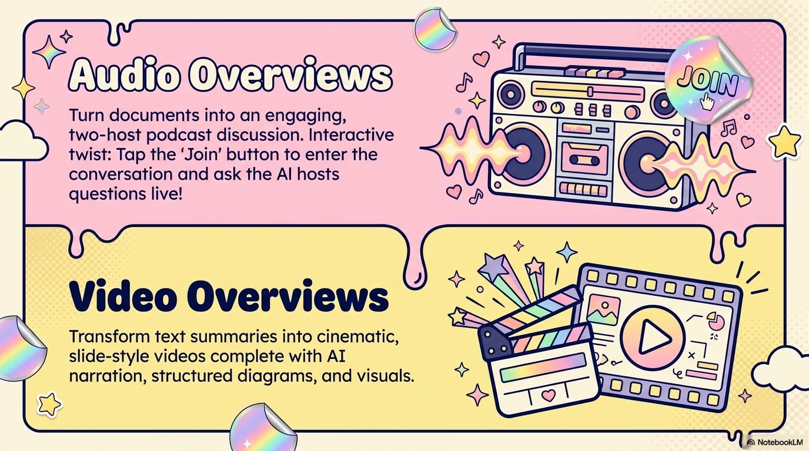

> [!TIP]
> This is a simplified preview. [View Full YAML](styles/kawaii_pop.yaml)

```yaml
description: "A vibrant and joyful aesthetic that blends Japanese Kawaii culture with Y2K pop art. It features the playful Genty script for expressive headlines and Hero for clean body text. Characterized by a cream background with pastel pink and yellow accents, it uses halftone patterns, bubbly clouds, and melting shapes to create a personalized and creative atmosphere."
design_system:
  global_style:
    theme: "Kawaii Pop. Joyful and expressive design with a mix of Y2K and Japanese cute culture."
    typography: 
      primary_heading: "Garet, sans-serif" # Using Garet as a fallback for the bubbly feel if Genty isn't available
      secondary_heading: "Genty, cursive"
      body_text: "Hero, regular"
    color_palette:
      primary: "#F8BBD0" # Pastel Pink
      secondary: "#FFF59D" # Pastel Yellow
      background: "#FFF9F0" # Soft Cream
      surface: "#1A237E" # Deep Navy for high contrast
      text_main: "#1A237E"
      text_secondary: "#F8BBD0"
    key_visual_elements: 
      - "Halftone (dot) patterns in the background for a pop-art feel"
      - "Bubbly, multi-colored clouds and melting liquid shapes"
      - "Sticker-like sparkles, stars, and rainbow motifs"
      - "Thick, playful outlines around images and containers"

  image_generation_prompts:
    style_guidelines: "Kawaii pop art aesthetic, pastel pink and yellow palette, halftone patterns, bubbly clouds and stars, Y2K vibe, joyful and creative atmosphere."
    themes:
      - target: "Creative Works"
        prompt_elements: "An artist studio filled with cute stickers, pastel clouds floating around, halftone dot background, vibrant and fun."
      - target: "About Me"
        prompt_elements: "A friendly workspace with a laptop, stars and sparkles everywhere, soft cream and pink tones, kawaii illustration style."

slide_layout_templates:
  - type: "Kawaii_Hero_Cover"
    usage: "Large pink Genty title surrounded by bubbly clouds and yellow stars on a cream background"
  - type: "Halftone_Gallery"
    usage: "A grid of photos where each one has a thick navy border and sits on a halftone-patterned section"
  - type: "Sparkle_Sticker_Points"
    usage: "Bullet points marked by different sticker-like icons (stars, hearts, clouds)"
  - type: "Melting_Section_Divider"
    usage: "A slide where a large yellow 'melting' shape separates the top and bottom content areas"
```


#### Fandom Noir

An elegant and moody aesthetic designed for fandom nights and social games. It pairs the high-contrast Astoria serif with the technical Neue Machina sans-serif. Characterized by a deep black background with soft lavender accents, it features monochrome butterfly motifs, glowing oval portraits, and subtle wavy lines to create a sophisticated yet mysterious community atmosphere.

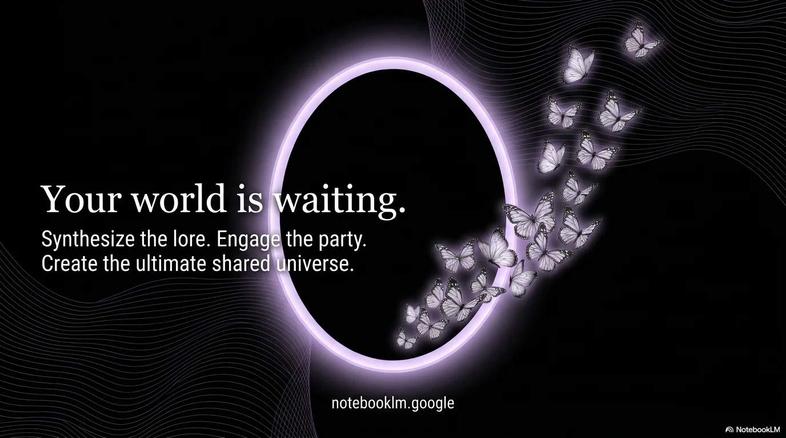

> [!TIP]
> This is a simplified preview. [View Full YAML](styles/fandom_noir.yaml)

```yaml
description: "An elegant and moody aesthetic designed for fandom nights and social games. It pairs the high-contrast Astoria serif with the technical Neue Machina sans-serif. Characterized by a deep black background with soft lavender accents, it features monochrome butterfly motifs, glowing oval portraits, and subtle wavy lines to create a sophisticated yet mysterious community atmosphere."
design_system:
  global_style:
    theme: "Fandom Noir. Sophisticated and moody design for social games and high-end community events."
    typography: 
      primary_heading: "Astoria, serif"
      secondary_heading: "Neue Machina, bold"
      body_text: "Neue Machina, regular"
    color_palette:
      primary: "#D1C4E9" # Soft Lavender
      secondary: "#000000" # Deep Black
      background: "#000000" # Black Background
      surface: "#1A1A1A" # Dark Gray Surface
      text_main: "#FFFFFF" # Pure White text
      text_secondary: "#D1C4E9" # Lavender text for accents
    key_visual_elements: 
      - "Monochrome butterfly icons scattered across the layout"
      - "Glowing oval-shaped containers for portraits and featured images"
      - "Subtle, fine-lined wavy patterns in the background"
      - "High-contrast layouts with bold typography on dark backgrounds"

  image_generation_prompts:
    style_guidelines: "Moody and elegant fandom photography, black and lavender palette, glowing oval frames, monochrome butterflies, Neue Machina and Astoria font aesthetic, sophisticated night vibe."
    themes:
      - target: "Game Rules"
        prompt_elements: "A stylish monochrome butterfly, soft lavender glow, deep black background, elegant and technical typography."
      - target: "Community Portraits"
        prompt_elements: "Close-up of friends laughing in a glowing lavender oval, moody lighting, black background, high-end editorial style."

slide_layout_templates:
  - type: "Noir_Cover"
    usage: "Large Astoria title in white on a black background with a subtle lavender glow and a butterfly icon"
  - type: "Glowing_Oval_Feature"
    usage: "Two or three glowing oval image frames with technical labels in Neue Machina"
  - type: "Wavy_Rule_Slide"
    usage: "Text centered over a fine wavy pattern with a lavender border"
  - type: "Dark_Resource_Page"
    usage: "Icons and elements in white and lavender on a dark gray grid"
```


#### Sweet Fandom

A charming and cozy aesthetic that transforms social games into a kawaii bakery or tea party experience. It features the friendly KG Primary Penmanship font for a handwritten, approachable feel. Characterized by a palette of pastel pink, mint green, and cream, it uses adorable illustrations of desserts, strawberries, and lemonade jars to create a sweet and playful community atmosphere.

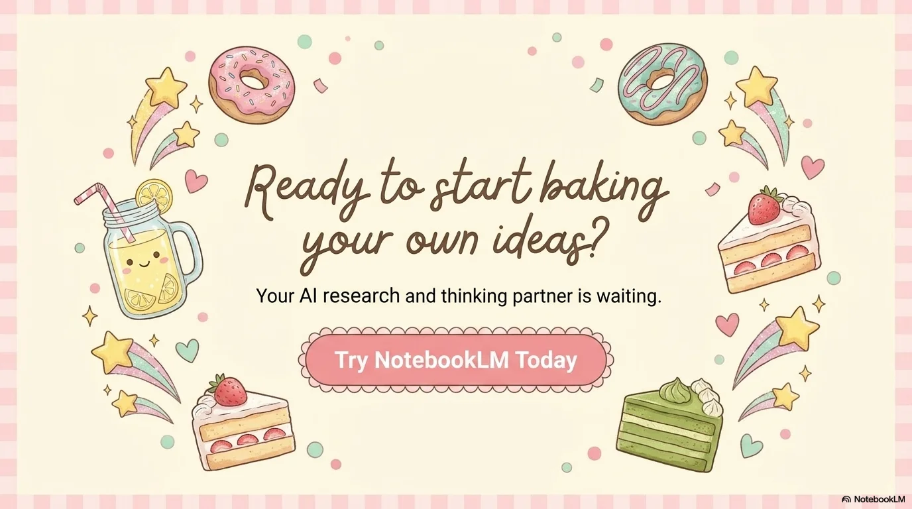

> [!TIP]
> This is a simplified preview. [View Full YAML](styles/sweet_fandom.yaml)

```yaml
description: "A charming and cozy aesthetic that transforms social games into a kawaii bakery or tea party experience. It features the friendly KG Primary Penmanship font for a handwritten, approachable feel. Characterized by a palette of pastel pink, mint green, and cream, it uses adorable illustrations of desserts, strawberries, and lemonade jars to create a sweet and playful community atmosphere."
design_system:
  global_style:
    theme: "Sweet Fandom. Charming and dessert-inspired design for cozy games and playful fan events."
    typography: 
      primary_heading: "KG Primary Penmanship, sans-serif"
      secondary_heading: "KG Primary Penmanship, medium"
      body_text: "Inter, regular" # Using Inter for body text to ensure long questions are readable
    color_palette:
      primary: "#F48FB1" # Pastel Pink
      secondary: "#A5D6A7" # Mint Green
      background: "#FFF9C4" # Soft Cream / Yellow
      surface: "#F8BBD0" # Lighter Pink Surface
      text_main: "#795548" # Soil Brown for a soft contrast
      text_secondary: "#F48FB1"
    key_visual_elements: 
      - "Adorable hand-drawn illustrations of cakes, donuts, and cupcakes"
      - "Cozy lifestyle elements like lemonade jars and strawberries"
      - "Bubbly cloud shapes for rule boxes and featured questions"
      - "Checkered or soft pattern backgrounds for a picnic/bakery feel"

  image_generation_prompts:
    style_guidelines: "Kawaii bakery aesthetic, pastel pink and mint green palette, dessert illustrations, hand-drawn stickers, KG Primary Penmanship font vibe, cozy and playful atmosphere."
    themes:
      - target: "Game Start"
        prompt_elements: "A delicious strawberry shortcake on a pastel pink plate, mint green background, cute hand-drawn hearts, sweet and cozy vibe."
      - target: "Winner Celebration"
        prompt_elements: "A variety of colorful donuts with sprinkles, soft cream background, joyful and sugary aesthetic."

slide_layout_templates:
  - type: "Sweet_Bakery_Cover"
    usage: "Large brown KG Primary title on a pink checkered background with dessert stickers in the corners"
  - type: "Dessert_Rule_Box"
    usage: "A slide with a large white cloud shape containing text, decorated with a small cake icon"
  - type: "Picnic_Grid"
    usage: "A grid of photos framed in mint green with strawberry icons as separators"
  - type: "Sweet_Thank_You"
    usage: "Centered 'Thanks for playing' in pink script font surrounded by cute treat illustrations"
```


#### Kawaii Fandom

A soft and adorable scrapbook aesthetic designed for K-Pop fandoms and creative community nights. It features the bubbly and hand-drawn More Sugar typeface. Characterized by a palette of pastel blue, pink, and yellow, it uses polaroid frames, cute bear stickers, and hand-drawn doodles to create a fun, youthful, and cozy atmosphere.

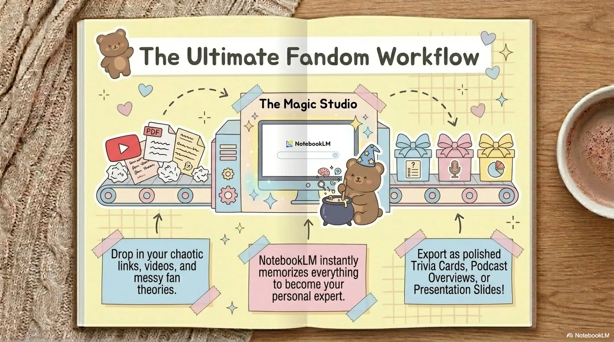

> [!TIP]
> This is a simplified preview. [View Full YAML](styles/kawaii_fandom.yaml)

```yaml
description: "A soft and adorable scrapbook aesthetic designed for K-Pop fandoms and creative community nights. It features the bubbly and hand-drawn More Sugar typeface. Characterized by a palette of pastel blue, pink, and yellow, it uses polaroid frames, cute bear stickers, and hand-drawn doodles to create a fun, youthful, and cozy atmosphere."
design_system:
  global_style:
    theme: "Kawaii Fandom. Adorable scrapbook design with pastel tones and cute community stickers."
    typography: 
      primary_heading: "More Sugar, sans-serif"
      secondary_heading: "More Sugar, medium"
      body_text: "Inter, regular"
    color_palette:
      primary: "#90CAF9" # Pastel Blue
      secondary: "#F8BBD0" # Pastel Pink
      background: "#FFF9C4" # Pastel Yellow Background
      surface: "#FFFFFF" # White Surface for polaroids
      text_main: "#424242" # Dark Gray for readability
      text_secondary: "#F8BBD0"
    key_visual_elements: 
      - "Polaroid-style frames for photos and member profiles"
      - "Adorable bear, heart, and sparkle stickers scattered around"
      - "Hand-drawn doodle lines and checkered patterns"
      - "Soft, low-contrast pastel backgrounds"

  image_generation_prompts:
    style_guidelines: "Kawaii scrapbook aesthetic, pastel blue and pink palette, polaroid frames, cute bear stickers, hand-drawn doodles, More Sugar font vibe, cozy fandom atmosphere."
    themes:
      - target: "Trivia Night"
        prompt_elements: "A cute brown bear holding a trivia card, pastel pink background, yellow stars and sparkles, kawaii sticker style."
      - target: "Member Profile"
        prompt_elements: "A polaroid photo of a smiling k-pop fan, decorated with pastel blue hearts and hand-drawn doodles, soft and sweet vibe."

slide_layout_templates:
  - type: "Scrapbook_Cover"
    usage: "Large More Sugar title on a yellow background with multiple polaroid photos and stickers"
  - type: "Bear_Trivia_Card"
    usage: "A white rounded box (the card) with a bear icon and a question in blue"
  - type: "Fandom_Scoreboard"
    usage: "A slide with a large pink grid for keeping score, decorated with sparkles and hearts"
  - type: "Kamsahamnida_Outro"
    usage: "Soft pink slide with a large 'Kamsahamnida!' in yellow script surrounded by cute doodles"
```


#### Monster Party

A joyful and high-energy aesthetic designed for anniversaries, celebrations, and playful presentations. It features the clean geometric Open Sauce typeface. Characterized by a white background with vibrant, glowing color blobs, it uses expressive 3D monster characters and floral mascots to create a friendly, modern, and festive atmosphere.

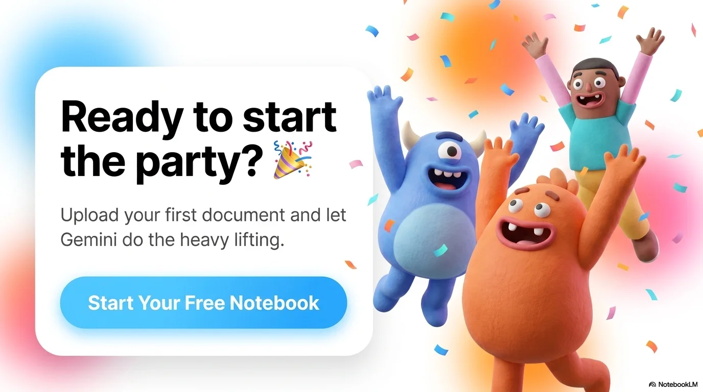

> [!TIP]
> This is a simplified preview. [View Full YAML](styles/monster_party.yaml)

```yaml
description: "A joyful and high-energy aesthetic designed for anniversaries, celebrations, and playful presentations. It features the clean geometric Open Sauce typeface. Characterized by a white background with vibrant, glowing color blobs, it uses expressive 3D monster characters and floral mascots to create a friendly, modern, and festive atmosphere."
design_system:
  global_style:
    theme: "Monster Party. Joyful and vibrant design with 3D mascots for celebrations and friendly events."
    typography: 
      primary_heading: "Open Sauce, sans-serif"
      secondary_heading: "Open Sauce, bold"
      body_text: "Open Sauce, regular"
    color_palette:
      primary: "#90CAF9" # Sky Blue Blob
      secondary: "#FFA726" # Vibrant Orange Blob
      background: "#FFFFFF" # Clean White Background
      surface: "#F5F5F5" # Light Gray Surface
      text_main: "#000000" # Solid Black for impact
      text_secondary: "#616161"
    key_visual_elements: 
      - "Playful 3D-rendered monster characters with expressive faces"
      - "Gradients and glowing color blobs (blue, orange, pink) in the background"
      - "Large bold headers mixed with colorful emojis"
      - "Clean, high-contrast layouts that feel airy and modern"

  image_generation_prompts:
    style_guidelines: "Joyful 3D monster characters, vibrant color blobs, white background, high-energy celebration style, Open Sauce font aesthetic, cute and modern mascots."
    themes:
      - target: "Greeting Slide"
        prompt_elements: "A cute 3D yellow sun monster waving, vibrant blue and orange blobs in the background, white space, joyful expression."
      - target: "Success Page"
        prompt_elements: "A group of 3D monster friends celebrating, confetti, bright gradients, modern and clean 3D render."

slide_layout_templates:
  - type: "Monster_Cover"
    usage: "Large bold black title on white with a giant 3D mascot and floating color blobs"
  - type: "Character_Quote"
    usage: "A 3D character next to a speech bubble containing a testimonial or key message"
  - type: "Vibrant_Resource_Grid"
    usage: "A grid of icons where each cell has a subtle glowing blob of a different color behind it"
  - type: "Emoji_Headline"
    usage: "A slide dominated by a large headline where key words are replaced or supplemented by emojis"
```


#### Mango Kids

A fun and friendly aesthetic designed for children's games, educational content, and playful group activities. It features the chunky and charismatic Mango AC display font. Characterized by a palette of sky blue, mango yellow, and watermelon pink on cream backgrounds, it uses adorable monster characters with glasses, thick-bordered speech bubbles, and colorful doodle patterns to create a joyful 'kids playroom' atmosphere.

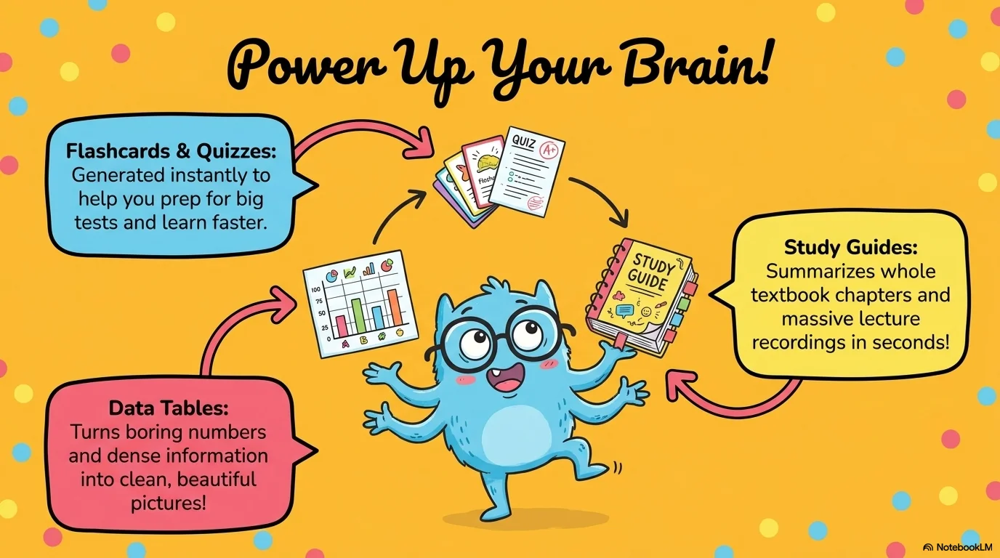

> [!TIP]
> This is a simplified preview. [View Full YAML](styles/mango_kids.yaml)

```yaml
description: "A fun and friendly aesthetic designed for children's games, educational content, and playful group activities. It features the chunky and charismatic Mango AC display font. Characterized by a palette of sky blue, mango yellow, and watermelon pink on cream backgrounds, it uses adorable monster characters with glasses, thick-bordered speech bubbles, and colorful doodle patterns to create a joyful 'kids playroom' atmosphere."
design_system:
  global_style:
    theme: "Mango Kids. Fun and bubbly design with cute monsters for children's activities and games."
    typography: 
      primary_heading: "Mango AC, cursive"
      secondary_heading: "Mango AC, regular"
      body_text: "Inter, bold" # Bold Inter for readability while matching the weight of the headings
    color_palette:
      primary: "#FFD54F" # Mango Yellow
      secondary: "#4FC3F2" # Sky Blue
      background: "#FFF9C4" # Soft Cream Background
      surface: "#F06292" # Watermelon Pink Surface
      text_main: "#424242" # Dark Gray
      text_secondary: "#FFFFFF"
    key_visual_elements: 
      - "Adorable, doodle-style monster characters with glasses and silly expressions"
      - "Thick-outlined speech bubbles with irregular, bubbly shapes"
      - "Playful background patterns of dots, waves, and swirls in bright colors"
      - "Rounded corner frames for images and interactive choices"

  image_generation_prompts:
    style_guidelines: "Cute doodle monster characters with glasses, bubbly speech bubbles, mango yellow and sky blue palette, playful background patterns, Mango AC font vibe, joyful kids playroom atmosphere."
    themes:
      - target: "Game Question"
        prompt_elements: "A pink monster with large glasses looking thoughtful inside a blue speech bubble, yellow background with colorful dots."
      - target: "Winner Screen"
        prompt_elements: "A group of happy monsters jumping and celebrating, confetti, vibrant colors, hand-drawn and cute style."

slide_layout_templates:
  - type: "Monster_Greeting"
    usage: "Large Mango AC title surrounded by cute monster stickers and colorful swirls"
  - type: "Choice_Bubble_Slide"
    usage: "A slide with two large thick-bordered bubbles for making a choice, decorated with dots"
  - type: "Doodle_Resource_Map"
    usage: "A playful map where resources are icons held by different monster characters"
  - type: "Kids_Summary"
    usage: "Clean layout with a large yellow '¡Qué divertido!' headline and a smiling monster in the corner"
```


#### Street Custom

A high-energy and creative aesthetic inspired by urban streetwear and custom product branding. It features the distinctive Fraunces serif for headlines that bridge the gap between classic elegance and modern grit. Characterized by a vibrant palette of electric blue, bright orange, and soft cream, it uses bold brush strokes, organic 'blob' frames, and high-contrast cut-out photography to create a dynamic, youthful, and impactful brand presence.

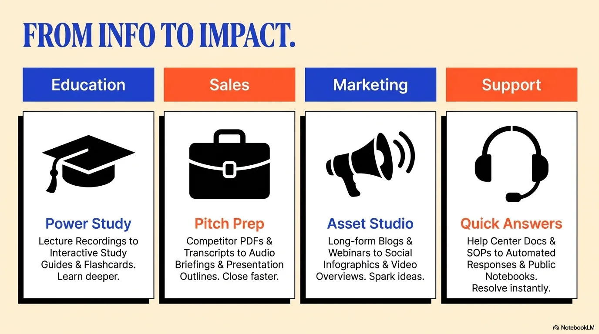

> [!TIP]
> This is a simplified preview. [View Full YAML](styles/street_custom.yaml)

```yaml
description: "A high-energy and creative aesthetic inspired by urban streetwear and custom product branding. It features the distinctive Fraunces serif for headlines that bridge the gap between classic elegance and modern grit. Characterized by a vibrant palette of electric blue, bright orange, and soft cream, it uses bold brush strokes, organic 'blob' frames, and high-contrast cut-out photography to create a dynamic, youthful, and impactful brand presence."
design_system:
  global_style:
    theme: "Street Custom. Vibrant urban design for streetwear, custom products, and creative marketing."
    typography: 
      primary_heading: "Fraunces, serif"
      secondary_heading: "Montserrat, bold"
      body_text: "Montserrat, medium"
    color_palette:
      primary: "#2D46D1" # Electric Blue
      secondary: "#FF5733" # Bright Orange
      background: "#FFF3E0" # Soft Cream
      surface: "#FFFFFF" # Pure White
      text_main: "#1A1A1A"
      text_secondary: "#2D46D1"
    key_visual_elements: 
      - "Dynamic brush stroke textures in orange and blue"
      - "Large organic 'blob' shapes used as image masks or background layers"
      - "Floating cut-out product photography with subtle drop shadows"
      - "Bold, oversized typography with tight tracking for impact"

  image_generation_prompts:
    style_guidelines: "Vibrant urban photography, streetwear aesthetic, electric blue and bright orange accents, brush stroke textures, high contrast, Fraunces font vibe, high-energy marketing look."
    themes:
      - target: "Product Customization"
        prompt_elements: "A person customizing a white t-shirt with vibrant paint, urban studio background, electric blue and orange splashes, dynamic and creative."
      - target: "Urban Style"
        prompt_elements: "Streetwear model in a minimalist urban setting, bold orange brush strokes in the background, high contrast, professional fashion look."

slide_layout_templates:
  - type: "Urban_Impact_Cover"
    usage: "Large Fraunces title over a dynamic blue background with a massive orange brush stroke on the bottom right"
  - type: "Custom_Product_Showcase"
    usage: "Product image contained within a large cream 'blob' shape, surrounded by bold Montserrat descriptions"
  - type: "Service_Grid_Vibrant"
    usage: "A 3-column grid with alternating blue and orange header bars and clean white content cards"
  - type: "Call_To_Action_Street"
    usage: "Oversized 'Más Info' button with an orange arrow over a solid electric blue surface"
```


#### Digital Nomad

A cozy and creative aesthetic designed for digital nomads, remote work culture, and lifestyle storytelling. It features the playful, hand-drawn A Day Without Sun typeface for headlines, bringing a personal and homey touch. Characterized by a palette of soft mint, warm peach, and chocolate brown, it uses charming doodle illustrations of workspace elements, plants, and coffee to create an inviting and imaginative atmosphere.

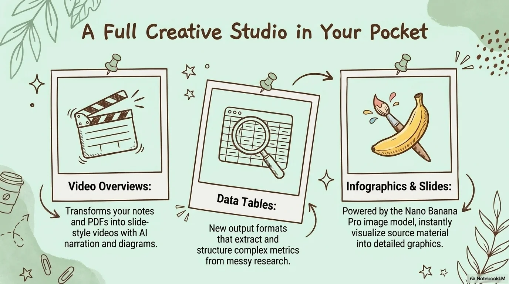

> [!TIP]
> This is a simplified preview. [View Full YAML](styles/digital_nomad.yaml)

```yaml
description: "A cozy and creative aesthetic designed for digital nomads, remote work culture, and lifestyle storytelling. It features the playful, hand-drawn A Day Without Sun typeface for headlines, bringing a personal and homey touch. Characterized by a palette of soft mint, warm peach, and chocolate brown, it uses charming doodle illustrations of workspace elements, plants, and coffee to create an inviting and imaginative atmosphere."
design_system:
  global_style:
    theme: "Digital Nomad. Cozy illustrated design with a playful doodle aesthetic."
    typography: 
      primary_heading: "A Day Without Sun, handwriting"
      secondary_heading: "Open Sauce, bold"
      body_text: "Open Sauce, regular"
    color_palette:
      primary: "#3E2723" # Chocolate Brown
      secondary: "#A5D6A7" # Sage Green
      background: "#B2DFDB" # Mint Green
      surface: "#FFCCBC" # Warm Peach Surface
      text_main: "#3E2723"
      text_secondary: "#5D4037"
    key_visual_elements: 
      - "Hand-drawn doodle illustrations of laptops, monitors, clocks, and desk plants"
      - "Rounded, hand-drawn rectangular containers for text and images"
      - "Soft, organic shapes used as background 'blobs'"
      - "Playful icons like coffee mugs, lightbulbs, and paperclips"

  image_generation_prompts:
    style_guidelines: "Whimsical hand-drawn illustrations, cozy workspace setup, mint green and peach palette, soft lighting, playful doodle aesthetic, A Day Without Sun font vibe."
    themes:
      - target: "Creative Inspiration"
        prompt_elements: "A hand-drawn illustration of a cozy desk with a laptop, a cup of coffee, and a small plant, mint green background, warm and inviting."
      - target: "The Nomad Lifestyle"
        prompt_elements: "A whimsical doodle of a globe and a backpack, surrounded by small sparkles and hand-drawn lines, peach and chocolate brown tones."

slide_layout_templates:
  - type: "Doodle_Workspace_Cover"
    usage: "Large A Day Without Sun title next to a hand-drawn monitor or desk illustration on a mint green background"
  - type: "Cozy_Story_Slide"
    usage: "Text contained in a hand-drawn peach bubble with small plant doodles in the corners"
  - type: "Nomad_Stats_Handmade"
    usage: "Data points represented with hand-drawn icons (clocks, lightbulbs) and chocolate brown text"
  - type: "Illustrated_Comparison"
    usage: "Two hand-drawn containers side-by-side with playful doodle arrows connecting them"
```


#### Engaging Learner

A fun and engaging aesthetic designed for language learning apps, EdTech startups, and interactive educational presentations. It features the bold Heading Now typeface for titles to convey energy, paired with the friendly clarity of TT Firs Neue. Characterized by a palette of periwinkle blue, soft mint, and coral pink, it utilizes playful speech bubble illustrations, wavy zigzag lines, and hand-drawn style tech icons to create a dynamic and welcoming learning experience.

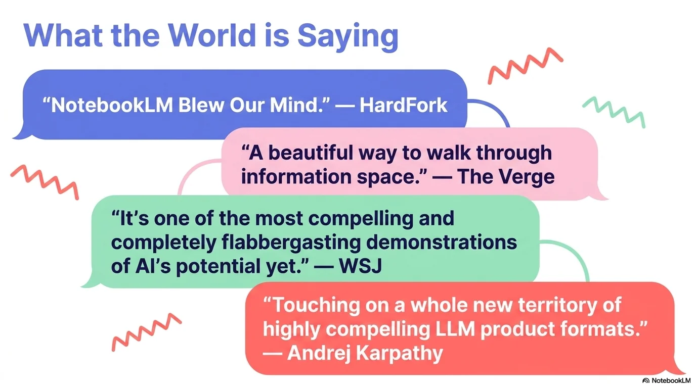

> [!TIP]
> This is a simplified preview. [View Full YAML](styles/engaging_learner.yaml)

```yaml
description: "A fun and engaging aesthetic designed for language learning apps, EdTech startups, and interactive educational presentations. It features the bold Heading Now typeface for titles to convey energy, paired with the friendly clarity of TT Firs Neue. Characterized by a palette of periwinkle blue, soft mint, and coral pink, it utilizes playful speech bubble illustrations, wavy zigzag lines, and hand-drawn style tech icons to create a dynamic and welcoming learning experience."
design_system:
  global_style:
    theme: "Engaging Learner. Playful EdTech design with periwinkle, mint, and coral accents."
    typography: 
      primary_heading: "Heading Now, bold"
      secondary_heading: "TT Firs Neue, bold"
      body_text: "TT Firs Neue, regular"
    color_palette:
      primary: "#7986CB" # Periwinkle Blue
      secondary: "#80CBC4" # Soft Mint Green
      background: "#FFFFFF" # Pure White
      surface: "#FCE4EC" # Soft Pink Surface
      accent: "#FF8A80" # Coral Pink
      text_main: "#3F51B5" # Deep Indigo Text
      text_secondary: "#5C6BC0" # Muted Indigo
    key_visual_elements: 
      - "Playful speech bubble illustrations in mint and coral"
      - "Wavy zigzag lines in various colors to represent dynamic communication"
      - "Hand-drawn style icons for digital devices (phones, tablets, search)"
      - "Soft rounded corners and friendly, high-contrast layouts"
      - "Bright, diverse photography of people learning and smiling"

  image_generation_prompts:
    style_guidelines: "Diverse group of young adults using mobile learning apps, bright and colorful atmosphere, periwinkle and coral accents, wavy lines and speech bubble overlays, fun and engaging, Heading Now font vibe."
    themes:
      - target: "Mobile Learning"
        prompt_elements: "A person smiling while using a language app on their phone in a sunny park, floating periwinkle speech bubbles, playful and energetic atmosphere."
      - target: "Interactive Classroom"
        prompt_elements: "A digital classroom setup with colorful icons and wavy lines, soft coral lighting, friendly and educational, high quality."

slide_layout_templates:
  - type: "Engaging_Hero_Pitch"
    usage: "Large speech bubble illustrations on the right with a bold periwinkle Heading Now title on the left"
  - type: "Interactive_Features_Showcase"
    usage: "Grid of mint-colored boxes with hand-drawn phone icons and dark indigo text"
  - type: "Community_Join_Cards"
    usage: "Split layout with a happy learning community photo and soft pink text cards"
  - type: "Learner_Review_Bubbles"
    usage: "Testimonials presented inside large colorful speech bubbles with coral accents"
```

---


### 📖 Editorial & Magazine

#### Editorial Essence

Sophisticated, editorial, and human-centric design language. It uses warm cream backgrounds, bold terracotta accents, and elegant serif typography to create a "book-like" presentation feel.

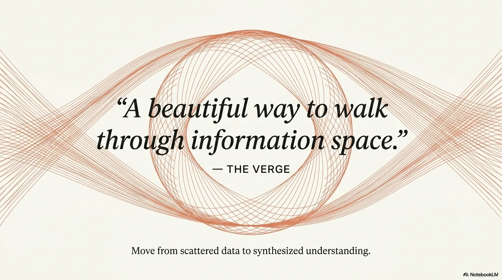

> [!TIP]
> This is a simplified preview. [View Full YAML](styles/editorial_essence.yaml)

```yaml
design_system:
  global_style:
    theme: "Minimalist, sophisticated, and human-centric. High-end editorial style using warm cream backgrounds and bold terracotta accents."
    typography: 
      primary_heading: "Elegant serif (e.g., Lora, Playfair Display), bold"
      secondary_heading: "Clean sans-serif (e.g., Poppins, Inter), uppercase"
      body_text: "Refined serif (e.g., Lora), airy line-height"
    color_palette:
      primary_color: "#D97757"
      background: "#FAF9F5"
      text_main: "#141413"
    key_visual_elements: 
      - "Generous whitespace (Editorial layout)"
      - "Abstract geometric line art"
      - "Pill-shaped labels"

  image_generation_prompts:
    style_guidelines: "Editorial photography style, warm natural lighting, high-end magazine aesthetic, minimalist cream background, terracotta accents."
    themes:
      - target: "Abstract Connection"
        prompt_elements: "Minimalist geometric shapes, warm earth tones, fine line art."

slide_layout_templates:
  - type: "Cover_Editorial"
    usage: "Main title slide with high-impact serif typography"
  - type: "Split_Insight"
    usage: "40/60 text-image split for conceptual explanations"
```

#### Luxury Editorial

A sophisticated, minimalist aesthetic inspired by high-end fashion magazines. It features a luxury palette of deep espresso and gold, combining elegant condensed serifs with flowing cursive accents. Ideal for luxury brands, fashion collections, and premium product launches.

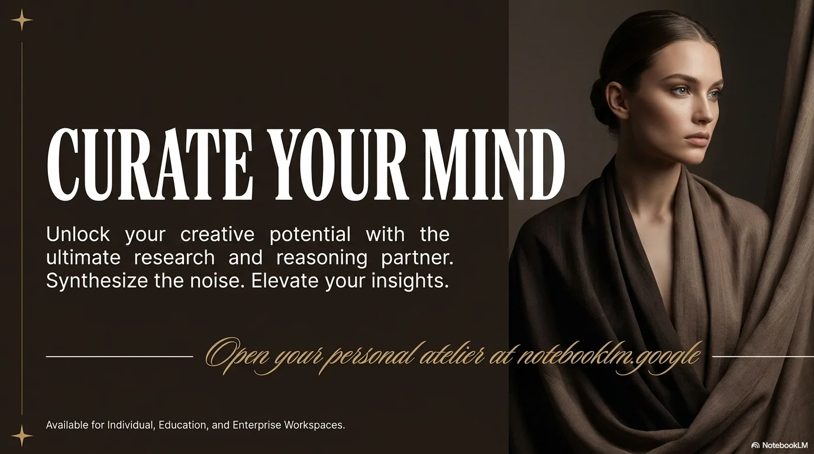

> [!TIP]
> This is a simplified preview. [View Full YAML](styles/luxury_editorial.yaml)

```yaml
design_system:
  global_style:
    theme: "High-end fashion magazine aesthetic. Deep espresso and gold."
    typography: 
      primary_heading: "Elegant condensed serif (Didot-style)"
      accent_script: "Refined flowing cursive"
      body_text: "Minimalist sans-serif with wide tracking"
    color_palette:
      primary_color: "#2D2926"
      secondary_color: "#D4AF37"
      background: "#3C2F2F"
      text_main: "#FFFFFF"
    key_visual_elements: 
      - "Subtle gold sparkle/star vector accents"
      - "Macro photography of luxury textures (silk, jewelry)"
      - "Asymmetric split-screen layouts"
      - "Overlaying script text on top of serif titles"

slide_layout_templates:
  - type: "Editorial_Cover"
    usage: "Fashion collection intro with full-bleed luxury imagery"
  - type: "Brand_Narrative"
    usage: "Split-screen layout for brand stories or mission"
  - type: "Visual_Lookbook"
    usage: "Grid-based display for styling ideas or products"
```

#### Cobalt Editorial

Bold editorial and Swiss-inspired design. High contrast between Electric Blue and Cream, featuring large brutalist typography, liquid organic textures, and iconic symbols like asterisks and plus signs.

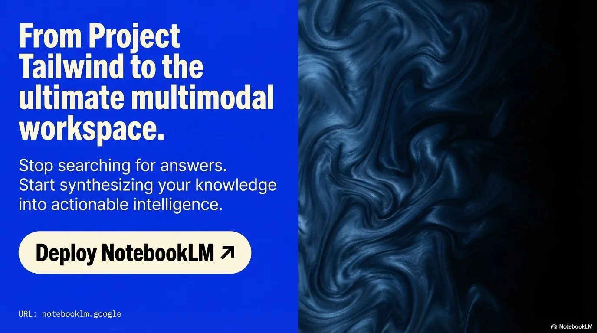

> [!TIP]
> This is a simplified preview. [View Full YAML](styles/cobalt_editorial.yaml)

```yaml
design_system:
  global_style:
    theme: "Bold editorial, Swiss-inspired. Electric Blue & Cream."
    typography: 
      primary_heading: "Extra-bold brutalist sans-serif (e.g., Inter)"
      secondary_heading: "Bold sans-serif, vertical layouts"
      body_text: "Clean sans-serif, high legibility"
    color_palette:
      primary_color: "#2B59FF"
      background: "#FDF5E6"
      text_main: "#000000"
    key_visual_elements: 
      - "Electric Blue asterisks (*) and plus signs (+)"
      - "Liquid, rippled, or smoky textures"
      - "Split-screen layouts"
      - "Pill-shaped buttons with blue outlines"

slide_layout_templates:
  - type: "Editorial_Split"
    usage: "Core sections or chapter starts"
  - type: "Vertical_Type_List"
    usage: "Detailed overviews or content lists"
  - type: "Modular_Brand_Focus"
    usage: "Presenting mission statements or pillars"
```

#### Architectural Portfolio

A modern, minimalist, and geometric design inspired by architectural blueprints and professional portfolios. It features complex pill-shaped photo masks, sage green accents, and a modular "Bento-grid" layout for a high-end, structured aesthetic.

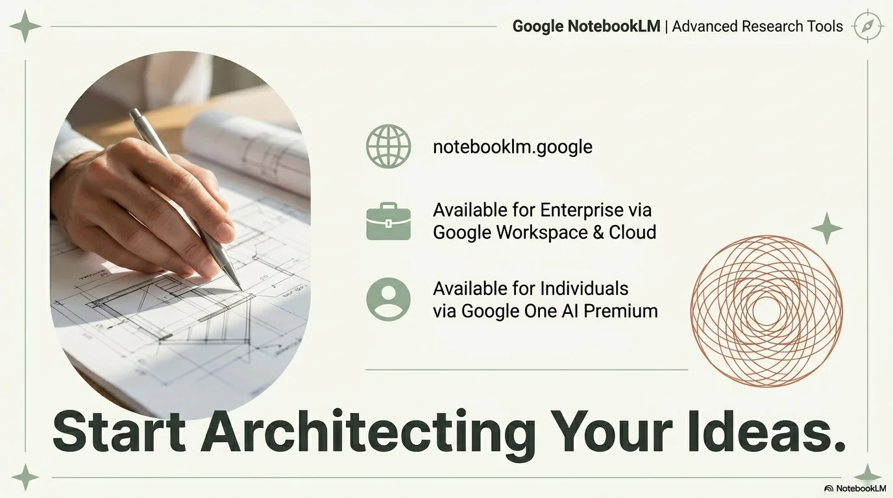

> [!TIP]
> This is a simplified preview. [View Full YAML](styles/architectural_portfolio.yaml)

```yaml
design_system:
  global_style:
    theme: "Modern architectural and geometric. Modular bento-grid layouts."
    typography: 
      primary_heading: "Bold geometric sans-serif (Montserrat/Inter)"
      secondary_heading: "Medium sans-serif, clean"
      body_text: "Light-weight minimalist sans-serif"
    color_palette:
      primary_color: "#8B9B7B"
      background: "Off-White (#F4F4F4)"
      text_main: "#333333"
      accent_color: "#A0522D"
    key_visual_elements: 
      - "Complex pill-shaped and circular photo masks"
      - "Modular Bento-grid content organization"
      - "Minimalist sage green star icons in corners"
      - "Thin horizontal separators and asymmetric clusters"

slide_layout_templates:
  - type: "Portfolio_Cover"
    usage: "Bold intro with complex geometric photo masking"
  - type: "Bento_Index"
    usage: "Modular TOC or overview with circular masks"
  - type: "Contact_Modular"
    usage: "Final contact info with terracotta accents"
```

#### Classical Gallery

A refined, museum-inspired design featuring parchment textures, sage green accents, and elegant ornamental filigree. It balances historical aesthetics with modern sans-serif typography for a scholarly and curated presentation feel.

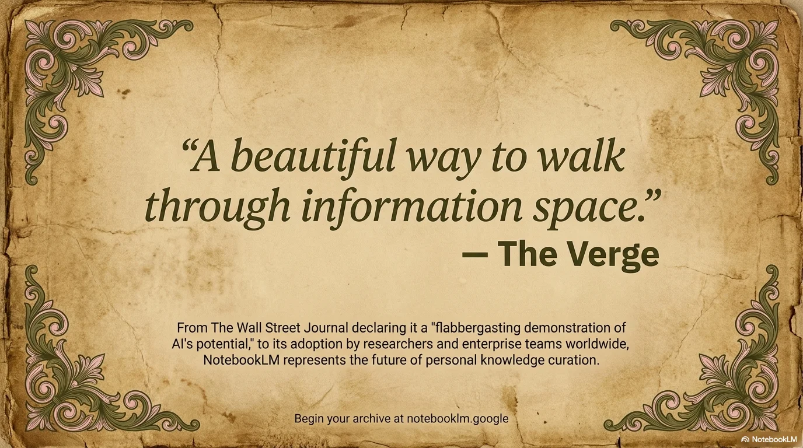

> [!TIP]
> This is a simplified preview. [View Full YAML](styles/classical_gallery.yaml)

```yaml
design_system:
  global_style:
    theme: "Classical museum-like, historical and refined. Parchment textures and elegant scrollwork."
    typography: 
      primary_heading: "Bold clean sans-serif for modern contrast"
      secondary_heading: "Medium weight sans-serif"
      body_text: "Highly legible sans-serif"
    color_palette:
      primary_color: "#8B9B7B"
      background: "Textured parchment (#E6E1D3)"
      text_main: "#4B5320"
      accent_color: "#F4C2C2"
    key_visual_elements: 
      - "Elegant ornamental filigree and scrollwork"
      - "Sage green color blocks for sidebars"
      - "Marble sculptures and Renaissance-style sketches"
      - "High-texture parchment background"

slide_layout_templates:
  - type: "Museum_Cover"
    usage: "Classical intro with symmetric filigree framing"
  - type: "Classical_Split"
    usage: "Art-focused layouts with large color blocks"
  - type: "Percentage_Highlight"
    usage: "Key metrics or summaries with historical framing"
```

#### Summer Collage

A bright, energetic, and sun-drenched design featuring asymmetric photo grids, breezy handwritten accents, and "Polaroid" style overlays. It creates a vibrant lifestyle atmosphere perfect for travel, leisure, and summer-themed presentations.

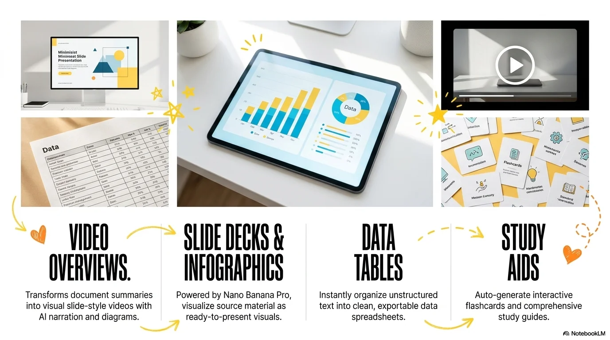

> [!TIP]
> This is a simplified preview. [View Full YAML](styles/summer_collage.yaml)

```yaml
design_system:
  global_style:
    theme: "Bright, energetic, and sun-drenched vacation vibe. Photo collages and handwritten accents."
    typography: 
      primary_heading: "Extra-tall, bold, condensed sans-serif"
      secondary_heading: "Elegant flowing script / handwritten font"
      body_text: "Clean minimalist sans-serif"
    color_palette:
      primary_color: "#00A8CC"
      background: "Pure White (#FFFFFF)"
      text_main: "#1A1A1A"
      accent_color: "#F4D03F"
    key_visual_elements: 
      - "Asymmetric photo grids and mosaics"
      - "Rotated 'Polaroid' style photo overlays"
      - "Hand-drawn doodle icons (hearts, arrows)"
      - "High-saturation lifestyle imagery"

slide_layout_templates:
  - type: "Vacation_Cover"
    usage: "High-impact mosaic intro with condensed typography"
  - type: "Polaroid_Memories"
    usage: "Reflective content with rotated photo frames"
  - type: "Condensed_Keyword"
    usage: "Bold section breaks or summary slides"
```

#### Vision Board

A tactile, handmade, and inspirational design featuring realistic paper textures, torn edges, and washi tape accents. It captures the essence of a physical scrapbook or mood board, perfect for creative workshops, personal planning, and visionary presentations.

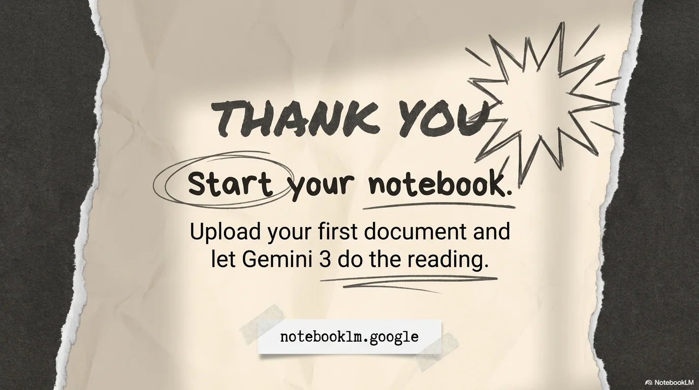

> [!TIP]
> This is a simplified preview. [View Full YAML](styles/vision_board.yaml)

```yaml
design_system:
  global_style:
    theme: "Tactile, handmade scrapbooking aesthetic. Torn edges, tape accents, and paper textures."
    typography: 
      primary_heading: "Extra-bold thick sans-serif (all caps)"
      secondary_heading: "Marker-style / handwritten font"
      body_text: "Clean professional sans-serif"
    color_palette:
      primary_color: "#F9F7F2"
      background: "Crumpled paper texture"
      text_main: "#2D2D2D"
      accent_color: "#E0E0E0"
    key_visual_elements: 
      - "Realistic torn paper edge overlays"
      - "Washi tape and masking tape strips"
      - "Hand-drawn marker ovals and arrows"
      - "Multi-layered paper scrap aesthetic"

slide_layout_templates:
  - type: "Manifesto_Cover"
    usage: "Bold inspirational intro with layered photos"
  - type: "Concept_Tornado"
    usage: "Mapping areas with marker arrows and taped notes"
  - type: "Note_to_Self"
    usage: "Key takeaways or quotes on centered paper scraps"
```


#### Academic Edge

A sophisticated academic and editorial aesthetic inspired by thesis defenses and research portfolios. It balances high-contrast black and white photography with bold red accents and soft warm 'aura' gradients. Powered by the geometric Codec Pro typeface.

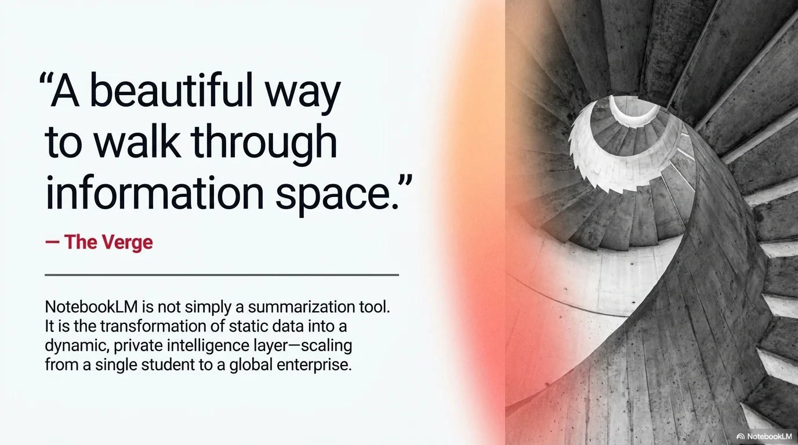

> [!TIP]
> This is a simplified preview. [View Full YAML](styles/academic_edge.yaml)

```yaml
description: "A sophisticated academic and editorial aesthetic inspired by thesis defenses and research portfolios. It balances high-contrast black and white photography with bold red accents and soft warm 'aura' gradients. Powered by the geometric Codec Pro typeface."
design_system:
  global_style:
    theme: "Academic Edge. Editorial research style with B&W imagery and crimson accents."
    typography: 
      primary_heading: "Codec Pro, sans-serif"
      secondary_heading: "Codec Pro, light"
      body_text: "Inter, sans-serif"
    color_palette:
      primary: "#D00000" # Academic Red
      background: "#FFFFFF" # Pure White
      surface: "#F8F9FA" # Ultra Light Grey
      accent_gradient: "Soft grainy gradient from peach to soft red"
      text_main: "#1A1A1A"
      text_secondary: "#4A4A4A"
    key_visual_elements: 
      - "High-contrast black and white photography"
      - "Bold red arrows and list bullets"
      - "Subtle film grain on background gradients"
      - "Minimalist horizontal dividers"

  image_generation_prompts:
    style_guidelines: "Editorial photography style, high-contrast black and white, minimalist composition, soft warm aura light leaks, architectural and nature details, professional academic aesthetic, Codec Pro font vibe."
    themes:
      - target: "Research & Detail"
        prompt_elements: "Close-up of architectural structures in high-contrast black and white, sharp lines, minimalist."
      - target: "Atmospheric Academic"
        prompt_elements: "Abstract soft warm aura gradient with light film grain, crimson accents, professional and clean."

slide_layout_templates:
  - type: "Thesis_Hero"
    usage: "Large bold title on the left with a vertical aura gradient on the right"
  - type: "Step_Process"
    usage: "Horizontal flow using B&W images connected by bold red arrows"
  - type: "Editorial_Results"
    usage: "Data charts with red bars and clean B&W background image integration"
  - type: "Recommendation_Cards"
    usage: "Split layout with B&W photos on top and red headings below"
```


#### Film Scrapbook

A tactile and nostalgic aesthetic designed for storytelling, biographies, and documentary-style presentations. It pairs the clean Open Sauce sans-serif with the technical Fira Code monospace. Characterized by a charcoal black and cream palette, it features film strip borders, ripped paper textures, and hand-drawn mustard yellow highlights to create a personal, 'behind-the-scenes' scrapbook atmosphere.

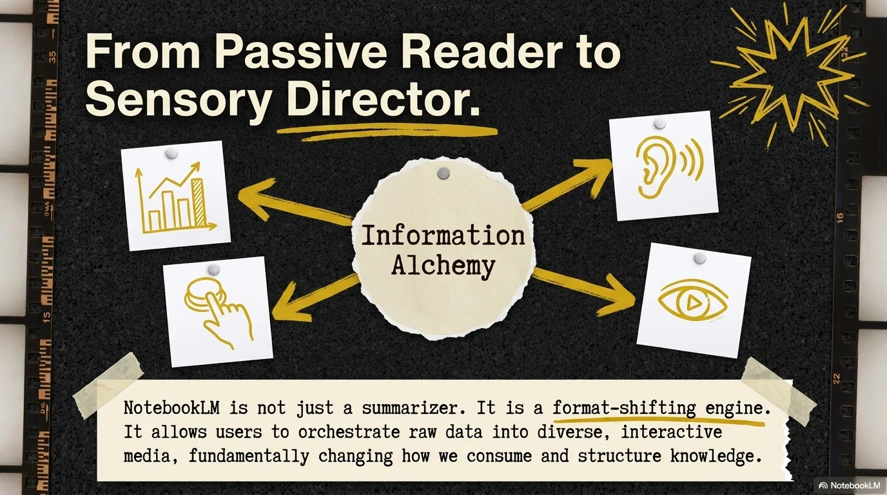

> [!TIP]
> This is a simplified preview. [View Full YAML](styles/film_scrapbook.yaml)

```yaml
description: "A tactile and nostalgic aesthetic designed for storytelling, biographies, and documentary-style presentations. It pairs the clean Open Sauce sans-serif with the technical Fira Code monospace. Characterized by a charcoal black and cream palette, it features film strip borders, ripped paper textures, and hand-drawn mustard yellow highlights to create a personal, 'behind-the-scenes' scrapbook atmosphere."
design_system:
  global_style:
    theme: "Film Scrapbook. Personal and nostalgic design with film textures and hand-drawn highlights."
    typography: 
      primary_heading: "Open Sauce, sans-serif"
      secondary_heading: "Fira Code, monospace"
      body_text: "Fira Code, regular"
    color_palette:
      primary: "#C0CA33" # Mustard Yellow Highlight
      secondary: "#F5F5DC" # Old Paper Cream
      background: "#121212" # Charcoal Black
      surface: "#F5F5DC" # Cream Surface for paper notes
      text_main: "#F5F5DC" # Cream text on dark
      text_secondary: "#121212" # Dark text on paper
    key_visual_elements: 
      - "Vertical film strip borders and vintage camera reel motifs"
      - "Ripped paper textures used as containers for secondary text"
      - "Hand-drawn mustard yellow circles and underlines to emphasize words"
      - "Simple doodle-style icons (smileys, arrows, stars) in yellow and white"

  image_generation_prompts:
    style_guidelines: "Vintage film scrapbook aesthetic, charcoal black and cream palette, film strips, ripped paper, hand-drawn yellow circles, Fira Code font vibe, grainy documentary atmosphere."
    themes:
      - target: "Story Introduction"
        prompt_elements: "A vintage film strip on the side of a charcoal black background, a piece of ripped cream paper in the center, hand-drawn yellow arrow."
      - target: "Historical Context"
        prompt_elements: "A grainy black and white photo framed like a polaroid, mustard yellow scribbles, old paper texture."

slide_layout_templates:
  - type: "Scrapbook_Title"
    usage: "Title in Open Sauce on black with film strips on the edges and a hand-drawn circle around a key word"
  - type: "Ripped_Note_Slide"
    usage: "Body text in Fira Code placed over a large ripped paper graphic in the center"
  - type: "Film_Strip_Gallery"
    usage: "Multiple photos arranged as if they were part of a continuous film reel"
  - type: "Doodle_Resource_Page"
    usage: "Icons and links surrounded by hand-drawn scribbles and smiley faces on a cream background"
```


#### Soft Editorial

A sophisticated and airy editorial aesthetic designed for fashion campaigns, high-end beauty brands, and feminine storytelling. It features the elegant, high-contrast Loubag serif typeface for headlines, providing a chic and authoritative presence. Characterized by a palette of soft cream, muted lime green, and pale sky blue, it utilizes generous white space, delicate horizontal lines, and pill-shaped category labels to create a premium, magazine-like experience.

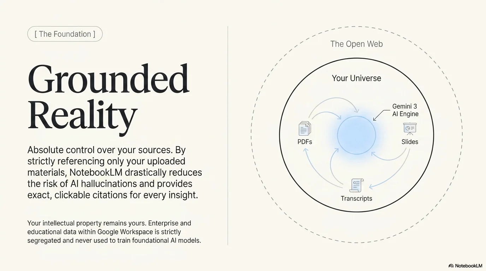

> [!TIP]
> This is a simplified preview. [View Full YAML](styles/soft_editorial.yaml)

```yaml
description: "A sophisticated and airy editorial aesthetic designed for fashion campaigns, high-end beauty brands, and feminine storytelling. It features the elegant, high-contrast Loubag serif typeface for headlines, providing a chic and authoritative presence. Characterized by a palette of soft cream, muted lime green, and pale sky blue, it utilizes generous white space, delicate horizontal lines, and pill-shaped category labels to create a premium, magazine-like experience."
design_system:
  global_style:
    theme: "Soft Editorial. Elegant magazine-style design with high-contrast serif typography."
    typography: 
      primary_heading: "Loubag, serif"
      secondary_heading: "Loubag, italic"
      body_text: "Inter, regular"
    color_palette:
      primary: "#D4E157" # Soft Lime Green
      secondary: "#B3E5FC" # Pale Sky Blue
      background: "#FDFCF8" # Cream/Off-white
      surface: "#FFFFFF" # Pure White
      text_main: "#1A1A1A" # Deep Charcoal
      text_secondary: "#757575" # Medium Grey
    key_visual_elements: 
      - "Generous white space for a clean, editorial layout"
      - "Pill-shaped labels with thin borders for categories or tags"
      - "Thin horizontal separators between titles and subtitles"
      - "Full-bleed or large-format photography with soft, natural lighting"

  image_generation_prompts:
    style_guidelines: "High-end editorial photography, soft natural lighting, minimalist composition, Loubag font aesthetic, pale lime and cream palette, sophisticated and serene."
    themes:
      - target: "Creative Concept"
        prompt_elements: "Close-up of two hands reaching towards each other, soft shadows, cream background, minimalist and artistic, editorial style."
      - target: "Beauty Product"
        prompt_elements: "A delicate white flower held by a person, soft focus, pale blue and lime accents, clean and airy composition."

slide_layout_templates:
  - type: "Editorial_Cover_Split"
    usage: "Full-bleed photo on one side, large Loubag title on a cream background on the other"
  - type: "Pill_Category_Intro"
    usage: "Centered title with a small pill-shaped tag above it and a thin separator below"
  - type: "Quote_Soft_Serif"
    usage: "Large italic Loubag quote on a soft lime background with subtle drop shadows"
  - type: "Photography_Showcase"
    usage: "Multiple photos of varying sizes arranged in a clean, asymmetric grid with minimal text"
```


#### Prime Noir

A dark and sophisticated culinary aesthetic designed for premium steakhouses, fine dining restaurants, and luxury food brands. It features a high-contrast serif for headings to convey tradition and excellence, paired with the modern DM Sans for clear information delivery. Characterized by a matte black background, deep burgundy accents, and delicate botanical illustrations, it creates a prestigious 'noir' dining experience.

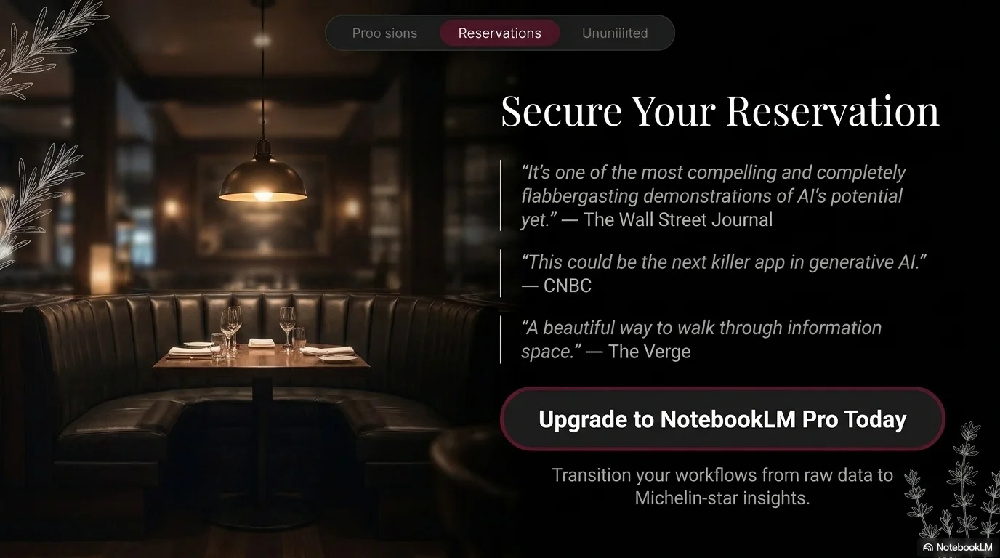

> [!TIP]
> This is a simplified preview. [View Full YAML](styles/prime_noir.yaml)

```yaml
description: "A dark and sophisticated culinary aesthetic designed for premium steakhouses, fine dining restaurants, and luxury food brands. It features a high-contrast serif for headings to convey tradition and excellence, paired with the modern DM Sans for clear information delivery. Characterized by a matte black background, deep burgundy accents, and delicate botanical illustrations, it creates a prestigious 'noir' dining experience."
design_system:
  global_style:
    theme: "Prime Noir. Sophisticated dark culinary design with burgundy and botanical accents."
    typography: 
      primary_heading: "Cinzel, serif"
      secondary_heading: "Playfair Display, serif"
      body_text: "DM Sans, sans-serif"
    color_palette:
      primary: "#990000" # Deep Burgundy
      secondary: "#111111" # Matte Black Background
      background: "#000000" # Pure Black
      surface: "#1A1A1A" # Dark Charcoal Surface
      text_main: "#FFFFFF" # Pure White Text
      text_secondary: "#CCCCCC" # Light Grey Text
    key_visual_elements: 
      - "White hand-drawn botanical illustrations (rosemary, leaves) in the corners"
      - "Pill-shaped navigation bar with red highlights for active items"
      - "Large, high-contrast serif titles for a prestigious feel"
      - "Circular or rounded-rectangular image containers with thin borders"
      - "Subtle dark gradients to add depth to the black background"

  image_generation_prompts:
    style_guidelines: "Fine dining food photography, low-key lighting, dark mood, steam rising from food, burgundy and charcoal palette, sharp focus, Prime Noir font aesthetic."
    themes:
      - target: "Signature Dish"
        prompt_elements: "A perfectly grilled steak on a black plate, rosemary garnish, dark moody lighting, steam, high-end restaurant photography, sharp and elegant."
      - target: "Restaurant Ambience"
        prompt_elements: "Interior of a luxury steakhouse, dim warm lighting, dark wood and leather textures, sophisticated and exclusive atmosphere."

slide_layout_templates:
  - type: "Steakhouse_Hero_Cover"
    usage: "Full-bleed food photo with a large Cinzel title centered and botanical corner accents"
  - type: "Noir_Menu_Category"
    usage: "Title on a deep burgundy highlight bar with a list of items in DM Sans below"
  - type: "Chef_Team_Circles"
    usage: "Round portraits of the team with thin white borders on a matte black background"
  - type: "Culinary_Values_Grid"
    usage: "Two-column layout with circular photos on one side and structured DM Sans text on the other"
```

---


### 🚀 Tech & Innovation

#### Visual Discovery

Focuses on visual-first layouts, card-based components with high border-radius, and vibrant red accents to drive engagement and focus. Inspired by modern discovery feeds.

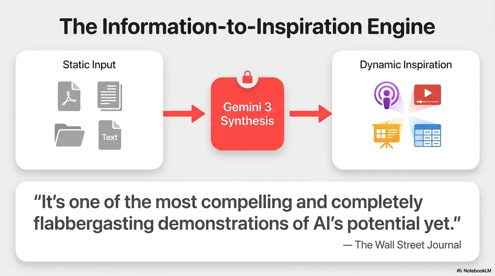

> [!TIP]
> This is a simplified preview. [View Full YAML](styles/visual_discovery.yaml)

```yaml
design_system:
  global_style:
    theme: "Modern, visual-first, and organized. Inspired by card-based discovery aesthetics. Uses card-based layouts with high border radius, soft shadows, and vibrant accents."
    typography: 
      primary_heading: "Clean rounded sans-serif (e.g., Roboto, Helvetica Rounded), bold"
      secondary_heading: "Simple sans-serif, medium weight, clean"
      body_text: "Functional sans-serif, standard weights, high contrast on white"
    color_palette:
      primary_color: "#E60023"
      background: "#FFFFFF"
      text_main: "#111111"
      accent_color: "#EFEFEF"
    key_visual_elements: 
      - "Rounded corners (16px to 24px) for cards and images"
      - "Drop shadows for depth"
      - "Grid-based image distribution"
      - "Circular profiles and 'save' style button call-outs"

  image_generation_prompts:
    style_guidelines: "Clean white studio background, vibrant accents, rounded corners, drop shadows, flat design elements, organized grid."

slide_layout_templates:
  - type: "Cover_Discovery"
    usage: "Impactful intro slide"
  - type: "Card_Grid_Insights"
    usage: "Presenting multiple features or items"
  - type: "Masonry_Vision"
    usage: "Inspiration or mood board"
```

#### Urban Ribbon

An authoritative and structured corporate aesthetic featuring distinctive 3D-folded "ribbon" elements and sharp diagonal background slices. It combines a professional charcoal and beige palette with golden-hour cityscape photography, creating a sense of metropolitan sophistication and executive power.

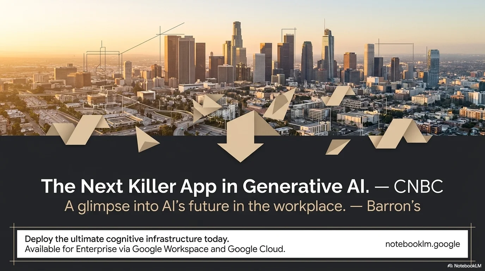

> [!TIP]
> This is a simplified preview. [View Full YAML](styles/urban_ribbon.yaml)

```yaml
design_system:
  global_style:
    theme: "Authoritative urban aesthetic. 3D-folded ribbons and diagonal slices."
    typography: 
      primary_heading: "Bold authoritative sans-serif (League Spartan)"
      secondary_heading: "Professional sans-serif"
      body_text: "Clean functional sans-serif"
    color_palette:
      primary_color: "#333333"
      secondary_color: "#D9C5B2"
      background_dark: "#5C4B41"
      text_main: "#1A1A1A"
    key_visual_elements: 
      - "3D-folded 'ribbon' overlays for titles and labels"
      - "Sharp diagonal background slices and parallelogram containers"
      - "Golden-hour urban landscapes and skyscraper photography"
      - "High-contrast charcoal and warm beige palette"

slide_layout_templates:
  - type: "Executive_Pitch"
    usage: "Professional business cover with urban backdrop and ribbon accents"
  - type: "Leadership_Grid"
    usage: "Team profiles with parallelogram-shaped portrait cards"
  - type: "Strategic_Comparison"
    usage: "Comparative data with diagonal dividers and vertical image bleeds"
```

#### Neon Pulsar

Futuristic, high-energy, and tech-focused design. This dark mode aesthetic uses vibrant neon gradients (Cyan, Magenta, Purple) and glassmorphic elements to create a cutting-edge startup atmosphere.

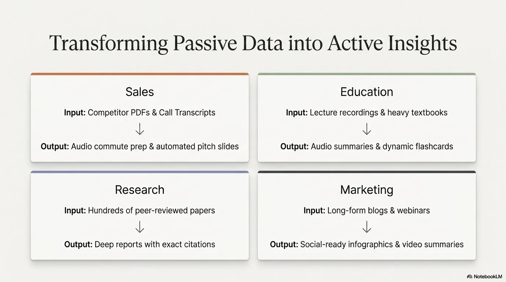

> [!TIP]
> This is a simplified preview. [View Full YAML](styles/neon_pulsar.yaml)

```yaml
design_system:
  global_style:
    theme: "Futuristic, high-energy, tech-focused. Dark mode neon."
    typography: 
      primary_heading: "Extra-bold modern sans-serif (e.g., Inter)"
      secondary_heading: "Medium sans-serif, high contrast"
      body_text: "Clean sans-serif for dark mode"
    color_palette:
      primary_color: "#FFFFFF"
      background: "#000000"
      accent_cyan: "#00F2FF"
      accent_purple: "#7000FF"
      accent_magenta: "#FF00E5"
    key_visual_elements: 
      - "Blurred neon gradient spheres"
      - "Concentric rings and digital orbits"
      - "Pill-shaped containers"
      - "Glassmorphic cards with neon borders"

slide_layout_templates:
  - type: "Tech_Startup_Hero"
    usage: "Main title or key announcement"
  - type: "Service_Orbits"
    usage: "Showing features around a core concept"
  - type: "Neon_Bento_Grid"
    usage: "Showcasing tech specs or team members"
```

#### Midnight Tactical

Modern, tech-utilitarian design with a high-contrast matte black base and vibrant lime green accents. Features industrial aesthetic elements like tilted boxes, double chevrons, and monospace metadata.

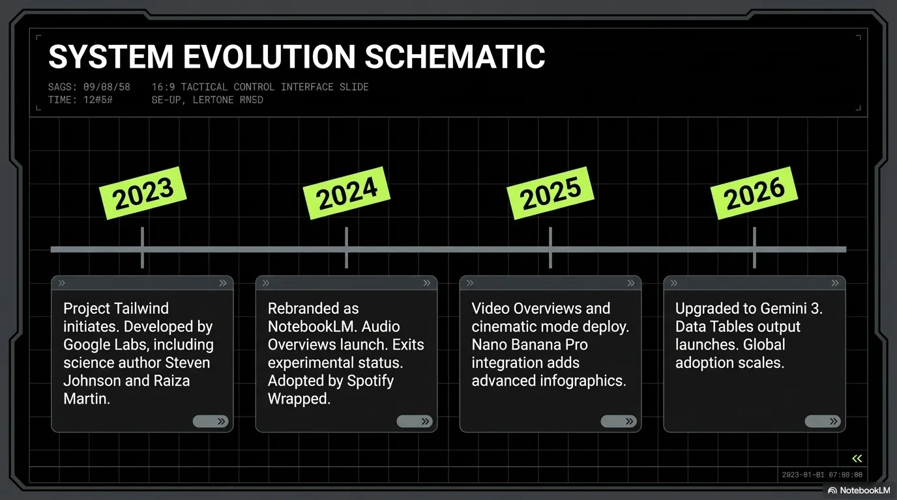

> [!TIP]
> This is a simplified preview. [View Full YAML](styles/midnight_tactical.yaml)

```yaml
design_system:
  global_style:
    theme: "Modern tech-utilitarian. Matte Black & Lime Green."
    typography: 
      primary_heading: "Bold geometric sans-serif (e.g., Space Grotesk)"
      secondary_heading: "Medium sans-serif, high contrast white"
      body_text: "Clean sans-serif for dark backgrounds"
      accent_mono: "Monospace for technical labels"
    color_palette:
      primary_color: "#C6FF00"
      background: "#000000"
      text_main: "#FFFFFF"
    key_visual_elements: 
      - "Tilted lime green highlight boxes (fractional labels)"
      - "Pill-shaped labels in dark green"
      - "Double chevron accents (<<)"
      - "Rounded-corner modular grid containers"

slide_layout_templates:
  - type: "Tactical_Hero"
    usage: "Section headers or main announcements"
  - type: "Utility_Agenda"
    usage: "Agenda or multi-point summaries"
  - type: "Textured_Gallery"
    usage: "Showcasing visual references or products"
```

#### Architectural Mono

Modern brutalist, monochromatic, and architectural design. Inspired by minimalist gallery aesthetics, it features high-contrast grayscale photography, large technical stamps, and sleek sans-serif typography.

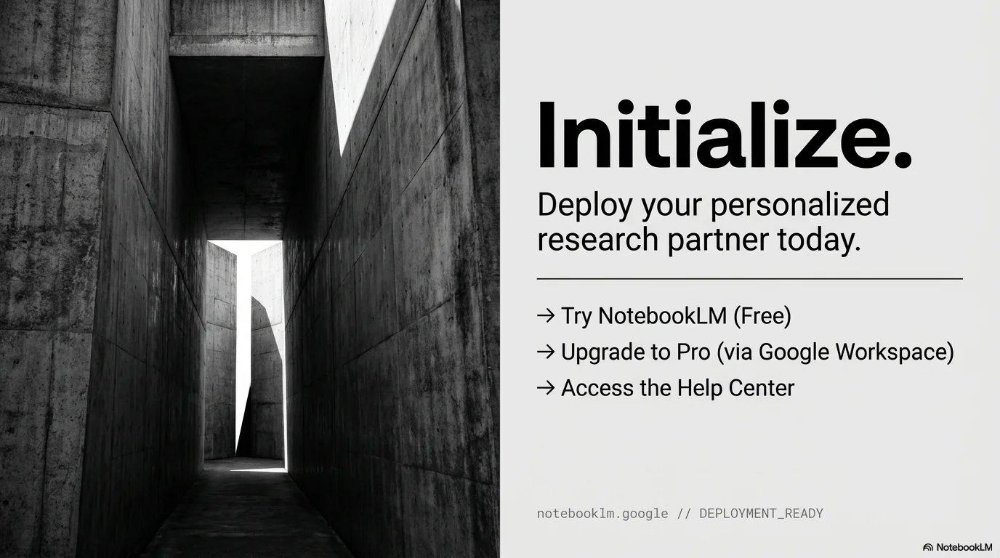

> [!TIP]
> This is a simplified preview. [View Full YAML](styles/architectural_mono.yaml)

```yaml
design_system:
  global_style:
    theme: "Modern brutalist, monochromatic, and architectural. High-contrast grayscale."
    typography: 
      primary_heading: "Clean modern sans-serif (e.g., Inter, Helvetica), bold"
      secondary_heading: "Refined sans-serif, standard weight"
      body_text: "Functional sans-serif, technical feel"
      accent_mono: "Monospace for technical labels"
    color_palette:
      primary_color: "#111111"
      background: "#E8E8E8"
      text_main: "#111111"
      accent_gray: "#B0B0B0"
    key_visual_elements: 
      - "High-contrast grayscale architectural photography"
      - "Large year stamps (e.g., '20 | 25')"
      - "Thin horizontal technical dividers"
      - "Thin arrow icons (→)"
      - "Vertical section labels"

slide_layout_templates:
  - type: "Architectural_Cover"
    usage: "Impactful intro with full-page imagery"
  - type: "Mission_Grid"
    usage: "Masonry grid for multiple references"
  - type: "Sliver_About"
    usage: "Vertical image sliver presentation"
```

#### Architectural Cobalt

Technical, dark architectural, and blueprint-inspired design. Features deep charcoal backgrounds with vibrant cobalt blue gradients and precise 'sight' crosshair visual elements for a high-end engineering feel.


> [!TIP]
> This is a simplified preview. [View Full YAML](styles/architectural_cobalt.yaml)

```yaml
design_system:
  global_style:
    theme: "Technical, dark architectural, blueprint-inspired. Deep charcoal with cobalt blue."
    typography: 
      primary_heading: "Bold high-contrast sans-serif"
      secondary_heading: "Medium sans-serif, clean"
      body_text: "Functional sans-serif, optimized for dark mode"
      technical_label: "Small uppercase sans-serif, spaced"
    color_palette:
      primary_color: "#304FFE"
      background: "#111111"
      text_main: "#FFFFFF"
      accent_overlay: "rgba(48, 79, 254, 0.2)"
    key_visual_elements: 
      - "Circular crosshair/sight icons"
      - "Vibrant cobalt blue gradient overlays"
      - "Dark, high-shadow architectural photography"
      - "Thin white structural grid lines"

slide_layout_templates:
  - type: "Cobalt_Impact_Cover"
    usage: "Impactful intro with technical structural visuals"
  - type: "Dark_Project_Detail"
    usage: "Showcasing projects with technical metadata"
  - type: "Expertise_Profile"
    usage: "Team introduction or profile highlights"
```


#### Startup Aura

A high-end, tech-focused pitch deck aesthetic. It features soft 'mesh' gradients in blue tones, clean Open Sauce typography, and a professional dark-mode charcoal base. Designed for startups, product launches, and innovative business presentations.

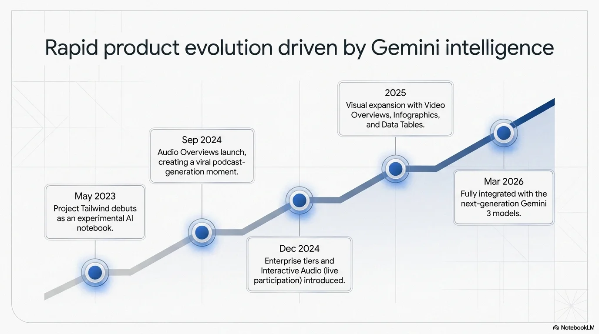

> [!TIP]
> This is a simplified preview. [View Full YAML](styles/startup_aura.yaml)

```yaml
description: "A high-end, tech-focused pitch deck aesthetic. It features soft 'mesh' gradients in blue tones, clean Open Sauce typography, and a professional dark-mode charcoal base. Designed for startups, product launches, and innovative business presentations."
design_system:
  global_style:
    theme: "Startup Aura. Modern pitch deck with mesh gradients and tech-centric typography."
    typography: 
      primary_heading: "Open Sauce, sans-serif"
      secondary_heading: "Open Sauce Sans, medium weight"
      body_text: "Open Sauce Sans, light weight"
    color_palette:
      primary: "#007BFF" # Electric Blue
      background: "#1A1A1A" # Deep Charcoal
      surface: "#2D2D2D" # Slate Grey
      accent_gradient: "Soft mesh gradient from blue to light grey"
      text_main: "#FFFFFF"
      text_secondary: "#B0B0B0"
    key_visual_elements: 
      - "Soft blue 'aura' mesh gradients as background accents"
      - "Thin 1px borders for content cards"
      - "Rounded rectangles with 12px-16px corners"
      - "Minimalist line icons and clean data visualization charts"

  image_generation_prompts:
    style_guidelines: "Modern tech aesthetic, soft blue mesh gradients, minimalist corporate photography, clean professional lighting, high-end startup presentation style, Open Sauce font vibe."
    themes:
      - target: "Innovation Backdrop"
        prompt_elements: "Soft blue and grey abstract mesh gradient, smooth transition, professional tech background, minimalist."
      - target: "Team & Tech"
        prompt_elements: "Close-up of a professional modern workspace with soft blue lighting, high-tech aesthetic, clean composition."

slide_layout_templates:
  - type: "Pitch_Hero"
    usage: "Main title slide with a large aura gradient accent on the right"
  - type: "Service_Grid"
    usage: "Features or services organized in outlined rounded cards"
  - type: "Data_Traction"
    usage: "Key metrics and growth charts with thin blue line accents"
  - type: "Timeline_Milestones"
    usage: "Company history or roadmaps using dotted line connectors and blue nodes"
```


#### Neon Venture

A bold, futuristic startup aesthetic that blends deep indigo backgrounds with vibrant neon lavender accents. It features iridescent 3D geometric shapes, glassmorphism UI elements, and dynamic vertical typography. Perfect for high-tech ventures, AI startups, and forward-thinking pitches.

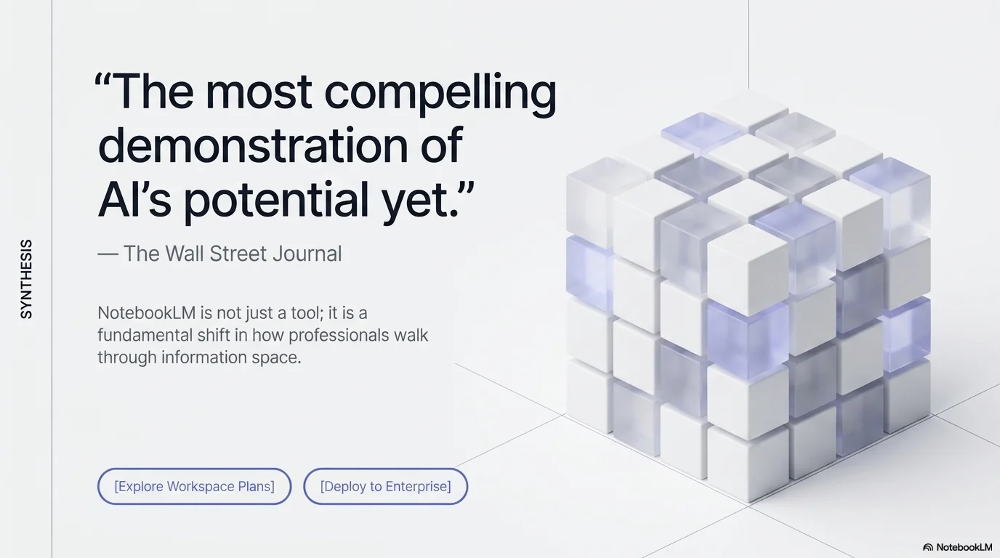

> [!TIP]
> This is a simplified preview. [View Full YAML](styles/neon_venture.yaml)

```yaml
description: "A bold, futuristic startup aesthetic that blends deep indigo backgrounds with vibrant neon lavender accents. It features iridescent 3D geometric shapes, glassmorphism UI elements, and dynamic vertical typography. Perfect for high-tech ventures, AI startups, and forward-thinking pitches."
design_system:
  global_style:
    theme: "Neon Venture. Cyber-corporate style with holographic 3D elements and neon accents."
    typography: 
      primary_heading: "Open Sauce, sans-serif"
      secondary_heading: "Open Sauce, medium"
      body_text: "Open Sauce, light"
    color_palette:
      primary: "#9D72FF" # Vibrant Neon Lavender
      background: "#0B071E" # Deep Space Indigo
      surface: "#1A1438" # Dark Purple Surface
      accent_gradient: "Iridescent holographic shimmer with purple and teal reflections"
      text_main: "#FFFFFF"
      text_secondary: "#B0A9D1"
    key_visual_elements: 
      - "Holographic 3D geometric primitives (cubes, spheres, pyramids)"
      - "Vertical sidebar titles for section headers"
      - "Glassmorphism cards with subtle neon glow shadows"
      - "Thin pill-shaped badge containers for categories"

  image_generation_prompts:
    style_guidelines: "Futuristic corporate tech style, 3D iridescent geometric objects, deep indigo lighting, neon purple accents, glassmorphism surfaces, sharp focus, professional innovative aesthetic, Open Sauce font vibe."
    themes:
      - target: "Data Visualization"
        prompt_elements: "Futuristic 3D bar chart with neon lavender glow, holographic textures, floating over deep indigo background."
      - target: "Abstract Growth"
        prompt_elements: "A stack of iridescent 3D cubes with metallic reflections, neon purple light leaks, high-tech minimalist composition."

slide_layout_templates:
  - type: "Neon_Hero"
    usage: "Massive title overlapping an iridescent 3D shape with neon badges above"
  - type: "Glass_Market_Analysis"
    usage: "Vertical section title on the left with data cards using glassmorphism effects"
  - type: "Corporate_Overview"
    usage: "Split layout with a long horizontal image banner and clean tech-text below"
  - type: "Holographic_Team"
    usage: "Team profiles in glass containers with neon hover-style accents"
```


#### Cyber Pixel

A vibrant and nostalgic aesthetic inspired by 8-bit gaming and retro-tech culture. It features the pixelated Pixelion typeface to capture the essence of vintage computing. Characterized by a dark purple and cyan neon palette, it uses icons of floppy disks, cassettes, and pixel hearts, all enhanced with glow effects and floating bubbles to create a futuristic synthwave atmosphere.

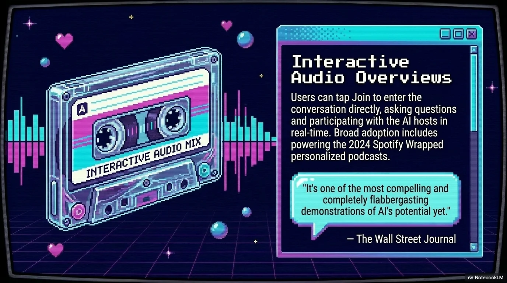

> [!TIP]
> This is a simplified preview. [View Full YAML](styles/cyber_pixel.yaml)

```yaml
description: "A vibrant and nostalgic aesthetic inspired by 8-bit gaming and retro-tech culture. It features the pixelated Pixelion typeface to capture the essence of vintage computing. Characterized by a dark purple and cyan neon palette, it uses icons of floppy disks, cassettes, and pixel hearts, all enhanced with glow effects and floating bubbles to create a futuristic synthwave atmosphere."
design_system:
  global_style:
    theme: "Cyber Pixel. Futuristic and nostalgic pixel-art design for tech and retro-gaming presentations."
    typography: 
      primary_heading: "Pixelion, sans-serif"
      secondary_heading: "Pixelion, medium"
      body_text: "Inter, regular" # Using a clean sans for readability against the pixelated headers
    color_palette:
      primary: "#00BCD4" # Neon Cyan
      secondary: "#C2185B" # Vibrant Magenta
      background: "#0D1B2A" # Deep Navy / Space
      surface: "#4A148C" # Dark Purple Surface
      text_main: "#00BCD4" # Cyan text for high visibility
      text_secondary: "#FFFFFF"
    key_visual_elements: 
      - "Pixelated icons of retro hardware (old PCs, floppy disks, cassettes)"
      - "Vibrant neon glow and scanline effects on text and boxes"
      - "8-bit pixel hearts and floating spheres as decorative elements"
      - "Dynamic gradients transitioning from deep purple to neon cyan"

  image_generation_prompts:
    style_guidelines: "Retro tech synthwave aesthetic, pixel art style, neon cyan and magenta palette, old computers and floppy disks, 8-bit hearts, glow effects, Pixelion font vibe."
    themes:
      - target: "Retro Innovation"
        prompt_elements: "A vintage beige computer with a glowing cyan screen, pixelated magenta hearts floating around, dark purple background, retro-tech vibe."
      - target: "Tech Roadmap"
        prompt_elements: "A digital grid with scanlines, cyan and magenta pixel art icons, futuristic 80s atmosphere."

slide_layout_templates:
  - type: "Cyber_Pixel_Cover"
    usage: "Large cyan Pixelion title on a deep navy background with glowing retro-tech illustrations"
  - type: "Neon_Grid_Timeline"
    usage: "A horizontal timeline sitting on a digital grid with neon cyan markers"
  - type: "Pixel_Heart_Stat"
    usage: "Large 8-bit heart icon next to a pixelated number or statistic"
  - type: "Floppy_Resource_Page"
    usage: "A grid where each resource is placed inside a colorful floppy disk container"
```


#### Project Launch

An energetic and professional aesthetic designed for tech launches, project kick-offs, and collaborative workshops. It pairs the elegant The Youngest serif with the bold Heading Now sans-serif. Characterized by high-contrast blocks of blue, orange, and magenta, it features sketchy, hand-drawn style illustrations of people and workspace elements to create a dynamic 'startup' atmosphere.

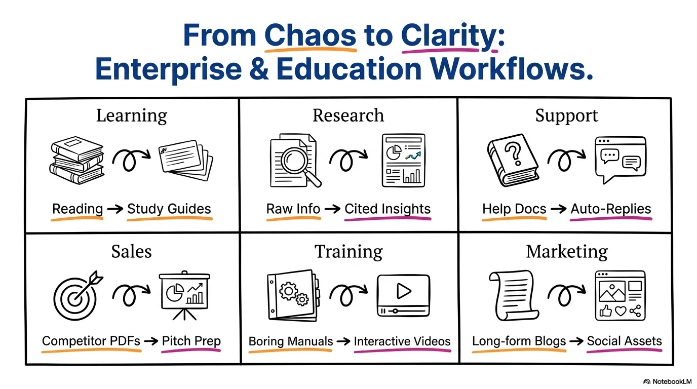

> [!TIP]
> This is a simplified preview. [View Full YAML](styles/project_launch.yaml)

```yaml
description: "An energetic and professional aesthetic designed for tech launches, project kick-offs, and collaborative workshops. It pairs the elegant The Youngest serif with the bold Heading Now sans-serif. Characterized by high-contrast blocks of blue, orange, and magenta, it features sketchy, hand-drawn style illustrations of people and workspace elements to create a dynamic 'startup' atmosphere."
design_system:
  global_style:
    theme: "Project Launch. Dynamic and collaborative design with bold colors and sketchy illustrations for tech teams."
    typography: 
      primary_heading: "Heading Now, sans-serif"
      secondary_heading: "The Youngest, serif"
      body_text: "Heading Now, regular"
    color_palette:
      primary: "#0D47A1" # Deep Blue
      secondary: "#EF6C00" # Energetic Orange
      background: "#FFFFFF" # White Background
      surface: "#F06292" # Magenta Accents
      text_main: "#000000" # Solid Black
      text_secondary: "#FFFFFF" # White for text on dark blocks
    key_visual_elements: 
      - "Hand-drawn, sketchy illustrations of people shopping, meeting, or using devices"
      - "Bold, solid color blocks used as backgrounds for key sections"
      - "Roughly sketched underlines and highlights for emphasis"
      - "Clean, high-contrast layouts with a 'whiteboard' or 'collaboration' feel"

  image_generation_prompts:
    style_guidelines: "Sketchy hand-drawn illustrations of professionals, bold color blocks in blue and orange, high-contrast whiteboard style, Heading Now and The Youngest font vibe, energetic startup atmosphere."
    themes:
      - target: "Project Goal"
        prompt_elements: "A sketchy illustration of a person placing a flag on a mountain, bold orange background block, clean white lines."
      - target: "Team Collaboration"
        prompt_elements: "Two people in a hand-drawn style brainstorming at a table, vibrant blue accents, modern and sketchy look."

slide_layout_templates:
  - type: "Launch_Cover"
    usage: "Large blue Heading Now title on white with a sketchy scene and orange highlights"
  - type: "Bold_Block_Stat"
    usage: "A solid magenta or blue block containing a large white number or key achievement"
  - type: "Sketchy_Process_Map"
    usage: "A slide where steps are connected by hand-drawn arrows and doodle-style icons"
  - type: "Contact_Orange"
    usage: "Full orange background with white text and a sketchy illustration of someone holding a phone"
```


#### Tech Pitch

A high-energy and futuristic pitch deck aesthetic designed for tech startups, innovation hubs, and venture capital presentations. It features the bold and technical Open Sauce typeface for maximum impact and modern clarity. Characterized by a matte black background, vibrant neon lime green accents, and grayscale photography, it utilizes sharp geometric lines, minimalist charts, and punchy typography to create a powerful and forward-thinking visual presence.


> [!TIP]
> This is a simplified preview. [View Full YAML](styles/tech_pitch.yaml)

```yaml
description: "A high-energy and futuristic pitch deck aesthetic designed for tech startups, innovation hubs, and venture capital presentations. It features the bold and technical Open Sauce typeface for maximum impact and modern clarity. Characterized by a matte black background, vibrant neon lime green accents, and grayscale photography, it utilizes sharp geometric lines, minimalist charts, and punchy typography to create a powerful and forward-thinking visual presence."
design_system:
  global_style:
    theme: "Tech Pitch. High-contrast startup design with neon green tech accents."
    typography: 
      primary_heading: "Open Sauce, bold"
      secondary_heading: "Open Sauce, medium"
      body_text: "Open Sauce, regular"
    color_palette:
      primary: "#C0FF00" # Neon Lime / Cyber Green
      secondary: "#121212" # Matte Black Background
      background: "#000000" # Pure Black
      surface: "#1E1E1E" # Dark Charcoal Surface
      text_main: "#FFFFFF" # Pure White Text
      text_secondary: "#A0A0A0" # Muted Grayscale Text
    key_visual_elements: 
      - "Neon green diagonal arrows and geometric progress indicators"
      - "Thin chart lines and data visualization elements in neon lime"
      - "Grayscale (black and white) professional photography with high contrast"
      - "Massive, punchy titles that dominate the layout"
      - "Minimalist 'plus' or 'target' symbols as background decorative elements"

  image_generation_prompts:
    style_guidelines: "Futuristic tech environments, high-contrast industrial spaces, grayscale photography with neon lime highlights, sharp geometric lines, Open Sauce font vibe, energetic startup aesthetic."
    themes:
      - target: "Global Opportunity"
        prompt_elements: "A futuristic world map represented by glowing dots on a black background, neon green data lines, high-tech and sharp."
      - target: "Innovation Team"
        prompt_elements: "Black and white portrait of a modern tech team in a minimalist office, high contrast, neon lime geometric overlays, professional and energetic."

slide_layout_templates:
  - type: "Neon_Pitch_Title"
    usage: "Large Open Sauce title in neon green on a pure black background with a grayscale architectural photo"
  - type: "Growth_Chart_Dynamic"
    usage: "A clean line graph in neon green showing upward movement on a matte black grid"
  - type: "Impact_Stats_Bold"
    usage: "Huge white numbers with neon green unit labels (e.g., '$4.5 T') and grayscale icons"
  - type: "Call_To_Action_Cyber"
    usage: "Massive neon green 'THANK YOU' text with small white contact details in a grid below"
```


#### Prismatic Tech

An ultra-clean and futuristic aesthetic designed for high-tech product launches, software architecture, and innovation-focused presentations. It features the wide and impactful Agrandir Extended typeface for titles, paired with the regular Agrandir for clarity. Characterized by a pure white background with prismatic and holographic accents, it utilizes 3D iridescent crystal illustrations, thin technical UI lines, and crop mark corners to create a sophisticated, high-performance visual experience.

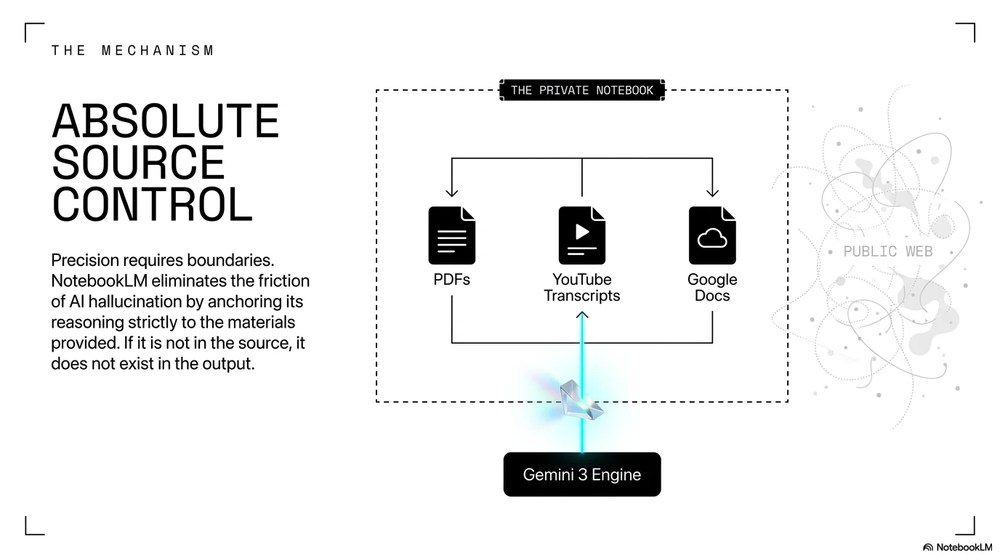

> [!TIP]
> This is a simplified preview. [View Full YAML](styles/prismatic_tech.yaml)

```yaml
description: "An ultra-clean and futuristic aesthetic designed for high-tech product launches, software architecture, and innovation-focused presentations. It features the wide and impactful Agrandir Extended typeface for titles, paired with the regular Agrandir for clarity. Characterized by a pure white background with prismatic and holographic accents, it utilizes 3D iridescent crystal illustrations, thin technical UI lines, and crop mark corners to create a sophisticated, high-performance visual experience."
design_system:
  global_style:
    theme: "Prismatic Tech. Minimalist holographic design with white backgrounds and iridescent crystals."
    typography: 
      primary_heading: "Agrandir Extended, bold"
      secondary_heading: "Agrandir, bold"
      body_text: "Agrandir, regular"
    color_palette:
      primary: "#000000" # Black Text
      secondary: "#00FFFF" # Holographic Cyan
      background: "#F5F5F5" # Near-White
      surface: "#FFFFFF" # Pure White
      accent: "#FF00FF" # Holographic Magenta
      text_main: "#000000" # Solid Black
      text_secondary: "#424242" # Dark Gray
    key_visual_elements: 
      - "3D floating holographic crystals and iridescent glass prisms"
      - "Thin technical lines and grid-like UI borders"
      - "Minimalist crop marks in the corners (L-shapes)"
      - "Iridescent gradients reflecting cyan, magenta, and yellow"
      - "Wide typography with generous letter spacing in headings"

  image_generation_prompts:
    style_guidelines: "A floating iridescent 3D crystal prism on a pure white background, soft rainbow reflections, minimalist technical lines, high-end tech aesthetic, Agrandir font vibe."
    themes:
      - target: "Future Technology"
        prompt_elements: "Close up of an iridescent glass device, prismatic light leaks, white minimalist environment, clean and sharp, futuristic."
      - target: "Holographic Interface"
        prompt_elements: "Minimalist UI elements floating in a white space with holographic glow, thin lines, sophisticated and professional."

slide_layout_templates:
  - type: "Prismatic_Hero_Cover"
    usage: "Large holographic crystal in the center with a bold black Agrandir Extended title and corner crop marks"
  - type: "Tech_Evolution_Grid"
    usage: "Clean white layout with iridescent floating cubes and thin technical separators"
  - type: "Communication_Revolution_Card"
    usage: "Landscape iridescent glass panel with black text and technical annotations"
  - type: "Prismatic_Thank_You"
    usage: "Centered text on a white background with two prismatic crystals flanking the 'Thank You' message"
```


#### Cyber AI

A high-impact and nocturnal aesthetic designed for AI research, cybersecurity, and cyberpunk-themed tech presentations. It features the blocky and futuristic Pattanans typeface for titles to convey a digital frontier feel, paired with the modern Montserrat for readability. Characterized by a deep midnight blue background with vibrant neon purple and cyan accents, it utilizes 3D glowing robot illustrations, isometric UI modules, and floating star effects to create an immersive digital future experience.

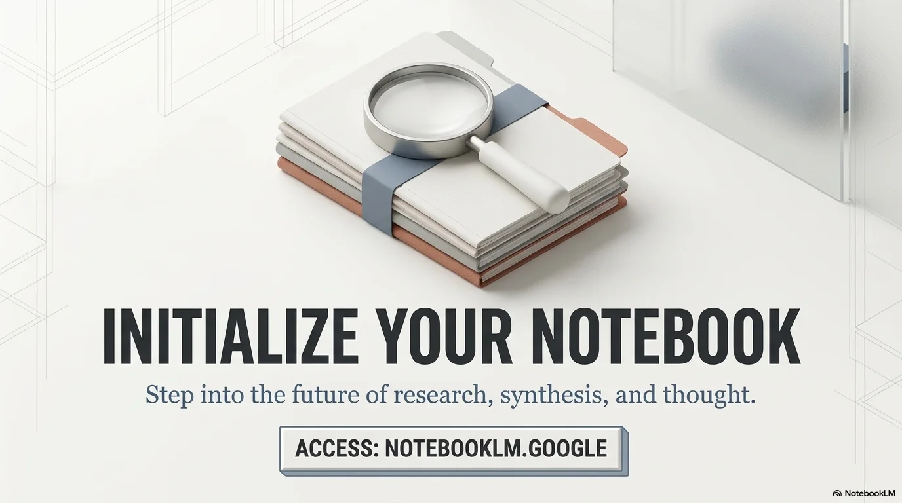

> [!TIP]
> This is a simplified preview. [View Full YAML](styles/cyber_ai.yaml)

```yaml
description: "A high-impact and nocturnal aesthetic designed for AI research, cybersecurity, and cyberpunk-themed tech presentations. It features the blocky and futuristic Pattanans typeface for titles to convey a digital frontier feel, paired with the modern Montserrat for readability. Characterized by a deep midnight blue background with vibrant neon purple and cyan accents, it utilizes 3D glowing robot illustrations, isometric UI modules, and floating star effects to create an immersive digital future experience."
design_system:
  global_style:
    theme: "Cyber AI. Nocturnal cyberpunk design with neon purple/cyan accents and glowing robots."
    typography: 
      primary_heading: "Pattanans, bold"
      secondary_heading: "Montserrat, bold"
      body_text: "Montserrat, regular"
    color_palette:
      primary: "#0D1117" # Deep Midnight Blue
      secondary: "#7C4DFF" # Neon Purple
      background: "#02040A" # Pitch Black
      surface: "#161B22" # Dark Slate Surface
      accent: "#00E5FF" # Electric Cyan
      text_main: "#FFFFFF" # Pure White
      text_secondary: "#8B949E" # Muted Gray
    key_visual_elements: 
      - "3D glowing robot and cyborg illustrations in neon blue and purple"
      - "Isometric futuristic UI modules and data visualization blocks"
      - "Floating star/nebula particles and glowing grid backgrounds"
      - "High-contrast neon highlights on dark surfaces"
      - "Blocky, digitized typography for section headers and titles"

  image_generation_prompts:
    style_guidelines: "A glowing blue robot reading a book in deep space, vibrant neon purple accents, floating stars, futuristic isometric UI elements, cyberpunk atmosphere, Pattanans font vibe."
    themes:
      - target: "Artificial Intelligence"
        prompt_elements: "A robotic hand reaching out towards a glowing brain interface, neon cyan and purple lighting, dark digital background, high-tech and immersive."
      - target: "Future Digital City"
        prompt_elements: "Isometric view of a futuristic city with neon lights and floating data streams, deep midnight blue and electric cyan, cinematic quality."

slide_layout_templates:
  - type: "Cyber_Hero_Future"
    usage: "Large glowing robot illustration on the left with a massive white Pattanans title over a dark space background"
  - type: "AI_Categories_Isometric"
    usage: "Three dark slate cards with neon glowing borders and isometric icons for different AI types"
  - type: "Nocturnal_Deep_Learning"
    usage: "Split layout with a glowing robotic arm visual and bullet points in electric cyan"
  - type: "Cyber_Thank_You"
    usage: "A small glowing robot reading a book centered on a dark background with neon star effects and a purple footer"
```

---


### 🌿 Nature & Wellness

#### Eco Modern

A modern, sustainable, and high-impact aesthetic inspired by nature and environmental initiatives. It features immersive landscape photography, dark mode backgrounds, and glassmorphic (frosted glass) overlays. A signature lime-green accent dot provides a contemporary brand finish.

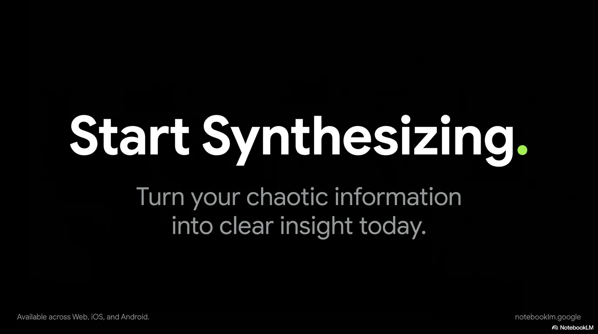

> [!TIP]
> This is a simplified preview. [View Full YAML](styles/eco_modern.yaml)

```yaml
design_system:
  global_style:
    theme: "Sustainable, modern nature aesthetic. Dark mode with glassmorphism."
    typography: 
      primary_heading: "Extra-bold geometric sans-serif (Codec Pro)"
      secondary_heading: "Clean bold sans-serif"
      body_text: "Highly legible functional sans-serif"
    color_palette:
      primary_color: "#D4FF00"
      secondary_color: "#5D8AA8"
      background_dark: "#000000"
      text_main: "#FFFFFF"
    key_visual_elements: 
      - "Full-bleed high-saturation nature photography"
      - "Frosted glass containers for text overlays"
      - "Large rounded corners on all UI elements"
      - "Signature lime-green accent dot after titles"

slide_layout_templates:
  - type: "Immersive_Hero"
    usage: "High-impact cover with full-bleed nature backdrop"
  - type: "Frosted_Agenda"
    usage: "Agenda points inside a glassmorphic container"
  - type: "Eco_Action_Grid"
    usage: "Practical tips with alternating rounded image/text blocks"
```

#### Botanical Journal

Eco-friendly, natural, and scrapbook-inspired design. Features hand-drawn botanical doodles (leaves, vines, flowers), washi tape accents, and torn notebook paper textures on a warm cream background.

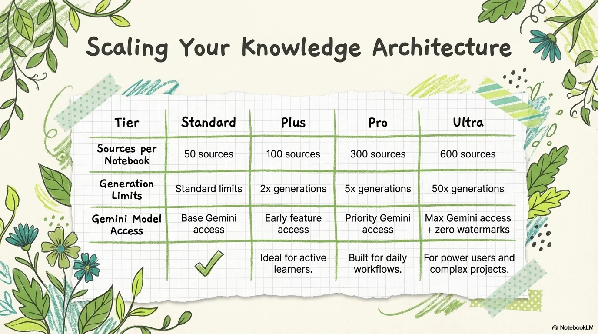

> [!TIP]
> This is a simplified preview. [View Full YAML](styles/botanical_journal.yaml)

```yaml
design_system:
  global_style:
    theme: "Eco Scrapbook. Natural & Botanical."
    typography: 
      primary_heading: "Bubbly hand-drawn sans-serif (e.g., Fredoka One)"
      secondary_heading: "Friendly rounded sans-serif"
      body_text: "Clean legible sans-serif"
    color_palette:
      primary_color: "#7CB342"
      background: "#F9F7F1"
      accent_lime: "#D4E157"
    key_visual_elements: 
      - "Torn binder paper textures"
      - "Decorative washi tape strips"
      - "Hand-drawn botanical doodles"
      - "Circular or oval photo frames"

slide_layout_templates:
  - type: "Botanical_Hero"
    usage: "Main title or environmental intros"
  - type: "Notebook_Scrapbook"
    usage: "Detailed points or objectives"
  - type: "Eco_Profile"
    usage: "Nature focus or overviews"
```

#### The Seasons

An organic and earthy aesthetic inspired by sustainable branding, apothecary, and wellness. It features high-contrast serifs, deep olive and terracotta tones, and botanical photography with stadium-shaped masks and balanced asymmetric layouts.

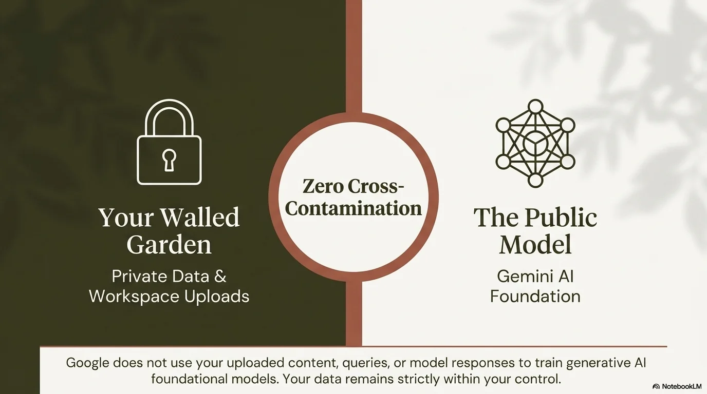

> [!TIP]
> This is a simplified preview. [View Full YAML](styles/the_seasons.yaml)

```yaml
design_system:
  global_style:
    theme: "Organic, earthy wellness and high-end botanical branding."
    typography: 
      primary_heading: "Classic, high-contrast serif (Playfair Display)"
      secondary_heading: "Refined italic serif or modern sans-serif"
      body_text: "Clean minimalist sans-serif"
    color_palette:
      primary_color: "#3D3D29"
      secondary_color: "#8F564B"
      background: "#F9F6F1"
      text_main: "#2D2D2D"
    key_visual_elements: 
      - "Macro botanical photography (eucalyptus, tropical leaves)"
      - "Stadium-shaped masks for images and content blocks"
      - "Shadow overlays of plant leaves for atmosphere"
      - "Earthy-toned data visualizations (Venn, bar charts)"

slide_layout_templates:
  - type: "Organic_Hero"
    usage: "Large Serif Title over botanical background bleed"
  - type: "Product_Inventory"
    usage: "Catalog list of stadium-shaped cards with portrait bleed"
  - type: "Data_Venn"
    usage: "Mapping brand values with terracotta and olive tones"
```

#### Scholar's Journal

Academic, vintage, and scientific design. Inspired by 19th-century botanical engravings and researcher journals. It features heavy coarse paper textures and deep indigo line art illustrations for a scholarly feel.

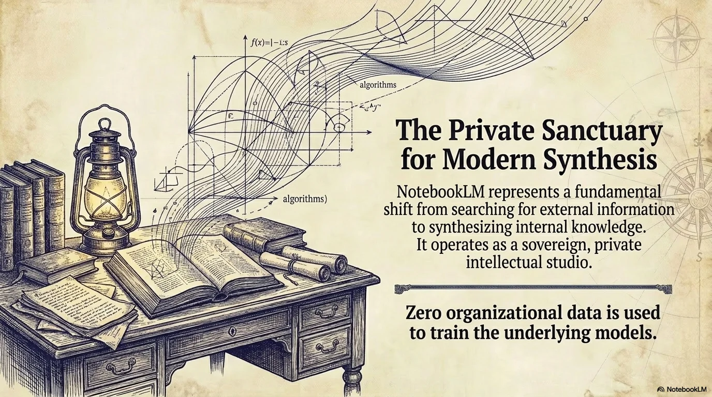

> [!TIP]
> This is a simplified preview. [View Full YAML](styles/scholars_journal.yaml)

```yaml
design_system:
  global_style:
    theme: "Academic, vintage, and scientific. Botanical engravings focus."
    typography: 
      primary_heading: "Traditional serif or slab serif (e.g., Trocchi)"
      secondary_heading: "Classic serif, clean"
      body_text: "Functional traditional serif"
    color_palette:
      primary_color: "#3E4E63"
      background: "#D1D1D1"
      text_main: "#2D3436"
    key_visual_elements: 
      - "Etched/Engraved line art illustrations"
      - "Heavy coarse paper texture grain"
      - "Indigo on Parchment monochromatic scheme"

slide_layout_templates:
  - type: "Scholar_Intro"
    usage: "Title slides or section starts"
  - type: "Illustration_Focus"
    usage: "Presenting concepts with a visual anchor"
  - type: "Balanced_Journal"
    usage: "Summary or Q&A slides"
```

#### Classical Scrapbook

A tactile, layered design that blends classical art history with a handcrafted scrapbook aesthetic. It features overlapping kraft paper and parchment textures, torn edges, washi tape accents, and elegant flowing script combined with classic serif typography.

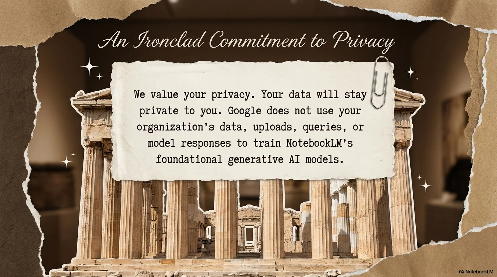

> [!TIP]
> This is a simplified preview. [View Full YAML](styles/classical_scrapbook.yaml)

```yaml
design_system:
  global_style:
    theme: "Classical art history meets scrapbook collage. Layered tactile materials."
    typography: 
      primary_heading: "Elegant flowing cursive script"
      secondary_heading: "Classic high-contrast serif"
      body_text: "Clean legible serif"
    color_palette:
      primary_color: "#8C7156"
      background: "#A68E74"
      text_main: "#403024"
      accent_color: "#D9C5B2"
    key_visual_elements: 
      - "Overlapping kraft and white paper with torn edges"
      - "Classical sculpture and impressionist painting cutouts"
      - "Washi tape, paper-clips, and sparkle accents"
      - "Circular timeline nodes and framed artwork"

slide_layout_templates:
  - type: "Cover_Collage"
    usage: "Tactile intro with cursive title and classical artifacts"
  - type: "Timeline_Historical"
    usage: "Chronological events with statue cutouts"
  - type: "Ending_Statement"
    usage: "Final slide with landscape bleed and torn edges"
```

#### Vibrant Agency

A high-energy, playful aesthetic inspired by modern marketing and creative agencies. It features vibrant orange "bubble" elements, wavy dividers, and friendly bold typography. Perfect for pitches that need to convey enthusiasm and creative momentum.

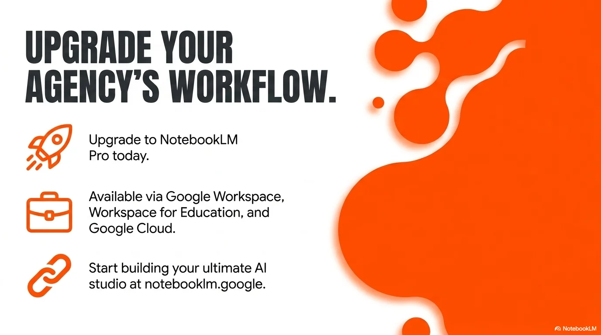

> [!TIP]
> This is a simplified preview. [View Full YAML](styles/vibrant_agency.yaml)

```yaml
design_system:
  global_style:
    theme: "High-energy, playful marketing and creative agency aesthetic."
    typography: 
      primary_heading: "Bold friendly sans-serif (Montserrat)"
      secondary_heading: "Approachable modern sans-serif"
      body_text: "Clean legible sans-serif"
    color_palette:
      primary_color: "#FF7A21"
      secondary_color: "#FFB392"
      background: "#FFFFFF"
      text_main: "#1A1A1A"
    key_visual_elements: 
      - "Large rounded 'bubble' background elements"
      - "Wavy and curved dividers for section transitions"
      - "Studio-style photography with vibrant monochromatic backgrounds"
      - "Circular progress indicators and playful donut charts"

slide_layout_templates:
  - type: "Campaign_Cover"
    usage: "Impactful title for marketing pitches with bubble accents"
  - type: "Strategy_Cards"
    usage: "Grid of large rounded cards with orange icons"
  - type: "Performance_Kpis"
    usage: "Visualizing metrics with orange donut progress charts"
```


#### Vitality Glow

An energetic and fresh aesthetic focused on health, wellness, and vitality. It features the friendly Poppins typeface, vibrant lime green and bright blue accents, and dynamic diagonal shapes. Perfect for wellness coaching, sports nutrition, and preventive healthcare presentations.

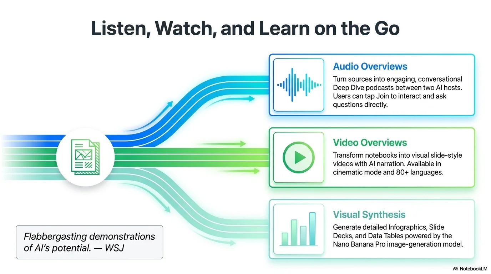

> [!TIP]
> This is a simplified preview. [View Full YAML](styles/vitality_glow.yaml)

```yaml
description: "An energetic and fresh aesthetic focused on health, wellness, and vitality. It features the friendly Poppins typeface, vibrant lime green and bright blue accents, and dynamic diagonal shapes. Perfect for wellness coaching, sports nutrition, and preventive healthcare presentations."
design_system:
  global_style:
    theme: "Vitality Glow. Energetic wellness style with diagonal accents and vibrant colors."
    typography: 
      primary_heading: "Poppins, sans-serif"
      secondary_heading: "Poppins, medium"
      body_text: "Poppins, light"
    color_palette:
      primary: "#10B981" # Vitality Green
      secondary: "#3B82F6" # Energy Blue
      background: "#FFFFFF" # Pure White
      surface: "#F0FDFA" # Mint Tint Surface
      text_main: "#1F2937"
      text_secondary: "#6B7280"
    key_visual_elements: 
      - "Large diagonal parallelograms in green and blue"
      - "Circular image masks for portraits and product shots"
      - "Small diamond-shaped (rhombus) accents"
      - "Clean white space with high-contrast vibrant accents"

  image_generation_prompts:
    style_guidelines: "Bright lifestyle photography, outdoor settings, high-key lighting, vibrant green and blue color grading, healthy living themes, energetic and optimistic vibe, Poppins font vibe."
    themes:
      - target: "Hydration & Vitality"
        prompt_elements: "Close-up of fresh water with mint leaves, bright sunlight, vibrant green and blue tones, refreshing aesthetic."
      - target: "Active Lifestyle"
        prompt_elements: "People exercising in a sunlit park, blurry green background, focus on movement and energy, optimistic atmosphere."

slide_layout_templates:
  - type: "Vitality_Hero"
    usage: "Large title with a massive diagonal green stripe in the background"
  - type: "Health_TOC_Circles"
    usage: "Table of contents with section numbers inside small green circles"
  - type: "Wellness_Grid"
    usage: "Information cards with diamond icons and subtle blue borders"
  - type: "Organic_Comparison"
    usage: "Side-by-side comparison using circular masks and diagonal dividers"
```


#### Modern Wellness

A sleek and professional aesthetic for contemporary health and lifestyle content. It utilizes the geometric TT Firs Neue typeface to convey precision and modernity. Featuring a balanced palette of deep slate, forest green, and amber orange, it combines clean photography with minimalist vector shapes and ample white space for a premium corporate wellness feel.

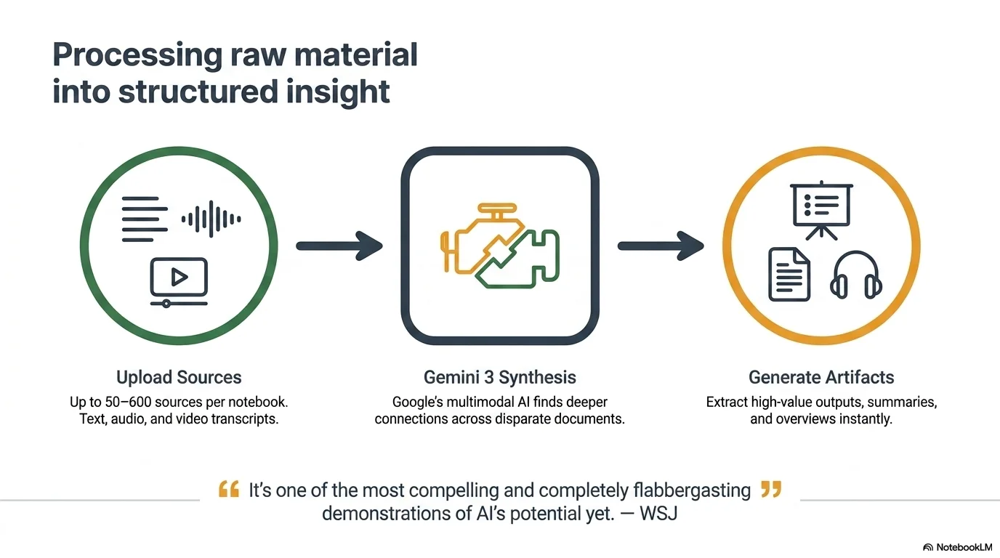

> [!TIP]
> This is a simplified preview. [View Full YAML](styles/modern_wellness.yaml)

```yaml
description: "A sleek and professional aesthetic for contemporary health and lifestyle content. It utilizes the geometric TT Firs Neue typeface to convey precision and modernity. Featuring a balanced palette of deep slate, forest green, and amber orange, it combines clean photography with minimalist vector shapes and ample white space for a premium corporate wellness feel."
design_system:
  global_style:
    theme: "Modern Wellness. Professional and geometric design for contemporary lifestyle presentations."
    typography: 
      primary_heading: "TT Firs Neue, sans-serif"
      secondary_heading: "TT Firs Neue, medium"
      body_text: "Inter, regular"
    color_palette:
      primary: "#263238" # Deep Slate
      secondary: "#2E7D32" # Forest Green
      accent: "#FF8F00" # Amber Orange
      background: "#FFFFFF" # Pure White
      text_main: "#263238"
      text_secondary: "#546E7A"
    key_visual_elements: 
      - "Clean, high-quality lifestyle photography"
      - "Minimalist flat vector illustrations of healthy activities"
      - "Geometric accents (rounded corners, circles, thick lines)"
      - "Modern info-boxes with subtle colored headers"

  image_generation_prompts:
    style_guidelines: "Modern minimalist photography, flat vector accents, deep green and amber color scheme, geometric composition, clean and professional atmosphere, white space."
    themes:
      - target: "Healthy Habits"
        prompt_elements: "A person practicing yoga in a bright modern room, minimalist green and orange graphic overlays, premium wellness vibe."
      - target: "Nutrition Guide"
        prompt_elements: "Close-up of fresh vegetables on a white table, geometric slate blue frames, clean and technical look."

slide_layout_templates:
  - type: "Modern_Wellness_Cover"
    usage: "Large TT Firs Neue title centered with a geometric green accent and a lifestyle photo background"
  - type: "Icon_List"
    usage: "Bullet points accompanied by clean flat icons in amber and forest green"
  - type: "Split_Visual"
    usage: "One side with a large photo, the other with organized text on a clean white background"
```


#### Deep Forest

A rugged and authentic aesthetic that honors the raw beauty of deep forests and mountain landscapes. It features the wide and impactful Agrandir Wide typeface for headlines that stand out against vast nature photography. Characterized by a palette of deep forest green and charcoal, it uses high-contrast layouts and minimal leaf icons to create a sense of conservation and wilderness adventure.

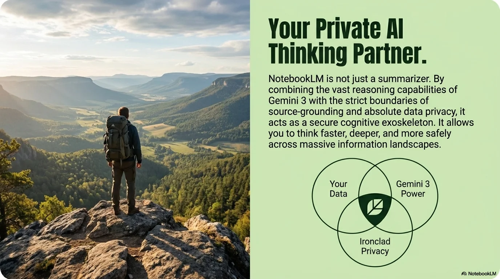

> [!TIP]
> This is a simplified preview. [View Full YAML](styles/deep_forest.yaml)

```yaml
description: "A rugged and authentic aesthetic that honors the raw beauty of deep forests and mountain landscapes. It features the wide and impactful Agrandir Wide typeface for headlines that stand out against vast nature photography. Characterized by a palette of deep forest green and charcoal, it uses high-contrast layouts and minimal leaf icons to create a sense of conservation and wilderness adventure."
design_system:
  global_style:
    theme: "Deep Forest. Rugged and minimalist nature design for environmental and hiking presentations."
    typography: 
      primary_heading: "Agrandir Wide, sans-serif"
      secondary_heading: "Agrandir, regular"
      body_text: "Poppins, regular"
    color_palette:
      primary: "#1B5E20" # Deep Forest Green
      secondary: "#212121" # Charcoal Black
      background: "#FAFAFA" # Off-White
      surface: "#E8F5E9" # Pale Leaf Green
      text_main: "#1B5E20"
      text_secondary: "#424242"
    key_visual_elements: 
      - "Full-bleed photography of forests and mountains"
      - "Minimalist leaf icons used as bullet points or accents"
      - "High-contrast layouts (large dark headlines on light backgrounds)"
      - "Rounded image corners to soften the rugged imagery"

  image_generation_prompts:
    style_guidelines: "High-contrast nature photography, deep forest green and charcoal accents, wide cinematic shots, rugged wilderness atmosphere, Agrandir Wide font vibe."
    themes:
      - target: "Sustainability"
        prompt_elements: "Close-up of pine needles with morning dew, deep green tones, minimalist charcoal text box, authentic and environmental."
      - target: "Hiking Adventure"
        prompt_elements: "A person walking on a mountain trail, vast forest background, high contrast, rugged and adventurous aesthetic."

slide_layout_templates:
  - type: "Wilderness_Headline"
    usage: "Large Agrandir Wide headline overlapping a cinematic forest photo"
  - type: "Leaf_Info"
    usage: "Bullet points marked by small green leaf icons on a clean charcoal surface"
  - type: "Contrast_Visual"
    usage: "A split slide with a dark green side for text and a full-height photo on the other"
```


#### Urban Jungle

A fresh and organic aesthetic designed for urban gardening and botanical pitch decks. It combines the modern Agrandir and Poppins typefaces for a clean, professional look with a friendly touch. Characterized by soft beige backgrounds, vibrant moss green accents, and iconic Monstera leaf decorations, it creates a sophisticated yet growth-oriented atmosphere for plant-centric content.

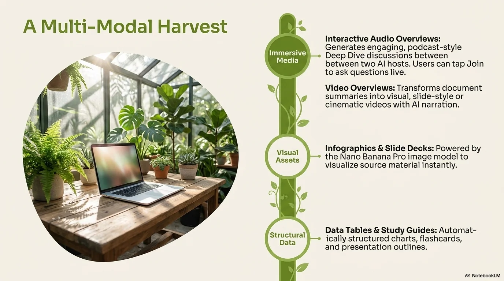

> [!TIP]
> This is a simplified preview. [View Full YAML](styles/urban_jungle.yaml)

```yaml
description: "A fresh and organic aesthetic designed for urban gardening and botanical pitch decks. It combines the modern Agrandir and Poppins typefaces for a clean, professional look with a friendly touch. Characterized by soft beige backgrounds, vibrant moss green accents, and iconic Monstera leaf decorations, it creates a sophisticated yet growth-oriented atmosphere for plant-centric content."
design_system:
  global_style:
    theme: "Urban Jungle. Modern botanical design for gardening and plant-focused pitch decks."
    typography: 
      primary_heading: "Agrandir, sans-serif"
      secondary_heading: "Poppins, medium"
      body_text: "Poppins, regular"
    color_palette:
      primary: "#33691E" # Moss Green
      secondary: "#1B5E20" # Dark Forest Green
      background: "#EFEBE9" # Soft Beige / Nude
      surface: "#F1F8E9" # Pale Green Surface
      text_main: "#1B5E20"
      text_secondary: "#546E7A"
    key_visual_elements: 
      - "Decorative Monstera and plant leaf overlays in the corners"
      - "Ultra-rounded containers for images and text blocks"
      - "Soft beige backgrounds that make green tones pop"
      - "Clean and airy layouts with focused botanical imagery"

  image_generation_prompts:
    style_guidelines: "Modern botanical illustration, Monstera leaves, soft beige and moss green palette, clean and professional pitch deck style, rounded corners, organic and fresh atmosphere."
    themes:
      - target: "Plant Cultivation"
        prompt_elements: "A variety of indoor plants in modern pots, soft sunlight, beige background, fresh and sophisticated botanical look."
      - target: "Market Potential"
        prompt_elements: "Minimalist greenhouse interior, green and nude color scheme, clean professional layout, organic growth vibes."

slide_layout_templates:
  - type: "Botanical_Pitch_Cover"
    usage: "Headline centered with large Monstera leaf shadows and a soft beige background"
  - type: "Plant_Feature"
    usage: "Large photo with ultra-rounded corners on one side and clean bullet points on the other"
  - type: "Leaf_Divider"
    usage: "A slide with a horizontal line decorated by small leaf icons to separate sections"
  - type: "Green_Summary"
    usage: "Final slide with a large 'Thank You' and a vibrant plant branch across the bottom"
```


#### Modern Farm

A robust and contemporary aesthetic that merges industrial agriculture with modern business design. It features bold Agrandir headlines and clean Poppins body text. Characterized by a striking palette of deep barn red and olive green, it uses rounded photography of farm life, daisy icons, and high-contrast color blocks to create a grounded yet professional atmosphere.

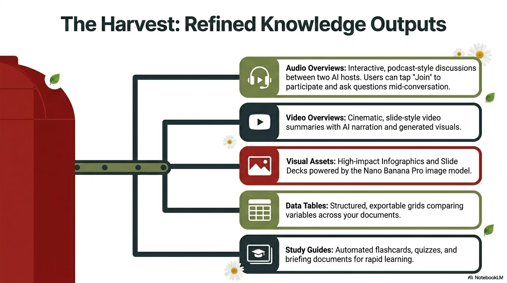

> [!TIP]
> This is a simplified preview. [View Full YAML](styles/modern_farm.yaml)

```yaml
description: "A robust and contemporary aesthetic that merges industrial agriculture with modern business design. It features bold Agrandir headlines and clean Poppins body text. Characterized by a striking palette of deep barn red and olive green, it uses rounded photography of farm life, daisy icons, and high-contrast color blocks to create a grounded yet professional atmosphere."
design_system:
  global_style:
    theme: "Modern Farm. Bold and industrial agricultural design for business and rural presentations."
    typography: 
      primary_heading: "Agrandir, sans-serif"
      secondary_heading: "Poppins, medium"
      body_text: "Poppins, regular"
    color_palette:
      primary: "#B71C1C" # Barn Red
      secondary: "#558B2F" # Olive Green
      background: "#FFFFFF" # White
      surface: "#212121" # Deep Charcoal
      text_main: "#212121"
      text_secondary: "#B71C1C"
    key_visual_elements: 
      - "Photography of modern barns and green meadows"
      - "Charming daisy and real leaf icons as decorative accents"
      - "Bold, solid red and green background sections"
      - "Rounded containers for images and info-boxes"

  image_generation_prompts:
    style_guidelines: "Modern agricultural photography, barn red and olive green palette, high-contrast business layout, rural and professional atmosphere, daisy icons, rounded corners."
    themes:
      - target: "Business Model"
        prompt_elements: "An aerial view of a modern green farm, barn red graphic overlays, professional and robust agricultural vibe."
      - target: "Our Solution"
        prompt_elements: "Close-up of a daisy and a green leaf on a white surface, olive green frames, clean and contemporary farm aesthetic."

slide_layout_templates:
  - type: "Modern_Farm_Cover"
    usage: "Large headline on a white background with a large rounded farm photo and a daisy icon"
  - type: "Barn_Red_Problem"
    usage: "A slide with a solid deep red background and white text for high impact"
  - type: "Leaf_Feature_Grid"
    usage: "A 3-column grid where each item has a different leaf or flower icon at the top"
```


#### Sustainable Agri

A clean and data-driven aesthetic for the future of farming and sustainable technology. It utilizes the neutral Canva Sans typeface to prioritize content clarity. Characterized by a monochrome palette of lush greens—from deep forest to vibrant lime—it features aerial crop photography, semi-transparent overlays, and structured roadmaps for a professional agro-tech feel.

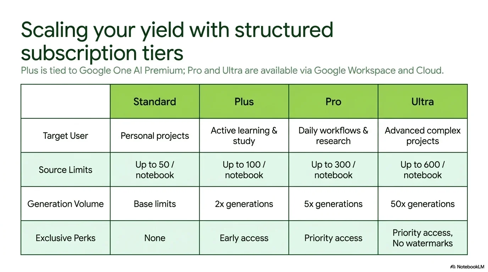

> [!TIP]
> This is a simplified preview. [View Full YAML](styles/sustainable_agri.yaml)

```yaml
description: "A clean and data-driven aesthetic for the future of farming and sustainable technology. It utilizes the neutral Canva Sans typeface to prioritize content clarity. Characterized by a monochrome palette of lush greens—from deep forest to vibrant lime—it features aerial crop photography, semi-transparent overlays, and structured roadmaps for a professional agro-tech feel."
design_system:
  global_style:
    theme: "Sustainable Agri. Technical and structured green design for innovation in agriculture."
    typography: 
      primary_heading: "Canva Sans, sans-serif"
      secondary_heading: "Canva Sans, medium"
      body_text: "Canva Sans, regular"
    color_palette:
      primary: "#1B5E20" # Forest Green
      secondary: "#AED581" # Lime Green
      background: "#FFFFFF" # White
      surface: "#33691E" # Moss Green
      text_main: "#1B5E20"
      text_secondary: "#AED581"
    key_visual_elements: 
      - "Aerial and macro photography of sustainable crops"
      - "Semi-transparent green overlays for text readability over images"
      - "Structured roadmaps and timelines with clean dots and lines"
      - "Minimalist grid layouts for presenting tech features or data"

  image_generation_prompts:
    style_guidelines: "Aerial agriculture photography, monochrome green color scheme, semi-transparent overlays, professional agro-tech atmosphere, structured and clean layout, Canva Sans font vibe."
    themes:
      - target: "Technology Roadmap"
        prompt_elements: "A field of crops with a digital grid overlay, vibrant lime and forest green tones, technical and futuristic agriculture."
      - target: "Team & Expertise"
        prompt_elements: "Farmers working in a sustainable greenhouse, soft green lighting, clean professional portrait style."

slide_layout_templates:
  - type: "Agri_Tech_Cover"
    usage: "Full-bleed crop photo with a large Canva Sans title in white over a semi-transparent dark green box"
  - type: "Green_Roadmap"
    usage: "Horizontal timeline with lime green markers on a dark forest green background"
  - type: "Data_Grid"
    usage: "Clean white background with moss green boxes for metrics and statistics"
  - type: "Field_Contact"
    usage: "Contact info over a blurred field background with vibrant green accents"
```


#### Modern Harvest

A premium and innovation-focused aesthetic for modern agriculture. It uses the friendly and geometric Garet typeface to present data-driven solutions. Characterized by a clean white background with sophisticated terracotta and deep earth tones, it features ultra-rounded image containers and high-end rural photography to create a trustworthy, high-tech farming atmosphere.

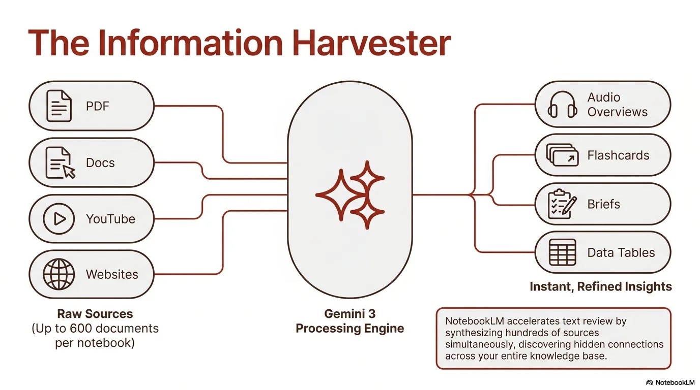

> [!TIP]
> This is a simplified preview. [View Full YAML](styles/modern_harvest.yaml)

```yaml
description: "A premium and innovation-focused aesthetic for modern agriculture. It uses the friendly and geometric Garet typeface to present data-driven solutions. Characterized by a clean white background with sophisticated terracotta and deep earth tones, it features ultra-rounded image containers and high-end rural photography to create a trustworthy, high-tech farming atmosphere."
design_system:
  global_style:
    theme: "Modern Harvest. Sophisticated and high-tech agricultural design for modern rural solutions."
    typography: 
      primary_heading: "Garet, sans-serif"
      secondary_heading: "Garet, medium"
      body_text: "Garet, regular"
    color_palette:
      primary: "#8D201A" # Terracotta Red
      secondary: "#4E342E" # Earth Brown
      background: "#FFFFFF" # Pure White
      surface: "#F5F5F5" # Light Gray Surface
      text_main: "#4E342E"
      text_secondary: "#8D201A"
    key_visual_elements: 
      - "Ultra-rounded (pill-shaped) image containers and buttons"
      - "Sunset-lit agricultural photography (hay bales, silos, tractors)"
      - "Clean, thin lines to separate sections and data points"
      - "Minimalist iconography for tech-driven farming features"

  image_generation_prompts:
    style_guidelines: "High-end agricultural photography, sunset lighting, terracotta and earth brown accents, ultra-rounded corners, clean and professional pitch deck style, Garet font aesthetic."
    themes:
      - target: "Data Solutions"
        prompt_elements: "A modern grain silo under a warm sunset, terracotta graphic lines, high-tech and premium rural vibe."
      - target: "Harvest Efficiency"
        prompt_elements: "Large hay bales in a golden field, ultra-rounded frame, earth tones, sophisticated agricultural look."

slide_layout_templates:
  - type: "Harvest_Premium_Cover"
    usage: "Large Garet headline on the left with a vertically-oriented pill-shaped photo on the right"
  - type: "Earth_Tone_Roadmap"
    usage: "A clean horizontal timeline with terracotta markers and soil brown labels"
  - type: "Pill_Image_Gallery"
    usage: "A grid of images where each one is enclosed in a pill-shaped container"
```


#### Mindful Aura

A calm and ethereal aesthetic designed for wellness, mindfulness, and mental health presentations. It features the elegant and clear Raleway typeface. Characterized by a palette of soft lavender and deep purples on pure white backgrounds, it uses radiant light beams, aura-like gradients, and floral geometric patterns to create a serene, therapeutic, and professional atmosphere.

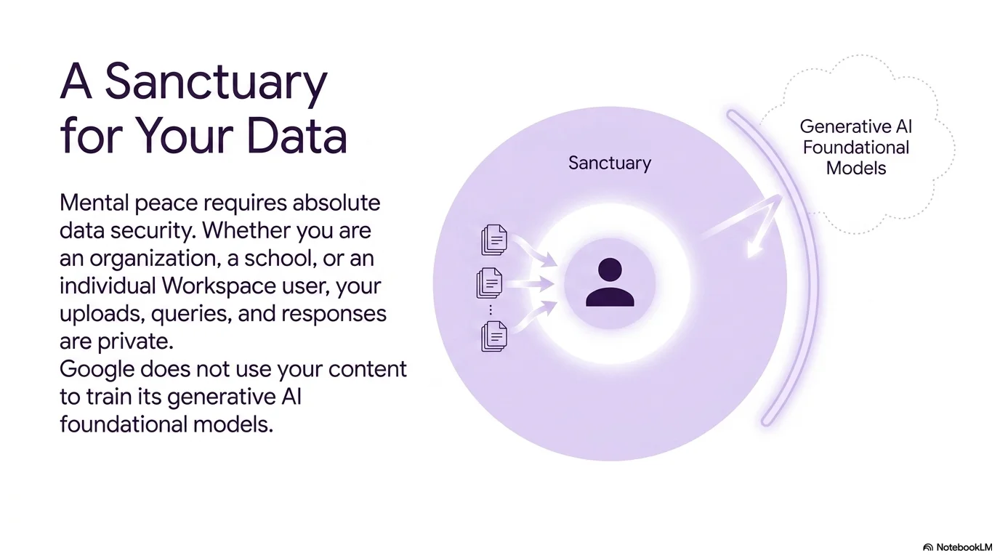

> [!TIP]
> This is a simplified preview. [View Full YAML](styles/mindful_aura.yaml)

```yaml
description: "A calm and ethereal aesthetic designed for wellness, mindfulness, and mental health presentations. It features the elegant and clear Raleway typeface. Characterized by a palette of soft lavender and deep purples on pure white backgrounds, it uses radiant light beams, aura-like gradients, and floral geometric patterns to create a serene, therapeutic, and professional atmosphere."
design_system:
  global_style:
    theme: "Mindful Aura. Ethereal and serene design with light gradients for wellness and mindfulness."
    typography: 
      primary_heading: "Raleway, sans-serif"
      secondary_heading: "Raleway, bold"
      body_text: "Raleway, regular"
    color_palette:
      primary: "#7E57C2" # Deep Purple
      secondary: "#B39DDB" # Soft Lavender
      background: "#FFFFFF" # Pure White
      surface: "#F3E5F5" # Very Light Purple Surface
      text_main: "#4527A0" # Deepest Purple for text
      text_secondary: "#7E57C2"
    key_visual_elements: 
      - "Radiant radial gradients and light beams that mimic auras or enlightenment"
      - "Floral geometric symbols resembling minimalist lotus flowers or mandalas"
      - "Bubbly, soft-edged containers with wavy outlines for text blocks"
      - "Clean, spacious layouts with a focus on negative space and light"

  image_generation_prompts:
    style_guidelines: "Ethereal wellness aesthetic, soft lavender aura gradients, radiant light beams, minimalist floral geometry, Raleway font vibe, serene and therapeutic atmosphere."
    themes:
      - target: "Breathing Exercise"
        prompt_elements: "A soft lavender radial glow expanding from the center, white background, minimalist floral symbol, ethereal and calm."
      - target: "Emotional Balance"
        prompt_elements: "Abstract light beams in purple and lavender, soft wavy shapes, zen atmosphere, high-end wellness look."

slide_layout_templates:
  - type: "Aura_Intro"
    usage: "Large Raleway title centered over a soft purple aura glow on a white background"
  - type: "Wavy_Message_Slide"
    usage: "A single powerful quote inside a large wavy-edged cloud container in light lavender"
  - type: "Zen_Grid"
    usage: "A grid of icons or points, each paired with a minimalist floral geometric symbol"
  - type: "Light_Summary"
    usage: "A summary slide where text is highlighted by subtle vertical light beams in the background"
```


#### Botanical Harmony

A warm and organic aesthetic inspired by folk art and botanical illustrations. It features the calligraphic 29LT Riwaya typeface. Characterized by an earthy palette of cream, sand, and taupe, it uses fine line-art of mountains, butterflies, and sun motifs to create a human, artisanal, and deeply serene atmosphere for wellness and nature topics.

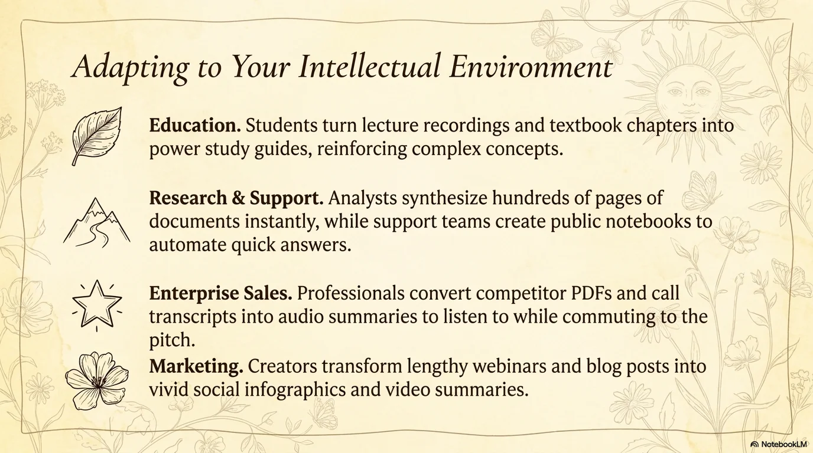

> [!TIP]
> This is a simplified preview. [View Full YAML](styles/botanical_harmony.yaml)

```yaml
description: "A warm and organic aesthetic inspired by folk art and botanical illustrations. It features the calligraphic 29LT Riwaya typeface. Characterized by an earthy palette of cream, sand, and taupe, it uses fine line-art of mountains, butterflies, and sun motifs to create a human, artisanal, and deeply serene atmosphere for wellness and nature topics."
design_system:
  global_style:
    theme: "Botanical Harmony. Human and organic design with line-art illustrations and earthy tones."
    typography: 
      primary_heading: "29LT Riwaya, serif"
      secondary_heading: "29LT Riwaya, italic"
      body_text: "29LT Riwaya, regular"
    color_palette:
      primary: "#D7CCC8" # Tan
      secondary: "#FFF59D" # Cream Yellow
      background: "#FAF9F6" # Off-White/Sand
      surface: "#EFEBE9" # Light Earthy Surface
      text_main: "#4E342E" # Deep Coffee Brown
      text_secondary: "#8D6E63"
    key_visual_elements: 
      - "Fine line-art illustrations of nature (mountains, butterflies, wildflowers)"
      - "Hand-drawn sun motif with a human face (folk-art style)"
      - "Wavy-edged organic containers for text and headings"
      - "Soft, parchment-like background textures with subtle botanical overlays"

  image_generation_prompts:
    style_guidelines: "Organic botanical aesthetic, fine line-art illustrations, 29LT Riwaya font vibe, earthy cream and taupe palette, folk-art sun, serene and artisanal atmosphere."
    themes:
      - target: "Natural Movement"
        prompt_elements: "Minimalist line-art of a butterfly and wildflowers, cream background, soft taupe accents, organic and peaceful."
      - target: "Inner Peace"
        prompt_elements: "A hand-drawn sun with a gentle face, simple mountain outlines, earthy tones, folk-art illustration style."

slide_layout_templates:
  - type: "Botanical_Title"
    usage: "Title in 29LT Riwaya placed inside a wavy organic container with botanical line-art in the corners"
  - type: "Illustrated_List"
    usage: "Numbered lists where each item is accompanied by a small hand-drawn nature icon (leaf, star, flower)"
  - type: "Mountain_Summary"
    usage: "A summary slide with a mountain range line-art at the bottom and key points in the center"
  - type: "Gratitude_Page"
    usage: "Text centered over a large, faint line-art of the sun with a face, on a warm cream background"
```


#### Yoga Glow

A gentle and maternal aesthetic designed for prenatal yoga, mindfulness, and conscious movement. It uses the clean Open Sauce typeface paired with soft, hand-drawn 'chalky' cloud outlines. Characterized by a soothing palette of sage greens and off-whites, it features flat illustrations of yoga poses and grainy textures to create a safe, nurturing, and calm atmosphere.

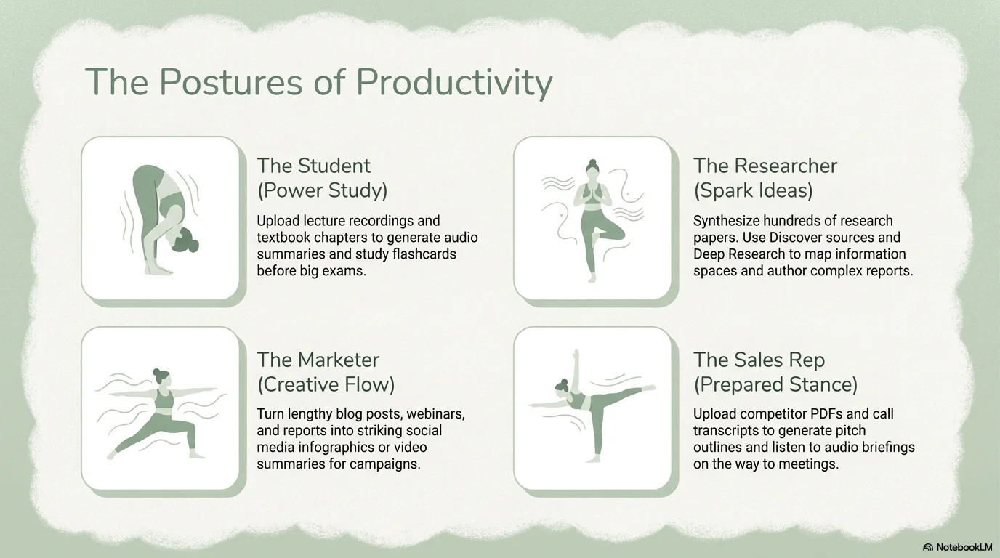

> [!TIP]
> This is a simplified preview. [View Full YAML](styles/yoga_glow.yaml)

```yaml
description: "A gentle and maternal aesthetic designed for prenatal yoga, mindfulness, and conscious movement. It uses the clean Open Sauce typeface paired with soft, hand-drawn 'chalky' cloud outlines. Characterized by a soothing palette of sage greens and off-whites, it features flat illustrations of yoga poses and grainy textures to create a safe, nurturing, and calm atmosphere."
design_system:
  global_style:
    theme: "Yoga Glow. Soothing and nurturing design with chalky textures and sage green tones."
    typography: 
      primary_heading: "Open Sauce, sans-serif"
      secondary_heading: "Open Sauce, medium"
      body_text: "Open Sauce, regular"
    color_palette:
      primary: "#819681" # Sage Green
      secondary: "#C1CDC1" # Pale Sage
      background: "#EDF1ED" # Off-White Sage
      surface: "#FFFFFF" # Pure White
      text_main: "#4A5D4A" # Dark Sage for text
      text_secondary: "#819681"
    key_visual_elements: 
      - "Soft cloud-like outlines with a chalky, hand-drawn texture"
      - "Flat, minimalist illustrations of yoga poses and conscious movement"
      - "Grainy, paper-like background textures for a tactile feel"
      - "Rounded containers and buttons that evoke comfort and safety"

  image_generation_prompts:
    style_guidelines: "Gentle yoga aesthetic, soft sage green and white palette, chalky cloud outlines, flat minimalist illustrations, Open Sauce font vibe, grainy maternal atmosphere."
    themes:
      - target: "Conscious Breathing"
        prompt_elements: "Minimalist illustration of a person in a meditative pose, soft chalky clouds in the background, sage green tones, peaceful and safe."
      - target: "Gentle Stretching"
        prompt_elements: "Abstract wavy lines resembling movement, soft grainy texture, pale sage green palette, ethereal and calm."

slide_layout_templates:
  - type: "Cloud_Title"
    usage: "Title in Open Sauce centered inside a large, soft-edged chalky cloud on a sage green background"
  - type: "Illustrated_Step_Slide"
    usage: "Each point is accompanied by a small flat illustration of a yoga pose inside a rounded square"
  - type: "Safety_Checklist"
    usage: "Key points listed inside horizontal rounded containers with a soft chalky border"
  - type: "Breathing_Focus"
    usage: "A large central text block surrounded by concentric chalky circles to simulate a breathing rhythm"
```


#### Deep Forest

A majestic and immersive aesthetic designed for environmental conservation, ecology, and deep nature topics. It features the geometric Garet typeface. Characterized by a palette of deep forest greens, charcoal, and moss, it uses high-contrast white text over foggy forest photography to create a professional, scientific, and atmospheric editorial look.


> [!TIP]
> This is a simplified preview. [View Full YAML](styles/deep_forest.yaml)

```yaml
description: "A majestic and immersive aesthetic designed for environmental conservation, ecology, and deep nature topics. It features the geometric Garet typeface. Characterized by a palette of deep forest greens, charcoal, and moss, it uses high-contrast white text over foggy forest photography to create a professional, scientific, and atmospheric editorial look."
design_system:
  global_style:
    theme: "Deep Forest. Atmospheric and majestic design with foggy forest imagery and deep greens."
    typography: 
      primary_heading: "Garet, sans-serif"
      secondary_heading: "Garet, bold"
      body_text: "Garet, regular"
    color_palette:
      primary: "#004D40" # Deep Forest Green
      secondary: "#9E9D24" # Moss Green
      background: "#37474F" # Charcoal/Dark Slate
      surface: "#00241F" # Darkest Green Surface
      text_main: "#FFFFFF" # High Contrast White
      text_secondary: "#B2DFDB" # Light Teal
    key_visual_elements: 
      - "Full-bleed background imagery of misty pine forests and foggy landscapes"
      - "High-contrast white typography that stands out against dark green overlays"
      - "Clean, scientific-editorial layouts with precise line spacing"
      - "Subtle teal dividers and small moss-green accent bullets"

  image_generation_prompts:
    style_guidelines: "Immersive nature photography, foggy pine forest, deep green and charcoal palette, high contrast, Garet font vibe, professional ecological editorial look."
    themes:
      - target: "Biodiversity Conservation"
        prompt_elements: "Close-up of a pine branch in a misty forest, deep greens, cinematic lighting, high-end environmental magazine style."
      - target: "The Future of Forests"
        prompt_elements: "A vast landscape of foggy mountains covered in trees, charcoal sky, mysterious and majestic atmosphere."

slide_layout_templates:
  - type: "Forest_Intro"
    usage: "Large Garet title centered over a full-bleed foggy forest image with a dark green gradient overlay"
  - type: "Scientific_Editorial"
    usage: "Text arranged in three clean columns over a dark charcoal background with a small forest inset photo"
  - type: "Conservation_Strategy"
    usage: "Key points listed with moss-green accent bullets on a deep forest green surface"
  - type: "Impact_Slide"
    usage: "A single large number or word in Garet bold centered on a misty background to emphasize scale"
```


#### Misty Forest

A majestic and immersive aesthetic designed for environmental conservation, ecology, and deep nature topics. It features the geometric Garet typeface. Characterized by a palette of deep forest greens, charcoal, and moss, it uses high-contrast white text over foggy forest photography to create a professional, scientific, and atmospheric editorial look.

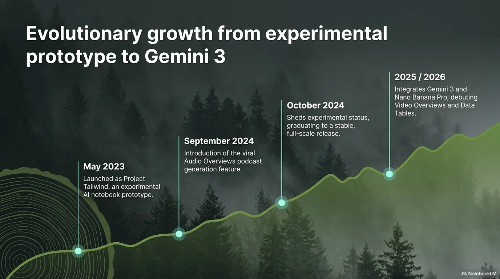

> [!TIP]
> This is a simplified preview. [View Full YAML](styles/misty_forest.yaml)

```yaml
description: "A majestic and immersive aesthetic designed for environmental conservation, ecology, and deep nature topics. It features the geometric Garet typeface. Characterized by a palette of deep forest greens, charcoal, and moss, it uses high-contrast white text over foggy forest photography to create a professional, scientific, and atmospheric editorial look."
design_system:
  global_style:
    theme: "Misty Forest. Atmospheric and majestic design with foggy forest imagery and deep greens."
    typography: 
      primary_heading: "Garet, sans-serif"
      secondary_heading: "Garet, bold"
      body_text: "Garet, regular"
    color_palette:
      primary: "#004D40" # Deep Forest Green
      secondary: "#9E9D24" # Moss Green
      background: "#37474F" # Charcoal/Dark Slate
      surface: "#00241F" # Darkest Green Surface
      text_main: "#FFFFFF" # High Contrast White
      text_secondary: "#B2DFDB" # Light Teal
    key_visual_elements: 
      - "Full-bleed background imagery of misty pine forests and foggy landscapes"
      - "High-contrast white typography that stands out against dark green overlays"
      - "Clean, scientific-editorial layouts with precise line spacing"
      - "Subtle teal dividers and small moss-green accent bullets"

  image_generation_prompts:
    style_guidelines: "Immersive nature photography, foggy pine forest, deep green and charcoal palette, high contrast, Garet font vibe, professional ecological editorial look."
    themes:
      - target: "Biodiversity Conservation"
        prompt_elements: "Close-up of a pine branch in a misty forest, deep greens, cinematic lighting, high-end environmental magazine style."
      - target: "The Future of Forests"
        prompt_elements: "A vast landscape of foggy mountains covered in trees, charcoal sky, mysterious and majestic atmosphere."

slide_layout_templates:
  - type: "Forest_Intro"
    usage: "Large Garet title centered over a full-bleed foggy forest image with a dark green gradient overlay"
  - type: "Scientific_Editorial"
    usage: "Text arranged in three clean columns over a dark charcoal background with a small forest inset photo"
  - type: "Conservation_Strategy"
    usage: "Key points listed with moss-green accent bullets on a deep forest green surface"
  - type: "Impact_Slide"
    usage: "A single large number or word in Garet bold centered on a misty background to emphasize scale"
```


#### Serum Essence

A serene and sophisticated aesthetic designed for premium skincare, beauty, and wellness editorial content. It features the exquisite TAN Mon Cheri serif for headlines, bringing a touch of high-fashion elegance. Characterized by a palette of warm amber, soft cream, and muted lavender, it uses frosted glass textures, organic shadows, and macro photography of liquid textures to create a calming and professional atmosphere.

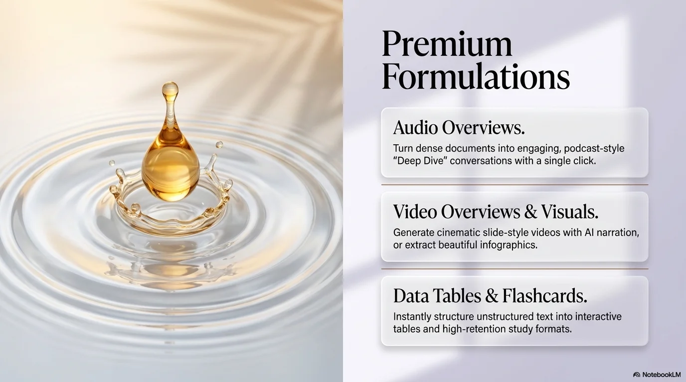

> [!TIP]
> This is a simplified preview. [View Full YAML](styles/serum_essence.yaml)

```yaml
description: "A serene and sophisticated aesthetic designed for premium skincare, beauty, and wellness editorial content. It features the exquisite TAN Mon Cheri serif for headlines, bringing a touch of high-fashion elegance. Characterized by a palette of warm amber, soft cream, and muted lavender, it uses frosted glass textures, organic shadows, and macro photography of liquid textures to create a calming and professional atmosphere."
design_system:
  global_style:
    theme: "Serum Essence. Premium beauty and wellness design with an editorial, high-contrast serif look."
    typography: 
      primary_heading: "TAN Mon Cheri, serif"
      secondary_heading: "Open Sauce, regular"
      body_text: "Open Sauce, light"
    color_palette:
      primary: "#8D6E63" # Amber Brown
      secondary: "#E1BEE7" # Soft Lavender
      background: "#FDFCFB" # Pearl White
      surface: "#F5F5F5" # Frosted Glass Surface
      text_main: "#4E342E" # Deep Umber
      text_secondary: "#8D6E63"
    key_visual_elements: 
      - "Frosted glass (glassmorphism) containers for text"
      - "Macro photography of serum droplets and liquid textures"
      - "Organic, soft window shadows (leaf or architectural shadows)"
      - "Minimalist botanical icons and thin serif dividers"

  image_generation_prompts:
    style_guidelines: "High-end skincare photography, frosted glass textures, warm natural sunlight with soft shadows, amber glass bottles, pearl white and soft lavender palette, TAN Mon Cheri font vibe."
    themes:
      - target: "Product Purity"
        prompt_elements: "Close-up of a glass serum dropper with a clear droplet, soft morning light, frosted glass background, elegant and clean."
      - target: "Wellness Ritual"
        prompt_elements: "Minimalist bathroom shelf with amber glass bottles, soft shadows of a palm leaf, serene and luxurious atmosphere."

slide_layout_templates:
  - type: "Editorial_Glow_Cover"
    usage: "Large TAN Mon Cheri title over a frosted glass overlay and a macro liquid background"
  - type: "Serum_Process_Steps"
    usage: "Numbered list with thin serif dividers and soft lavender accent blocks"
  - type: "Texture_Focus_Split"
    usage: "Full-height product texture photo on one side with clean, airy text on the other"
  - type: "Skincare_Manifesto"
    usage: "A central quote in TAN Mon Cheri light surrounded by generous white space and soft shadows"
```


#### Artisanal Bloom

A warm and organic aesthetic inspired by artisanal floriculture and botanical heritage. It features the flowing Bakerie script for headlines and the clean, modern TT DRUGS for body text. Characterized by a sun-drenched palette of ochre, golden yellow, and warm beige, it uses fine-line botanical illustrations, circular framing, and elegant timeline layouts to create a sense of growth, quality, and natural beauty.

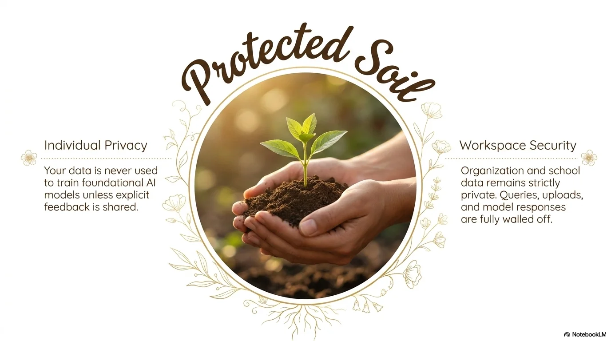

> [!TIP]
> This is a simplified preview. [View Full YAML](styles/artisanal_bloom.yaml)

```yaml
description: "A warm and organic aesthetic inspired by artisanal floriculture and botanical heritage. It features the flowing Bakerie script for headlines and the clean, modern TT DRUGS for body text. Characterized by a sun-drenched palette of ochre, golden yellow, and warm beige, it uses fine-line botanical illustrations, circular framing, and elegant timeline layouts to create a sense of growth, quality, and natural beauty."
design_system:
  global_style:
    theme: "Artisanal Bloom. Warm botanical design with an organic, handcrafted feel."
    typography: 
      primary_heading: "Bakerie, script"
      secondary_heading: "TT DRUGS, regular"
      body_text: "TT DRUGS, light"
    color_palette:
      primary: "#B07D05" # Golden Ochre
      secondary: "#E6A100" # Warm Yellow
      background: "#FFF3E0" # Soft Beige
      surface: "#FFFFFF" # Pure White
      text_main: "#4E342E" # Deep Earth Brown
      text_secondary: "#B07D05"
    key_visual_elements: 
      - "Fine-line golden botanical illustrations (tulips, roses)"
      - "Circular and arched frames for photography"
      - "Dotted horizontal lines for timelines and separators"
      - "Minimalist flower icons as bullet points"

  image_generation_prompts:
    style_guidelines: "Sun-drenched botanical photography, fields of flowers, warm golden lighting, fine-line floral sketches, ochre and beige palette, Bakerie font vibe."
    themes:
      - target: "Heritage and Growth"
        prompt_elements: "Close-up of a golden flower in a sunlit field, soft focus background, warm and organic atmosphere, artisanal feel."
      - target: "Natural Quality"
        prompt_elements: "Hands holding a fresh bouquet of flowers, soft natural lighting, warm beige background, professional botanical look."

slide_layout_templates:
  - type: "Botanical_Hero_Cover"
    usage: "Large Bakerie title next to a fine-line tulip illustration on a warm beige background"
  - type: "Artisanal_Timeline"
    usage: "Horizontal dotted timeline with golden nodes and Bakerie date labels"
  - type: "Arched_Product_Gallery"
    usage: "Three arched image containers for different flower varieties with ocre captions"
  - type: "Organic_Contact"
    usage: "Contact info with small flower icons and a central 'Trabajemos Juntos' call to action"
```

---


## 🚀 نحوه استفاده

۱. کد YAML مربوط به استایل دلخواه خود را کپی کنید.
۲. هنگام تولید اسلاید در نوت‌بوک خود، آن را در بخش پرامپت یا دستورالعمل‌های سفارشی (Custom Instructions) در نوت‌بوک NotebookLM قرار دهید.
۳. از ارائه زیبا و حرفه‌ای خود لذت ببرید!

## 🛠️ مشارکت در پروژه

شما می‌توانید با مطالعه [راهنمای مشارکت](CONTRIBUTING.md)، استایل‌های جدید و خلاقانه خود را به این مجموعه اضافه نمایید.

- **آدرس مخزن:** [https://github.com/hvrashta/nps](https://github.com/hvrashta/nps)

---

## 🏗️ تقدیر و تشکر

تصاویر پیش‌نمایش در این مخزن و وب‌سایت با استفاده از قابلیت **Slide Decks در NotebookLM** تولید شده‌اند.

این پروژه توسط **جعفر قربانی** و **مدرسه هوش مصنوعی یاس** گردآوری و پشتیبانی می‌شود و با همکاری و ابزارهای زیر میسر شده است:

- **مدرسه هوش مصنوعی یاس** (مدیریت آموزشی و طراحی تجربه)
- **جعفر قربانی** (پدیدآورنده و مدیر پروژه)
- **مخزن پروژه:** [github.com/hvrashta/nps](https://github.com/hvrashta/nps)
- **Vercel** (میزبانی و زیرساخت استقرار وب)
- **آیکون‌های اجتماعی:** [thesvg.org](https://www.thesvg.org/)
- **NotebookLM** (موتور تولید اسلاید مبتنی بر هوش مصنوعی گوگل)
- **Gemini** (مدل پایه هوش مصنوعی)
- **Antigravity** (دستیار هوشمند کدنویسی و توسعه)

---

## ⚖️ سلب مسئولیت

پروژه **مدرسه هوش مصنوعی یاس — استایل‌های اسلاید NotebookLM** یک ابتکار آموزشی مستقل به هدایت جعفر قربانی است و **هیچ‌گونه وابستگی رسمی به Google LLC یا تیم رسمی NotebookLM ندارد.** نام و نشان «NotebookLM» علامت‌های تجاری متعلق به Google LLC می‌باشند.

اگرچه این پرامپت‌ها به طور اختصاصی برای قابلیت Slide Decks در NotebookLM بهینه‌سازی شده‌اند، اما ساختار منظم کدهای YAML و ترکیبات زیبایی‌شناختی آن‌ها چندمنظوره بوده و با **سایر ابزارهای هوش مصنوعی تولید تصویر و اسلاید** (نظیر Midjourney، DALL-E، Canva Magic Design و غیره) که پرامپت‌های ساختاریافته دریافت می‌کنند نیز سازگار و قابل استفاده هستند.

